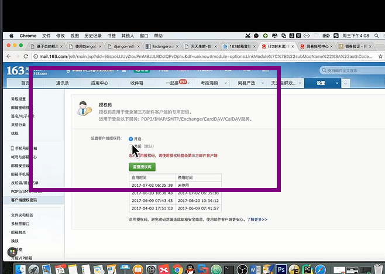
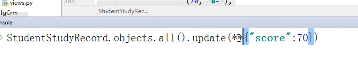

#### 表关系


#### 注册(forms.ModelForm)

##### 1.forms 组件, 自定义钩子

```js
from django import forms
from app01.models import *

from django.forms import widgets as wid
from django.core.exceptions import NON_FIELD_ERRORS, ValidationError
import re
class UserModelForm(forms.ModelForm):
    r_pwd = forms.CharField(error_messages={'r_pwd':"不能为空"}, label='确认密码',
                            widget=wid.PasswordInput(attrs={"class": "form-control"}))
    # r_pwd = forms.CharField(label='确认密码',error_messages={'r_pwd':"不能为空"})
    # widgets={'r_pwd':wid.PasswordInput(attrs={'type':"password"})}
    class Meta:
        model=UserInfo
        # fields=['username','email','gender','tel',"password"]
        fields = "__all__"
        labels={'username':"用户名",'password':'密码','email':'邮箱',"tel":"电话",'gender':"性别"}
        help_texts={'username':'请输入用户名',"password":'请输入密码',"email":'请输入163邮箱','tel':'请输入电话号码'}
        widgets={'password':wid.PasswordInput(attrs={'placeholder':'请输入由数字与字母组成的长度不小于5密码'}),'username':wid.TextInput(attrs={'placeholder':'请输入不少于五位的用户名'}),'email':wid.EmailInput(attrs={'placeholder':'请输入163邮箱'}),'tel':wid.TextInput(attrs={'placeholder':'请输入手机号'})}

        #如果有时间限制格式:
            # widgets={'pub_date':wid.TextInput(attrs={'type':'date'})}


    def __init__(self, *args, **kwargs):
        super().__init__(*args, **kwargs)
        for filed in self.fields.values():
            print(filed.error_messages)
            filed.error_messages={"required":"不能为空","invalid": "格式错误"}
            filed.widget.attrs.update({'class': 'form-control'})

    def clean_tel(self):
        tel=self.cleaned_data.get('tel')
        if re.match(r'^(13\d|14[5|7]|15\d|166|17[3|6|7]|18\d)\d{8}$',tel):
            return tel
        else:
            raise ValidationError("手机号码非法")
    def clean_email(self):
        import re
        email = self.cleaned_data.get('email')
        if re.search('[0-9a-zA-Z]+@163\.com', email):
            return email
        else:
            if email=='':
                raise  ValidationError('邮箱不能为空')
            else:
                raise ValidationError('请输入163.com邮箱')
    def clean_username(self):
        username=self.cleaned_data.get('username')
        ret = UserInfo.objects.filter(username=username)
        if ret:
            raise ValidationError('用户名已存在')
        else:
            return username
	# 全局勾的错误信息 名称是__all__ 给他定义一个别名, 然后前端好渲染
    def clean(self):
        password =  self.cleaned_data.get('password')
        r_pwd= self.cleaned_data.get('r_pwd')
        print(password,r_pwd)

        if password==r_pwd:
            print('haha')
            return self.cleaned_data
        else:
            self.add_error('r_pwd',ValidationError('密码不一致'))
	# 重写save 方法, 继承了那个抽象表之后,密码成明文的了, 现在是密文的了
    def save(self, commit=True):
        # Save the provided password in hashed format
        # 继承基类的save()
        user = super(UserModelForm, self).save(commit=False)
        # 把明文密码改成密文
        user.set_password(self.cleaned_data["password"])
        if commit:
            user.save()
        return user
```


```js
# 前端:  modelFrom组件渲染过来 都在表字段的基础上加id_字段名
<!DOCTYPE html>
<html lang="en">
<head>
    <meta charset="UTF-8">
    <title>Title</title>
    <link rel="stylesheet" href="/static/bootstrap-3.3.7/dist/css/bootstrap.css">
    <script src="/static/node_modules/jquery/dist/jquery.js"></script>
    <style>
        .error{
            color: red;
        }
    </style>
</head>
<body>
    <h3>欢迎注册</h3>
    <div class="container">
        <div class="row">
            <div class="col-md-6 col-md-offset-2">
                <form novalidate>
                
                  
                        <div class="form-group">
                             <label for="title">{{ field.label }}</label>
                             {{ field }}
                             <span class="error"></span>
                        </div>
                 
    </form>
    <input type="button" id="regbtn" value="提交" class="btn btn-success  pull-right">
            </div>
        </div>
    </div>
    <script>

{#        写函数#}
        $('#regbtn').click(function () {
           $.ajax({
               url:'/reg/',
               type:'post',
               data:{
                   username:$('[name=username]').val(),
                   password:$('[name=password]').val(),
                   r_pwd:$('[name=r_pwd]').val(),
                   email:$('[name=email]').val(),
                   gender:$('[name=gender]').val(),
                   tel:$('[name=tel]').val(),
                   csrfmiddlewaretoken:$("[name='csrfmiddlewaretoken']").val()
               },
               success:function (response) {
                   if (response.user) {
                       console.log(response)
                    location.href='/login/'
                   } else {
                       console.log(response);
                       $("span").html("")
                       $.each(response.errors, function (i, j) {
                           $('#id_' + i).next('span').html(j)
                       })
                   }
               }
           })
        })
    </script>

</body>


</html>
```


##### 2.注册成功之后邮件激活:(django+redis+celery+)





```js
发送激活邮件, 包含激活连接:http://127.0.0.1:8000/user/active/3
激活连接中需要包含用户的身份信息, 并且要把身份信息进行加密

#加密用户的身份信息, 生成激活token
from itsdangerous import TimedJSONWebSignatureSerializer as Serializer

serializer = Serializer(settings.SECRET_KEY, 3600)
        info = {'confirm':user.id}
        token = serializer.dumps(info) # bytes
        token = token.decode()

send_register_active_email.delay(email, username, token)
```

```js
# pip install celery

celery_tasks\email_task
from django.conf import  settings
from django.core.mail import send_mail
from celery import Celery

import time

# 创建一个Celery类的实例对象
app = Celery('celery_tasks.email_tasks',broker='redis://127.0.0.1:6379/8')

@app.task
def send_register_active_email(to_email, username, token):
    '''发送激活邮件'''
    # 组织邮件信息
    8sage = '<h1>%s, 欢迎您成为天天生鲜注册会员</h1>请点击下面链接激活您的账户<br/><a href="http://127.0.0.1:8000/user/active/%s">http://127.0.0.1:8000/user/active/%s</a>' % (username, token, token)
    # 因为是里面含有标签的信息, 所以放到html_message
    send_mail(subject, message, sender, receiver, html_message=html_message)
    time.sleep(5)

```


```js
# settings.py
# 发送邮件配置
EMAIL_BACKEND = 'django.core.mail.backends.smtp.EmailBackend'
# smpt服务地址
EMAIL_HOST = 'smtp.163.com'
EMAIL_PORT = 25
# 发送邮件的邮箱
EMAIL_HOST_USER = '15776555268@163.com'
# 在邮箱中设置的客户端授权密码
EMAIL_HOST_PASSWORD = 'yuan1234'
# 收件人看到的发件人
EMAIL_FROM = '天天生鲜<15776555268@163.com>'
```

```js
# 启动worker
E:\celery_email>celery -A celery_tasks.email_tasks worker -l info -P eventlet

# worker需要运行代码, 而且worker那边的代码 需要配置email_task 里面配置
import os
import django
os.environ.setdefault('DJANGO_SETTINGS_MODULE', 'celery_email.settings')
django.setup()
```

```js
# 相应激活视图
class ActiveView(View):
    '''用户激活'''
    def get(self, request, token):
        '''进行用户激活'''
        # 进行解密，获取要激活的用户信息
        serializer = Serializer(settings.SECRET_KEY, 3600)
        try:
            info = serializer.loads(token)
            # 获取待激活用户的id
            user_id = info['confirm']

            # 根据id获取用户信息
            user = User.objects.get(id=user_id)
            user.is_active = 1
            user.save()

            # 跳转到登录页面
            return redirect(reverse('user:login'))
        except SignatureExpired as e:
            # 激活链接已过期
            return HttpResponse('激活链接已过期')
```


#### 登录

```js
 $('.changebtn').click(function () {
         $('[pk=yanzhengma]')[0].src+='?'
    })

# 图片验证码基于PIL模块创建
```


#### index页面

##### 限制登录之后才能看见

```js
# 方式一
@login_required
def index(request):

    return render(request,"index.html")

# 让需要登录的类直接继承这个就可以
# 方式二
class LoginRequireMixin(object):
    @classmethod
    def as_view(cls,**initkwargs):
        view = super(LoginRequireMixin,cls).as_view(**initkwargs)
        return login_required(view)
    
```


##### 根据状态的不同显示不同的颜色

#### 客户管理

- 私户转公户

  ```js
  # 此时可能两个人同时打开了页面,但是有一个点了,但是另一个人此时有可能也能看到页面:
  先过滤出:
  select_id = request.POST.getlist('select_id')
  customer_queryset = Customer.objects.filter(pk__in=select_id)
  ret = func(request, customer_queryset)
  
  # 公户转私户
  def patch_change(self, request, customer_queryset):
  	 ret = customer_queryset.filter(consultant__isnull=True)
  	 if ret:
              return HttpResponse('手数慢了')
        else:
              customer_queryset.update(consultant=request.user)
  # 私户转公户
   def patch_change_public(self, request, customer_queryset):
          customer_queryset.update(consultant=None)
  ```

  - 增删改查基于stark 组件,
  - action 基于stark组件
  - filter  一般是针对多对多字段
  - search 一般是单个字段 
  - 分页组件
  - 保存搜索路径

#### 跟进记录管理

- 难点添加跟进记录的时候应该只能添加当前登录人

- 富文本编辑器(用在路飞课程详情编辑上)

```
note = HTMLField(verbose_name="跟进内容...")


# settings.py
TINYMCE_DEFAULT_CONFIG = {
    'theme':'advanced',  # 主题高级
    'width':600,
    'height':400
}


```

```
INSTALLED_APPS = [
    'django.contrib.admin',
    'django.contrib.auth',
    'django.contrib.contenttypes',
    'django.contrib.sessions',
    'django.contrib.messages',
    'django.contrib.staticfiles',
    'app01.apps.App01Config',
    'tinymce'  # 富文本编辑器
]
```

```
path('tinymce/',include('tinymce.urls') ),

# 保存的是一个html 标签, 拿出来的时候需要转义
```

```js
class ConsultRecordModelForm(forms.ModelForm):
    class Meta:
        model=ConsultRecord
        exclude=["delete_status"]
    def __init__(self, request, *args, **kwargs):
        super().__init__(*args, **kwargs)
        self.request = request
        # 限制select 里面的数据只有当前登录人
        self.fields['consultant'].queryset = UserInfo.objects.filter(pk=self.request.user.pk)
    def save(self,commit=True):
        self.instance.consultant=self.request.user
        return super(ConsultRecordModelForm,self).save(commit)
class AddEditConsultRecordView(View):
    def get(self,request,edit_id=None):
        edit_obj = ConsultRecord.objects.filter(pk=edit_id).first()
        form = ConsultRecordModelForm(request=self.request,instance=edit_obj,initial={"consultant":request.user})
        # form = ConsultRecordModelForm(initial={"consultant":request.user})
        return render(request, "add_edit_consultrecord.html", {"form": form,"edit_obj":edit_obj})

    def post(self,request,edit_id=None):
        edit_obj = ConsultRecord.objects.filter(pk=edit_id).first()
        form=ConsultRecordModelForm(self.request,request.POST,instance=edit_obj,)
        if form.is_valid():
            form.save()
            return redirect(reverse("consult_records"))
        else:
            print(form.errors)
            return render(request, "add_edit_consultrecord.html", {"form": form,"edit_obj":edit_obj})
```


#### 报名表


#### 学生管理

##### 班级学习记录管理


```js

# 有个学生学习记录表,但是里面班级很多字段重复的,所以需要单独开一个班级学习记录表
```


##### 批量创建学生学习记录

```js
学习到的知识点 : - 点击checkbox 提交的可能是多个所以getlist接收,
    		   - 因为可能点击两次, 所以需要保证不能重复添加, 于是在studentrecoder 里面 设置了联合唯一, 里面student对象和 班级记录不可以一样,
                 # 会议室系统里面也用了这个  
                class Meta:
        			unique_together = ['student','classstudyrecord']
```


```js
class ClassStudyRecordView(View):
    def get(self, request, id=None):
        if request.path == reverse("classsturecoder"):
            ClassStudyRecord_list = ClassStudyRecord.objects.all()
            current_page_num = request.GET.get('page', 1)
            # 分页,记住这里
            pagination = Pagination(current_page_num, ClassStudyRecord_list.count(), request)
            ClassStudyRecord_list = ClassStudyRecord_list[pagination.start:pagination.end]
            path = request.GET.get('path')
            return render(request, "students/classstudentrecorder.html",
                          {"ClassStudyRecord_list": ClassStudyRecord_list, "pagination": pagination})

    def post(self, request):
        func_str = request.POST.get("action")
        id_list = request.POST.getlist("select_id")
        if hasattr(self, func_str):
            func = getattr(self, func_str)
            ret = func(id_list)
            if ret:
                return ret
            # 返回继续查看界面
            return self.get(request)

    def patch_delete(self, queryset):
        queryset.delete()

    # 批量创建学习记录
    def patch_create(self, selected_pk_list):
        # print(111)
        try:
            # print(selected_pk_list)
            # 批量创键学习记录
            for classstudy_pk in selected_pk_list:
                print(classstudy_pk)
                # 从班级学习记录表里过滤出对应班级的学习记录对象
                class_study_record_obj = ClassStudyRecord.objects.filter(pk=classstudy_pk).first()
                # print(class_study_record_obj)
                # 班级记录对象与学生 并没有直接关联,所以需要找班级记录表所关联的班级,班级里面的所有学生
                student_list = class_study_record_obj.class_obj.student_set.all()
                print("=====================",student_list)
                for student in student_list:
                    StudentStudyRecord.objects.create(student=student, classstudyrecord=class_study_record_obj)
        except Exception as e:
            pass
```


##### 录入成绩(批量录入成绩)





```js
有了他为什么还要Q:
	StudentStudyRecord.objects.filter(**{"score":70})
	上面的统统都是且的意思,  
     Q 可以有或的关系 Q 是用来查询的
```

- 以前版本

```js
为什么没有给他放到菜单权限里面,因为批量录入成绩需要,携带班级的id,课程等
# 前端
<div class="container">

    <form action="" method="post">
         

         <table class="table table-hover table-striped">
               <thead>
                    <tr>
                        <th>编号</th>
                        <th>姓名</th>
                        <th>考勤</th>
                        <th>成绩</th>
                        <th>批语</th>
                    </tr>
               </thead>
               <tbody>
                    
                      <tr>
                          <td>{{ forloop.counter }}</td>
                          <td>{{ studentstudyrecord.student }}</td>
                          <td>{{ studentstudyrecord.get_record_display }}</td>
                          <td>
                              ######################
                              <select name="score_{{ studentstudyrecord.pk }}" id="">
                                  
                                      
                                            <option selected value="{{ score_choice.0 }}">{{ score_choice.1 }}</option>
                                      
                                            <option value="{{ score_choice.0 }}">{{ score_choice.1 }}</option>
                                      
                                  

                              </select>
                               #######################
                          </td>
                        <td>
                            <textarea name="homework_note_{{ studentstudyrecord.pk }}" id="" cols="20" rows="1" class="form-control">{{ studentstudyrecord.homework_note|default:"" }}</textarea>
                        </td>

                      </tr>
                    

               </tbody>
         </table>
        <input type="submit" class="btn btn-success pull-right" value="保存">
    </form>
</div>

```

```js
class RecordScoreView(View):

    def get(self, request, class_study_record_id):
        class_study_record_obj = ClassStudyRecord.objects.get(pk=class_study_record_id)
        # print(class_study_record_obj)
        student_study_record_list = class_study_record_obj.studentstudyrecord_set.all()
        # print("student_study_record_list",student_study_record_list)
        score_choices = StudentStudyRecord.score_choices
        return render(request, "students/scoreshow.html", locals())

    def post(self, request, class_study_record_id):

        print(request.POST)
        #
        # < QueryDict: {'csrfmiddlewaretoken': ['nJ0h1ldSmTXtEKSjN2UeO4BCztp1ZAqaRwjVQotjS7iMx4NAF6uuW1U25lcaFba3'],
        #               'score_23': ['70'], 'homework_note_23': ['142'], 'score_31': ['70'], 'homework_note_31': ['45'],
        #               'score_35': ['70'], 'homework_note_35': ['\r\n47\r\n']} >
        data_dict = {}

        #  重点
        for key, val in request.POST.items():
            print(key, val)
            if key == "csrfmiddlewaretoken":
                continue
            field, pk = key.rsplit("_", 1)
            ##################对数据库进行优化
            if pk not in data_dict:
                data_dict[pk] = {
                    field: val
                }
            else:
                data_dict[pk][field] = val

        print(data_dict)
        for pk, data in data_dict.items():
            StudentStudyRecord.objects.filter(pk=pk).update(**data)

        # StudentStudyRecord.objects.filter(pk=pk).update(**{field:val})

        return redirect(request.path)
```


- modelformset当前版本

  ```js
  <hr>
  <div class="panel panel-default">
          <div class="panel-heading">学习记录</div>
          <div class="panel-body">
              <div style="width: 680px;margin: 0 auto;">
                  <form method="post" action="">
                      
                      {{ formset.management_form }}
  
                      <table class="table table-bordered">
                          <thead>
                          <tr>
                              <th>姓名</th>
                              <th>考勤</th>
                              <th>作业成绩</th>
                              <th>作业评语</th>
                          </tr>
                          </thead>
                          <tbody>
                          
                              <tr>
                                  {{ form.id }}
  {#                                <td>{{ form.instance.student }}</td>  不需要修改就加一个instance #}
                                  <td>{{ form.instance.student }}</td>
                                  <td>{{ form.instance.get_record_display }} </td>
  {#                                后盾元组((1,'缺勤'),("2",'迟到'))  如果不加instance 会直接给渲染好,不用加get_recorder_display#}
                                  <td>{{ form.score }} </td>
                                  <td>{{ form.homework_note }}</td>
                              </tr>
                          
                          </tbody>
                      </table>
                      <input type="submit" value="保存">
                  </form>
              </div>
          </div>
      </div>
  <hr>
  
  ```

  ```js
  from django import  forms
  class Recorder(forms.ModelForm):
      class Meta:
          model=StudentStudyRecord
          fields = ["score", "homework_note"]  # 如果是__all__ 校验所有字段
  from django.forms.models import modelformset_factory
  class RecordScoreView(View):
      # extra=1 额外添加一个
      def get(self, request, class_study_record_id):
          modelformset = modelformset_factory(model=StudentStudyRecord,form=Recorder,extra=0)
          queryset = StudentStudyRecord.objects.filter(classstudyrecord=class_study_record_id)
          formset = modelformset(queryset=queryset)
          return render(request, "students/scoreshow.html", locals())
  
      def post(self, request,class_study_record_id):
          model_formset_cls = modelformset_factory(model=StudentStudyRecord, form=Recorder, extra=0)
          print("request.POST",request.POST)
          formset=model_formset_cls(request.POST)
          if formset.is_valid():
              formset.save()
  
          print(formset.errors)
  
          return redirect(request.path)
  ```


#### 会议室预定系统

juery-ui Datepicker  ,bootstart_tree


- 1. auth_user表里面使用了扩展字段

     ```js
     from django.contrib.auth.models import AbstractUser
     class UserInfo(AbstractUser):
     	tel = models.Charfield(max_length=32)
     
     需要在settings 里面配置
     AUTH_USER_MODEL = 'app01.UserInfo'
     ```

- 2. ```js
     gender=models.IntegerField(choices=((1,"男"),(2,"女")),default=1)
     
      time_choices = (
             (1, '8:00'),
             (2, '9:00'),
             (3, '10:00'),
             (4, '11:00'),
             (5, '12:00'),
             (6, '13:00'),
             (7, '14:00'),
             (8, '15:00'),
             (9, '16:00'),
             (10, '17:00'),
             (11, '18:00'),
             (12, '19:00'),
             (13, '20:00'),
         )
         # IntegerField() 单纯存一个数字, 只能存1-13 这几个数,但是显示的时候可以显示后面的内容, 元组里面套的元组
          # 进行ModelForm 渲染的时候会渲染成select下拉菜单
         time_id = models.IntegerField(choices=time_choices)
     ```

- 3 同步数据命令

  ```js
  python manage.py migrations
  python manage.py migrate
  ```

- 4 做登录的时候, 用得用户认证组件

  ```js
  from django.contrib import auth
  user = request.POST.get('user')
  pwd = request.POST.get('pwd')
  # 因为使用了, 用户认证组件, 所以核对
  user_obj = auth.authenticate(username=user, password=pwd)
  # 登录成功之后注册session
  if user:
       auth.login(request, user_obj)  # 注册session ,然后有一个request.user 的东西就可以用了
  
  ```

- 5. 使用static 文件夹需要配置

     ```js
     STATIC_URL = '/static/'
     STATICFILES_DIRS=[
         os.path.join(BASE_DIR,"static")
     ]
     ```

##### 难点1 将对应数据渲染到指定位置 (预定人在预定的指定地方)

```js
# 后端渲染
'''
首先前端展示的页面应该指定哪天的, 如果没有指定就渲染当天的
需要book 表里面过滤出根据日期的数据,  前端页面构建, 如果数据里面的book.room_id == 当前循环数据room.id  book.time_id == 当前循环的数据库里面的Book.time_choices  time.id  就添加active属性
'''
def index(request):
	time_choices = Book.time_choices
    room_list = Room.objects.all()
    
	# 拿预定信息应该以时间为过滤条件
    date = datetime.datetime.now().date() //今天的时间
    # datetime.datetime.now(). 拿到的是年月日, 时分秒 datetime.datetime(2019, 3, 3, 18, 23, 54, 902189)
    # datetime.datetime.now().date()   datetime.date(2019, 3, 3)
    book_date = request.GET.get('book_date',date)  # 如果拿不到就过滤今天的
    book_list = Book.objects.filter(date=book_date)
    htmls = ""
    for room in room_list:
        # 每个room,四列
        htmls += "<tr><td>{}({})</td>".format(room.caption, room.num)
        # 每个时间 td
            for time_choice in time_choices:
        	// 如果今天 这个房间 这个时段 过滤出有人就退出时间循环,  flag = True 的时候,就给他添加class = 'active'
            flag = False
            for book in book_list:
                # 在一个时间段一个会议室 只能有一个人预定了, 所以推出循环, 看当前房间的下一个时间段,
                if  book.time_id == time_choice[0] and book.room_id == room.id:

                    flag = True
                    break
            # for  循环不存在作用域, 推出循环的正好是当前匹配成功的信息 极好
            if flag:
        
                if request.user == book.user:
                    htmls += "<td  class='active item' room_id={} time_id={} class='act'>{}</td>".format(room.id, time_choice[0],
                                                                                book.user)
                else:
                    htmls += "<td  class='other_active item' room_id={} time_id={} class='act'>{}</td>".format(room.id,
                                                                                                    time_choice[0],
                                                                                                    book.user)
            else:
                htmls += "<td room_id={} time_id={} class='item'></td>".format(room.id, time_choice[0])

        htmls += "</tr>"
    # print(html)


    return render(request,"index.html",locals())

 <tbody>
           {{ htmls|safe }}

 </tbody>


# 前端渲染
def index(request):

    current_date = datetime.datetime.now().date()
    book_date = request.GET.get("book_date", current_date)
    time_choices = Book.time_choices
    room_list = Room.objects.all()
    					books=list(Book.objects.filter(date=book_date).values("room_id","time_id","user__username"))
    books=json.dumps(books)

    return render(request, 'index.html', locals())


# 前端
var books = {{ books|safe }}
            console.log(books);
    $.each(books, function (i, obj) {

        let choose_td = '[rid=' + obj.room_id + ']' + '[tid=' + obj.time_id + ']';
        if ("{{ request.user.username }}" == obj.user__username) {
            $(choose_td).addClass("active").removeClass("item").text(obj.user__username)
        } else {
            $(choose_td).addClass("active_other").removeClass("item").text(obj.user__username)

        }

    });
```


##### 难点2 点击添加会议室(临时选择取消)

```javascript
'
前端构建数据格式:  因为一个房间可能有好几个时间会被预定
post_data = {
    "ADD":{}, // 'ADD':{'room_id1':[time_id, time_id2,],'room_id2':[]}
    "DEL":{}  //  'DEL':{'room_id':[time_id, time_id2,]}	
}

`当前登录人 class="active item" 
其他登录人 class='other_active item'
什么都没有的 class='item'`


- 思路:
	情况一: 点击什么都没有的, 加class='td_active'
	情况二: 点击有class='active'  去掉active, 添加 cancel,item
	情况三: 点击是class='td_active' 去掉td_active
 # 点击保存按钮发送ajax 的时候:
 	 $(".keep").click(function () {
        var POST_DATA = {
            DEL: {},
            ADD: {},
        };
       
       if ("{{ request.user.username }}") {

            //处理 预定信息 数据
            $(".item.td_active").each(function (index, ele) {
                if ($(this).hasClass("cancel")) {
                    return
                }
                let rid = $(this).attr("rid");
                let tid = $(this).attr("tid");

                if (POST_DATA.ADD[rid]) {
                    POST_DATA.ADD[rid].push(tid)
                } else {
                    POST_DATA.ADD[rid] = [tid]
                }


            });
            //处理 取消预定 数据
            $(".cancel.item").each(function (index, ele) {
                if ($(this).hasClass("td_active")) {
                    return
                }
                let rid = $(this).attr("rid");
                let tid = $(this).attr("tid");

                if (POST_DATA.DEL[rid]) {
                    POST_DATA.DEL[rid].push(tid)
                } else {
                    POST_DATA.DEL[rid] = [tid]
                }
            });
        
        $.ajax({
                url: "/book/",
                type: 'post',
                data: {
                    post_data: JSON.stringify(POST_DATA),
                    csrfmiddlewaretoken: $("[name='csrfmiddlewaretoken']").val(),
                    choose_date: CHOSEN_DATE,
                },
                success: function (data) {
                    console.log('data',data);
                    location.href = location.href
                }

            })
        
        })
```


##### 难点3 日历插件的使用

```js
// 构建日期类型
Date.prototype.Format = function (fmt) { //author: meizz
        var o = {
            "M+": this.getMonth() + 1, //月份
            "d+": this.getDate(), //日
            "h+": this.getHours(), //小时
            "m+": this.getMinutes(), //分
            "s+": this.getSeconds(), //秒
            "q+": Math.floor((this.getMonth() + 3) / 3), //季度
            "S": this.getMilliseconds() //毫秒
        };
        if (/(y+)/.test(fmt)) fmt = fmt.replace(RegExp.$1, (this.getFullYear() + "").substr(4 - RegExp.$1.length));
        for (var k in o)
            if (new RegExp("(" + k + ")").test(fmt)) fmt = fmt.replace(RegExp.$1, (RegExp.$1.length == 1) ? (o[k]) : (("00" + o[k]).substr(("" + o[k]).length)));
        return fmt;
    };


date = new Date()  // 前端获取日期
    $('#datetimepicker11').datetimepicker({
        minView: "month",
        language: "zh-CN",
        sideBySide: true,
        format: 'yyyy-mm-dd',
        // startDate: new Date(),
        bootcssVer: 3,
        autoclose: true,
        defaultDate: new Date()

    }).on('changeDate', book_query);  // 监听事件,如果日期发生变化, 触发函数
    function book_query(ev) {

        CHOSEN_DATE = ev.date.Format('yyyy-MM-dd');
        console.log('格式化日期',CHOSEN_DATE)
        location.href = "/index/?book_date=" + CHOSEN_DATE

    }
	// 给input 框设置value, 默认日期显示
     $('#datetimepicker11').attr('value',date.getFullYear() + '-' + (date.getMonth() + 1) + '-' + date.getDate())
     
	// 如果路由上面有日期, 就显示路由上面的, localion.search.slice(11) 获取路由上面query 然后从11 个字符之后开始切割
	if (location.search.slice(11)) {
        		// 
                CHOSEN_DATE = location.search.slice(11)
                console.log(CHOSEN_DATE)
                 $('#datetimepicker11').attr('value',CHOSEN_DATE)
            }
            else {
                CHOSEN_DATE = new Date().Format('yyyy-MM-dd');
            }
```

##### 后端后端处理数据

```js
def book(request):
        import json
        if request.method == "POST":
            post_data = request.POST.get('post_data')
            post_data = json.loads(post_data)
            chioce_date = request.POST.get("choose_date")
		   ##  批量创建数据
            book_obj_list = []
            print(post_data['ADD'].items())
            for room_id, time_list in post_data['ADD'].items():

                for time_id in time_list:
                    obj = Book(room_id=room_id, time_id=time_id, user_id=request.user.pk, date=chioce_date)
                    book_obj_list.append(obj)
            # 批量创建  批量插入的是 book_obj
            Book.objects.bulk_create(book_obj_list)


            # 删除会议室是预定信息
            for room_id, time_list in post_data['DEL'].items():
                for time_id in time_list:
                    # 这个将进行数据库的多次查询
                    Book.objects.filter(room_id=room_id,time_id=time_id, date=chioce_date, user_id=request.user.pk).delete()
            '''
            yuan先生版本
        for room_id, time_id_list in post_data['DEL'].items():
            for time_id in time_id_list:
                temp = Q()
                temp.connector = 'AND'
                temp.children.append(('user_id', request.user.pk,))
                temp.children.append(('date', choice_date))
                temp.children.append(('room_id', room_id,))
                temp.children.append(('time_id', time_id,))  temp 里面的过滤条件是and , remove_booking
                的 过滤条件是or
                remove_booking.add(temp, 'OR')  
        #         remove_booking ('or', temp,temp1)
        if remove_booking:
            Book.objects.filter(remove_booking).delete()
            
            
            '''


            status_code = {'status':1}

            return HttpResponse(json.dumps(status_code))

from django.http import JsonResponse
return JsonResponse(response)
```

##### login登录视图

```js
from django.contrib import auth


def login(request):

    if request.method == "POST":
        user = request.POST.get("user")
        pwd = request.POST.get("pwd")
        user = auth.authenticate(username=user, password=pwd)
        if user:
            auth.login(request, user)
            return redirect("/index/")

    return render(request, "login.html")
```


### 


#### 问卷调查

```js

```


#### 权限组件

jquery插件库

##### model 表

权限----角色  多对多

角色-- user   

权限

Permission 表
title
type
url
code
pid
pids


- user 表

  ```js
  roles  外键(一个人可能有多个角色)
  class User(AbstractUser):
      """
      用户表
      """
      roles = models.ManyToManyField(to=Role, verbose_name='用户所拥有的角色', blank=True)
  	def __str__(self):
        return self.username
  # 说明是一个抽象类,不会被生成一张表,谁来继承他,就会继承里面的字段
      class Meta:
          abstract = True
  
  
  #########crm里面的model 继承User(已有只要你的项目里用继承这个表即可)
  from rbac.models import User
  
  class UserInfo(User):
  	  """
      员工表
      """
  姓名是真实的名字, AbstractUser 里的是登录的名字用户名
  
      name=models.CharField(max_length=32,unique=True,null=True,verbose_name="姓名")
      birthday = models.DateField(verbose_name='生日', blank=True, null=True)
      age = models.IntegerField(verbose_name='年龄', blank=True, null=True)
      gender = models.CharField(max_length=10, choices=(('Female', '女'), ('Male', '男')), verbose_name='性别', default='Male')
      image = models.ImageField(upload_to='images/%Y/%m', verbose_name='头像',null=True,blank=True)
      depart=models.ForeignKey("Department",on_delete=models.CASCADE,null=True,blank=True) 
      USERNAME_FIELD = "username"
  
  ```

- role表

  ```js
  class Role(models.Model):
      name = models.CharField(max_length=32, verbose_name='角色名称')
      permissions = models.ManyToManyField(to='Permission', verbose_name='角色所拥有的权限', blank=True)
  
      def __str__(self):
          return self.name
  
      class Meta:
          verbose_name_plural = '角色表'
          verbose_name = '角色表'
  ```


- permissions  

  ```js
  class Permission(models.Model):
      """
      权限表
      """
      title = models.CharField(max_length=32, verbose_name='权限名称')
      type = models.CharField(max_length=32, verbose_name='资源类型', choices=[("menu", "菜单权限"), ("button", "按钮权限")])  # 按钮权限
      url = models.CharField(max_length=128, verbose_name='访问url地址', null=True, blank=True)
      code = models.CharField(max_length=32, verbose_name='权限代码字符', null=True, blank=True) # code增删改查用code表示
      pid = models.ForeignKey("self", on_delete=models.CASCADE, null=True, verbose_name='父权限', blank=True)  #自关联
      #per_level = models.PositiveSmallIntegerField(null=True, blank=True, verbose_name="权限级别")
      pids=models.CharField(max_length=32,null=True,blank=True,verbose_name="父权限组合") # "1/5/13" 可避开递归,当然需要重写save
  
      class Meta:
          verbose_name_plural = '权限表'
          verbose_name = '权限表'
  
      def __str__(self):
          return self.title
  
      def save(self, *args, **kwargs):
          count = 1
          pid_list=[]
          while self.pid:
              count += 1
              pid_list.append(self.pid_id)
              self.pid=self.pid.pid
          self.per_level = count
          self.pids = "/".join([str(i) for i in pid_list])
          super(Permission, self).save(*args, **kwargs)
  
  ```


#### 成单记录表(主要是orm语句,使用了echart)

```js
class TongJiView(View):
    def today(self):
        import datetime
        # 取得年月日
        today = datetime.datetime.now().date()  # datetime.datetime.now() 年月日 时分秒对象, date()只取日期
        # 今天成交的所有客户
        customer_list = Customer.objects.filter(baoming_date=today)
        # 查询每一个销售的名字,以及今天的对应成单量, 你得查数所有的销售,因为有的销售没有成单量你也应该显示
        # UserInfo.objects.filter(depart_id=2, customers__baoming_date=today).annotate(c=Count('customers')).values('name','c')

        # 因为里面有个别名,要不然反向查询按照表名小写_set.all()
        ret = UserInfo.objects.filter(depart=2, customers__baoming_date=today).annotate(
            c=Count("customers")).values_list("username", "c")
        ret = [[item[0], item[1]] for item in list(ret)]
        return {"customer_list": customer_list, "ret": ret}

    def yesterday(self):
        import datetime
        # 取得年月日
        yesterday = datetime.datetime.now().date() - datetime.timedelta(days=1)
        # print(yesterday)
        customer_list = Customer.objects.filter(baoming_date=yesterday)
        # 因为里面有个别名,要不然反向查询按照表名小写_set.all()
        # 过滤出每个销售的成交量

        ret = UserInfo.objects.filter(depart=2, customers__baoming_date=yesterday).annotate(
            c=Count("customers")).values_list("username", "c")
        # print(ret)
        ret = [[item[0], item[1]] for item in list(ret)]
        return {"customer_list": customer_list, "ret": ret}

    def week(self):
        import datetime
        # 取得年月日
        today = datetime.datetime.now().date()
        week_today = datetime.datetime.now().date() - datetime.timedelta(weeks=1)
        customer_list = Customer.objects.filter(baoming_date__gte=week_today, baoming_date__lte=today, )
        # 因为里面有个别名,要不然反向查询按照表名小写_set.all()
        ret = UserInfo.objects.filter(depart=2, customers__baoming_date__gte=week_today,
                                      customers__baoming_date__lte=today).annotate(
            c=Count("customers")).values_list("username", "c")
        ret = [[item[0], item[1]] for item in list(ret)]
        return {"customer_list": customer_list, "ret": ret}

    def recent_month(self):
        import datetime
        # 取得年月日
        today = datetime.datetime.now().date()
        recent_month = datetime.datetime.now().date() - datetime.timedelta(weeks=4)
        customer_list = Customer.objects.filter(baoming_date__gte=recent_month, baoming_date__lte=today)
        # 因为里面有个别名,要不然反向查询按照表名小写_set.all()
        ret = UserInfo.objects.filter(depart=2, customers__baoming_date__gte=recent_month,
                                      customers__baoming_date__lte=today).annotate(
            c=Count("customers")).values_list("username", "c")
        ret = [[item[0], item[1]] for item in list(ret)]
        return {"customer_list": customer_list, "ret": ret}
	##########里面应用了反射
    def get(self, request):
        date = request.GET.get('date', "today") # 如果取不到默认今天的
        if hasattr(self, date):
            context = getattr(self, date)()  # 函数名() 直接调用
        return render(request, "customers/tongji.html", context
```

```js
<!DOCTYPE html>
<html lang="zh-CN">
<head>
    <meta charset="UTF-8">
    <title>Title</title>
    <meta name="viewport" content="width=device-width, initial-scale=1">
   <link rel="stylesheet" href="/static/bootstrap/css/bootstrap.min.css">

</head>
<body>
         
         
<h3>客户成单量统计</h3>

<hr>
<a href="?date=today">今天</a>
<a href="?date=yesterday">昨天</a>
<a href="?date=week">最近一周</a>
<a href="?date=recent_month">最近一个月</a>
<hr>


<div class="container">
    <div class="row">
        <div class="col-md-12">
            <table  id="example2" class="text-center table table-bordered table-hover">
                                        <thead>
                                            <tr>
                                                <th class="text-center">编号</th>
                                                <th class="text-center">客户姓名</th>
                                                <th class="text-center">性别</th>
                                                <th class="text-center">客户来源</th>
                                                <th class="text-center">销售</th>
                                                <th class="text-center">所报班级</th>
                                            </tr>
                                        </thead>
                                        <tbody>

                                         
                                             <tr>
                                                <td>{{ forloop.counter }}</td>
                                                <td>{{ customer.name }}{{ customer.baoming_date|date:"Y-m-d" }}</td>
                                                <td>{{ customer.get_sex_display }}</td>
                                                <td>{{ customer.get_source_display }}</td>
                                                 
                                                    <td class = 'error' style="color: red">{{ customer.consultant|default:"暂无" }}</td>
                                                 
                                                     <td>{{ customer.consultant}}</td>
                                                 

                                                <td>{{ customer.get_classlist }}</td>

                                             </tr>
                                         


                                        </tbody>
                                    </table>
            <hr>
            <div id="container" style="width:600px;height:400px"></div>
        </div>
    </div>
</div>

######## 引入hight
<script src="/static/Highcharts-6.2.0/code/highcharts.js"></script>
<script>
    var chart = Highcharts.chart('container', {
                        chart: {
                            type: 'column'
                        },
                        title: {
                            text: '统计成单量'
                        },
                        subtitle: {
                            text: '数据截止 2017-03，来源: <a href="https://en.wikipedia.org/wiki/List_of_cities_proper_by_population">Wikipedia</a>'
                        },
                        xAxis: {
                            type: 'category',
                            labels: {
                                rotation: 0  // 设置轴标签旋转角度
                            }
                        },
                        yAxis: {
                            min: 0,
                            title: {
                                text: '成单数'
                            }
                        },
                        legend: {
                            enabled: false
                        },
                        tooltip: {
                            pointFormat: '成单人数: <b>{point.y} 单</b>'
                        },
                        series: [{
                            name: '总人口',
                            data: {{ ret|safe }},
                            dataLabels: {
                                enabled: true,
                                rotation: -90,
                                color: '#FFFFFF',
                                align: 'right',
                                format: '{point.y:.1f}', // :.1f 为保留 1 位小数
                                y: 10
                            }
                        }]
          });

</script>
</body>
</html>
```


