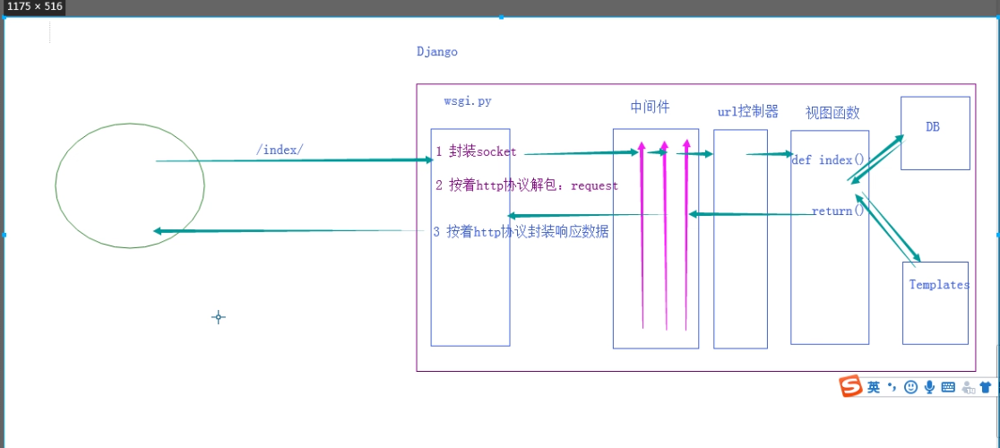

#### MVC 和 MTV

```js
mvc:
	- MVC 就是把web应用分为模型(M), 控制器(C), 视图(V), 
        模型:负责业务对象与数据库的对象(ORM), 视图负责与用户的交互(页面), 控制器(C)接收用户的输入调用模型和视图完成用户的请求.
        
     - MTV 就是把web应用分为模型(Model), 模板(Template), 视图(View)
	    Model(模型): 负责业务对象与数据库对象
        Template(模板): 负责如何把页面展示给用户
        View(视图): 负责业务逻辑, 并在适当的时候用Model 和 Template
        此外Django 还有一个url分发器, 他的作用是将一个个URL的页面请求分发给不同的view处理,view在调用想赢的Model和Template
        
        
        
        
        
        
        
        
        
        
        
        
        
        
        
        
        
        
        
        
        
        
```

#### contentype

#### model 表里面参数

```js
- on_delete : 级联删除
    on_delete=models.CASCADE 级联删除: 删了一个内容和他关联的也就没有了
    也就是当删除主表的数据时候从表中的数据也随着一起删除, 外键关联的表是主表
```

#### django 路由

```js
如果你不写'/' 浏览器会给你加上/, 但是请求就会变成get, 默认不让他加上
# 这句话是让浏览器给你不加/
# APPEND_SLASH = False
```

##### - 有名分组

```js
- 没有命名的正则表达式组(通过圆括号) 来捕获url 中的值并以位置参数传递给视图,
- 可以使用命名的正则表达式组来捕获url中的值并以关键字 参数传递给视图, 
    python 正则表达式中, 命名正则表达式组的语法(?P<name>pattern)
	name 是组的名字, pattern 是要匹配的模式


from django.urls import path,re_path

from app01 import views

urlpatterns = [
    re_path(r'^articles/2003/$', views.special_case_2003),
    re_path(r'^articles/(?P<year>[0-9]{4})/$', views.year_archive),
    re_path(r'^articles/(?P<year>[0-9]{4})/(?P<month>[0-9]{2})/$', views.month_archive),
    re_path(r'^articles/(?P<year>[0-9]{4})/(?P<month>[0-9]{2})/(?P<day>[0-9]{2})/$', views.article_detail),
]

# 这个实现与前面的示例完全相同，只有一个细微的差别：捕获的值作为关键字参数而不是位置参数传递给视图函数。例如：

'''
    /articles/2005/03/ 请求将调用views.month_archive(request, year='2005', month='03')函数，而不是views.month_archive(request, '2005', '03')。
    /articles/2003/03/03/ 请求将调用函数views.article_detail(request, year='2003', month='03', day='03')。

    '''
```


##### -  动态参数

```js
urls.py
	 re_path('customer/edit/(\d+)', views.EditCustomerView.as_view(),name="editcustomers"),
         
views.py
	return redirect(reverse('index'))	
	- 含有动态参数的时候:	如果aaa中含有动态参数,利用args传递 return redirect(reverse('aaa'),args=(1,2))

index.html
	<a href="">点击跳转</a>
	- 含有动态参数的时候: 如果index中有动态参数,空格,直接加 <a href="">点击跳转</a>	 
	
```

##### - 路由的分发

```js
from django.urls import path,re_path,include
from app01 import views

urlpatterns = [
   re_path(r'^admin/', admin.site.urls),
   re_path(r'^blog/', include('blog.urls')),  # 在对应app 下面建立urls
]

访问路由  blog/3 会进入到这个blog app 下

blog app 下的 urls.py
	urlpatterns = [
        path('', basic.SurveyIndexView.as_view()),
        re_path('(?P<pk>\d+)/',basic.SurveyDetailView.as_view)
        ]
```

##### - 名称空间

```js
命名空间（英语：Namespace）是表示标识符的可见范围。一个标识符可在多个命名空间中定义，它在不同命名空间中的含义是互不相干的。这样，在一个新的命名空间中可定义任何标识符，它们不会与任何已有的标识符发生冲突，因为已有的定义都处于其它命名空间中。

由于name没有作用域，Django在反解URL时，会在项目全局顺序搜索，当查找到第一个name指定URL时，立即返回
我们在开发项目时，会经常使用name属性反解出URL，当不小心在不同的app的urls中定义相同的name时，可能会导致URL反解错误，为了避免这种事情发生，引入了命名空间。

project的urls.py:
urlpatterns = [
    re_path(r'^admin/', admin.site.urls),
    re_path(r'^app01/', include("app01.urls",namespace="app01")),
    re_path(r'^app02/', include("app02.urls",namespace="app02")),
]
app01.urls:
urlpatterns = [
    re_path(r'^index/', index,name="index"),
]
app02.urls:
urlpatterns = [
    re_path(r'^index/', index,name="index"),
]
app01.views 
from django.core.urlresolvers import reverse

def index(request):

    return  HttpResponse(reverse("app01:index"))
app02.views
from django.core.urlresolvers import reverse

def index(request):

    return  HttpResponse(reverse("app02:index"))


```


#### http

#### drf

#### cookies 和 session

```js
cookie  : 针对每一个服务器在客户端浏览器上的key-vlaue结构
保存在客户端不太安全
```

```js
#设置cookie
def login(request):
	if user:
         obj = HttpResponse('ok')
		# 设置cookie
         obj.set_cookie('username',user,max_age = 3600*24)
		obj.set_cookie('is_login',True)
		return obj

# 获取cookie
def index(request):
	request.COOKIES.get('user_name')

#删除cookie
def logout(request):

    rep = redirect("/login/")

    rep.delete_cookie("user")
	
```


- session

- ```js
  服务器压力太大
  ```

- 

  

  ```js
  from django.contrib.auth.models import User
  def reg(request):
  	# 创建用户
  	User.object.create_user('')
  
  def login(request):
  	if user:
           # 设置session
           request.session['username'] = 'yuan'
  		return HttpResponse("ok")
  
  
  def index(request):
  	# 获取session
  	request.session.get()
  
  def loginout(request):
  	request.session.flush()
  ```

  ```js
  # request.session['username'] = yaun
  1. 生成一个随机字符串 454651cdicu
  2. 向django-session 表里面插入记录:
  session_key     session_data
  454651cdicu      {'username':yuan}
  3.响应set_cookie : {sessionid:454651cdicu}
  
  
  # request.session.get('username')
  1. request.COOKIE.get('sessionid')
  2. 在django_session 表里面过滤数据  session_key = 454651cdicu 的记录
  2. 在django_session 表里面拿出数据session_data反序列化字典
  
  ```

##### token

```js
token 是不进行存储的服务器, 时间换空间
token 私钥加密, 
```


#### 用户认证组件

- 使用django 自带的用户表auth_user  表

```js
from django.contrib import auth
# 数据库查询该用户是否存在 auth_user

def login(request):		
	user_obj = auth.authenticate(username='',password='')
    if user_obj:
        # 保存用户信息
        auth.login(request, user_obj)      //request.session['user_id'] = user_obj.pk
// 以后有一个request.user 就可以用了

def index(request):
	// request.user  默认匿名用户对象, 如果auth.login 后 就是当前登录人
	if request.user.is_authenticated:
    	return redirect(reverse('login'))

# 注销
def logout(request):
	auth.logout(request)
```


#### form

 

```js
  # IntegerField() 单纯存一个数字, 加了choice只能存1-13 这几个数,但是显示的时候可以显示后面的内容, 元组里面套的元组
     # 进行ModelForm 渲染的时候会渲染成select下拉菜单
     
     
      <th>性别</th>
	   
	  	<td>{{ customer.get_gender_display }}</td>
```


obj =UserInfo,objects.get(pk=1)

obj.name

\>>>yuan

obj.gender

\>>>1

obj.get_gender_display():

\>>>男

 

Form组件里: ChoiceFIeld渲染select表单控件,合格的从clean_data(里不会有没有效验的字段)中拿出来可以create_re进auth-user表里

有多少元组渲染多少option标签


#### contentype

```js
from django.db import models
from django.contrib.contenttypes.models import ContentType
from  django.contrib.contenttypes.fields import GenericForeignKey,GenericRelation
# content_type 表将app 名称与其中的表的关系进行保存
"""
    当一张表作为多个表的FK,并且只能选择其中一个或几个时,就可以使用content_type表
    例如上面的优惠券表,被食物和衣服当做FK,数据库表一旦建立就难以更改,如果以后需要增加
    电器等表并把优惠券作为FK表,这时就不能做到在优惠券表里面添加列字段,因此就可以使用content_type
    表 来将表与表中的对象进行关联,从而做到不增加列字段,因此就可以使用content_type 表来表与表中的对象进行个拉链
    从而做到不增加字段情况下增加FK
    在使用content_type表时,需要在FK表中增加concent_type 作为FK字段,并增加GenenricForeignKey
    便于优惠券建立,
"""
###########如果还多商品的话, 就需要改动表Coupon结构,增加外键关联


# 一个食物可以有多个优惠券
class Food(models.Model):
    name = models.CharField(max_length=32)
    coupons = GenericRelation("Coupon")

class Cloth(models.Model):
    name = models.CharField(max_length=32)
    coupons = GenericRelation("Coupon")

class Coupon(models.Model):

    name = models.CharField("活动名称",max_length=64)
    # 代表哪个app下的哪张表
    content_type = models.ForeignKey(ContentType,blank=True,null=True,on_delete=models.CASCADE)
    # 代表哪张表中的对象id
    object_id = models.PositiveIntegerField("绑定商品",blank=True,null=True)
    # 不会生成额外的列
    content_obj = GenericForeignKey("content_type","object_id")


 # 通过优惠券找商品的原价格
 Coupon.objects.get(name='考级立减券').content_obj.price


# 通过商品找优惠券
Foods.object.get(pk=1).coupons.all()


```


#### 跨域

#### 中间件

```js
# django 自带的中间件:
	session
    csrf
    auth 

class PermissionMideeleWare(MiddlewareMixin):	
        process_request
        process_reponse
        process_view
        process_exception

```


#### orm

```js
ORM : Object Relation Mapping(关系对象映射)


类名 ----> 数据库中的表名
类属性 ---->  对应库里面的字段
类实例对应 ---> 数据库表里面的一段记录


```


#### django 数据迁移

```js
同步数据库 db1 (注意：不是数据库名是db1,是settings.py中的那个db1，不过你可以使这两个名称相同，容易使用)

python manage.py migrate --database=db1
复制代码
数据导出

python manage.py dumpdata app1 --database=db1 > app1_fixture.json
python manage.py dumpdata app2 --database=db2 > app2_fixture.json
python manage.py dumpdata auth > auth_fixture.json
数据库导入

python manage.py loaddata app1_fixture.json --database=db1
python manage.py loaddata app2_fixture.json --database=db2
```


#### django 多数据库连用

```js
DATABASES = {
'default': {
'ENGINE': 'django.db.backends.sqlite3',
'NAME': os.path.join(BASE_DIR, 'db.sqlite3'),
},
'db1': {
'ENGINE': 'django.db.backends.mysql',
'NAME': 'dbname1',
'USER': 'your_db_user_name',
'PASSWORD': 'yourpassword',
"HOST": "localhost",
},
'db2': {
'ENGINE': 'django.db.backends.mysql',
'NAME': 'dbname2',
'USER': 'your_db_user_name',
'PASSWORD': 'yourpassword',
"HOST": "localhost",
},
}

use multi-database in django
add by WeizhongTu
DATABASE_ROUTERS = ['project_name.database_router.DatabaseAppsRouter']
DATABASE_APPS_MAPPING = {

example:
#'app_name':'database_name',
'app1': 'db1',
'app2': 'db2',
}
复制代码
在project_name文件夹中存放database_router.py内容如下：

复制代码


from django.conf import settings

DATABASE_MAPPING = settings.DATABASE_APPS_MAPPING

class DatabaseAppsRouter(object):

    def db_for_read(self, model, **hints):
        """"Point all read operations to the specific database."""
        if model._meta.app_label in DATABASE_MAPPING:
            return DATABASE_MAPPING[model._meta.app_label]
        return None

    def db_for_write(self, model, **hints):
        """Point all write operations to the specific database."""
        if model._meta.app_label in DATABASE_MAPPING:
            return DATABASE_MAPPING[model._meta.app_label]
        return None

    def allow_relation(self, obj1, obj2, **hints):
        """Allow any relation between apps that use the same database."""
        db_obj1 = DATABASE_MAPPING.get(obj1._meta.app_label)
        db_obj2 = DATABASE_MAPPING.get(obj2._meta.app_label)
        if db_obj1 and db_obj2:
            if db_obj1 == db_obj2:
                return True
            else:
                return False
        return None

    # for Django 1.4 - Django 1.6
    def allow_syncdb(self, db, model):
        """Make sure that apps only appear in the related database."""

        if db in DATABASE_MAPPING.values():
            return DATABASE_MAPPING.get(model._meta.app_label) == db
        elif model._meta.app_label in DATABASE_MAPPING:
            return False
        return None

    # Django 1.7 - Django 1.11
    def allow_migrate(self, db, app_label, model_name=None, **hints):
        print db, app_label, model_name, hints
        if db in DATABASE_MAPPING.values():
            return DATABASE_MAPPING.get(app_label) == db
        elif app_label in DATABASE_MAPPING:
            return False
        return None
复制代码
这样就实现了指定的 app 使用指定的数据库了,当然你也可以多个sqlite3一起使用，相当于可以给每个app都可以单独设置一个数据库！如果不设置或者没有设置的app就会自动使用默认的数据库。

回到顶部
使用指定的数据库来执行操作
在查询的语句后面用 using(dbname) 来指定要操作的数据库即可


# 查询
YourModel.objects.using('db1').all() 
或者 YourModel.objects.using('db2').all()

#保存 或 删除
user_obj.save(using='new_users')
user_obj.delete(using='legacy_users')

# 多个数据库连用时数据导入导出
# 使用的时候和一个数据库的区别是：

如果不是defalut(默认数据库）要在命令后边加 --database=数据库对应的settings.py中的名称 如： --database=db1 或 --database=db2


```

##### 

```js
SIMPLE_TAG

1、在APP下创建templatetags目录。必须 是templatetags

2、在templatetags目录下创建tag.py,任意名

3、在tag.py 中

from django import template

register=template.Libraty()

@register.simple_tag

def func(a1,a2,...):

　　这里写逻辑

　　return 逻辑返回的值

4、网页中调用顶部



缺点：不能作为IF条件

优点：参数可以无数个

FILTER

1、在APP下创建templatetags目录。必须 是templatetags

2、在templatetags目录下创建tag.py,任意名

3、在tag.py 中

from django import template

register=template.Libraty()

@register.filter

def func(a1,a2):

　　这里写逻辑

　　return 逻辑返回的值

4、网页中调用

顶部

{{ a1|func:"a2"}}

如果非要有多个

{{a1|func:"a2,a3"}}

缺点：只能有两个参数，优点：可以用于IF判断。
```

