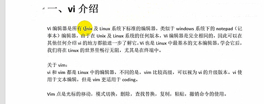

#### 虚拟机   安装centos 镜像  远程软件的安装

#### 1. 虚拟机  

https://blog.csdn.net/hui_2016/article/details/68927487

##### 设置ip 和 网关

https://blog.csdn.net/x_xiaodeng/article/details/80345505

##### 主机ping 不同虚拟机,但虚拟机能ping同主机,解决方案

Window - X打开网络连接,然后更改适配器选项

https://blog.csdn.net/qqxyy99/article/details/80864862#commentBox

#### 初始化服务器

```js
防火墙1: iptables  第三方 
防火墙2: selinux  系统自带的
(1) 关闭linux 的防火墙(就是一堆安全机制),如同保安的贴墙上的那些规则,共享单车进制入内
因为后期我们去学习软件，学习nginx  mysql  redis  ，为了学习的方便，关闭防火墙，允许所有的端口可以访问
(2) 
iptables -F  清空防火墙规则
systemctl stop firewalld		关闭防火墙服务
systemctl disable firewalld	     关闭防火自启动的服务
(3) 关闭selinux,此步骤需要重启linux 方可生效
vi /etc/selinux/config
找到
SELINUX=enforcing这一行
改成
SELINUX=disabled 

配置linux的ip地址的方法
1.选择上网的方式，可以选择2种，

桥接  
nat
2.选择了上网模式之后，可以通过命令管理网卡服务

systemctl stop network   停止网络服务
systemctl start network   开启网络服务

getenforce 查看防火墙状态

```


#### 基本命令

##### top:查看服务器的进程所占资源

```js
作用: 查看服务器的进程占的资源
退出命令: 按下q 退出
```

##### whoami 

```js
作用: 我是谁,显示当前登录的用户名,一般用于shell脚本
用于 获取当前用户的用户名方便记录日志
```

##### 管道

```js
管道符:|
作用: 管道一般可以用于过滤
语法:
	管道不能单独使用,必须配合前面所讲的一些指令来一起使用
(1)需要通过管道查询出根目录下包含“y”字母的文档名称
    [root@localhost ~]# ls /|grep y
(2) 请使用学过的命令,来统计某个目录下的文档的总个数
	[root@localhost ~]# ls /|wc -l

```

##### cal  

```js
作用: 用来操作日历的
cal 直接输出当前月份的日历
cal -3 表示输出上一个月+本月+下一个月的日历

```

##### wc

```js
作用:统计文件内容信息(包含行数, 单词数, 字节数)
wc -lwc 需要统计的文件路径
	-l : 表示lines   行数
    -w : 表示words   单词数,依照空格来判断单词数量
	-c : 表示bytes   字节 
```

##### 查看系列

```js
ls查看linux 文件夹
	
	ls 文件夹\文件
	ls -l  文件夹\文件 查看详细信息    
	ls -li  文件夹\文件  里面有索引节点号
	
查看linux 文件大小
	du -sh 查看文件夹大小的合计
	du -h 查看文件夹的大小

	
统计文件内容信息(包含行数, 单词数, 字节数)
	wc -lwc   需要统计的文件路径
	
	-l : 表示lines  行数
	-w : 表示单词
	-c : 表示字节
    
    
查看磁盘空间:
df -h 
```


##### 查看自己ip

```js
ip addr show
```

##### 创建普通用户

```js
useradd yuan  创建新用户yuan
passwd yuan   给yuan 改密码

普通用户的身份提示符$
root 用户是# 身份提示符
```


##### mkdir 

   Linux mkdir命令用于建立名称为 dirName 之子目录。

- 语法: mkdir [-p] dirName

- 参数说明:

  ​       -p  确保目录名称存在,不存在就建一个

- 实例:

  ```js
  (1)在工作目录下创建一个名为AAA 的子目录
      mkdir AAA
  (2)递归创建目录:
      // 在工作目录下的 BBB 目录中，建立一个名为 Test 的子目录。 若 BBB 目录原本不存在，则建立一个。（注：本例若不加 -p，且原本 BBB目录不存在，则产生错误。）
  [root@localhost /]# mkdir -p /AAA/hahha
  [root@localhost /]# tree /AAA
  /AAA
  └── hahha
  ```

##### scp 远程传输命令

```js
语法:
	scp 你想传的东西,传输到的地方
		scp 自己的文件, 给远程服务器(root@ip:/opt/)
	传输远程服务器的文件,到自己的本地
		scp root@ip:/文件 /opt/文件
```

##### ls 查看linux 文件夹大小的命令

```js
ls -h
du -h
du -sh  查看文件夹大小的合计
```

##### linux 查看时间

```js
date
yum install ntpdate
ntpdate -u ntp.aliyun.com
```

##### wget 下载资源命令

```js
yum install wget.x86_64
wget http://pythonnav.cn/av/girl2.gif
```

##### 文件上传到linux

```js
rz 
```


linux ls 命令是用于显示指定目录下的内容(列出目前所有工作目录所含的文件及及子目录)

- 语法: ls [-alrtAFR]  name

- 参数说明:

  -a 显示所有文件及目录(ls 内定将文件名或目录名称开头为"."的视为隐藏,不会列出)

  -l 除文件名称外,亦将文件型态,权限,拥有者.文件大小等咨询详细列出

  -r 将文件以相反次序显示

  -t 将文件依建立时间之先后次序列出

  -R 若目录下有文件,则以下之文件亦皆可列列出

  -d 查看目录

ls -la  

​	命令:参数-l  以列表形式显示

##### cd

```js
cd - 
    代表回到上一级目录,从哪来的回哪去
cd ~
    回到家目录
   useradd 创建新用户
   
```


改变目录的路径

```js
cd /etc/sysconfig/network-scripts/ifcfg-ens33
```

##### pwd

```js
打印当前工作路径
```

##### touch

```js
创建文件或更新文件的时间戳,如果文件不存在则创建文件,如果文件存在就改变文件到的访问时间,time等时间戳信息,
```

##### 绝对路径和相对路径

```js
绝对路径:从根/开始的路径
相对路径:不从跟开始的路径
./ 表示当前目录
../ 表示上一级目录

```

##### 为文件添加内容的oldboy.txt ,增加内容"i am studying"

```js
方式一:(麻烦)		
	(1)创建文件  touch	oldboy.txt
	(2)编辑文件  vi oldboy.txt      进入vi编辑器(默认命令模式),点击a或i进入编辑模式,敲入内容 i am studying
	(3)保存文件: 然后按esc键退出编辑模式(进入到命令模式),然后敲  	 :wq  解释write quit
	不保存    :q
	强制退出  :q!
方式二:  
	# echo 是一个打印输出内容的一个常用命令,配合 '>' 和">>"
	可以为文件覆盖及追加内容
    echo "haha"  所输及所得
    '>' 的意思是重定向,会清空文件文件里面的内容
    '>>'的意思内容追加只在文件末尾追加需要的内容
	(1) echo "i am studying" > oldboy.txt
		如果没有文件会创建一个文件并将引号里的内容放进去
        如果有文件会清空里面的内容
     (2) echo "i am studying" >> oldboy.txt 
		如果没有文件会创建一个文件并将引号里面的内容放进去
        如果有文件会在文件末尾将内容追加进去
     (3) 写脚本常用追加多行,内容放到文件结尾
		echo '1111
2222
3333' >> oldboy.txt
方式三:
	cat >oldboy.txt   清空oldboy.txt 里面的内容
    [root@localhost /]# cat >oldboy.txt<<EOF
     > hahaha
     > ahhah
     > EOF
// 用EOF包起来就不用按Ctrl +c 或d 停止输入,可以任意成对的但是不要和内容重复
```

##### 特殊符号

```js
> 或 1> 输出重定向:把前面输出的内容追加到文件后面,会清空原来的文件内容
>> 或 1>>  追加重定向:把追加内容放到文件后面,不会清空原来的内容

< 或 0<  输入重定向:用于改变命令的输入,后面指定输入内容,前面跟文件名
<< 或 0<< 追加输入重定向后面跟字符串,用来表示"输入结束",也可以用

2> 错误重定向:把错误信息输入到指定文件后面,会删除原来的内容
2>> 错误追加重定向:后面跟字符串

Ctrl + d 来结束输入
示例:
#  输出重定向输入内容和> 之间有空格
	[root@localhost ~]# echo 1 2 3 4 > oldboy.txt
	[root@localhost ~]# cat oldboy.txt 
#  
输入重定向:
echo 1 2 3 4 > oldboy.txt
		把 文件oldboy.txt里面的内容输入给前面的xargs处理 -n num(次数),
		表示在执行argument的个数,默认是用所有的
			xargs -n 2 < oldboy.txt
			输出:	//	1 2
					//	3 4
			xargs -n 1 < oldboy.txt
			输出:	// 	1
					//	2
					//	3
					//	4
	例2:
		发邮件:
			mail -s '邮件标题' 邮件地址 <邮件内容(文件)
			mail -s'oldboy training'  49000448--@qq.com </etc/hosts       
错误追加重定向
说明:箭头的指向就是数字流的指向
1.数字说明:
-  标准输入  :  代码为0,使用0<或0<< ,数据流向从右向左
-  标准正常输出: 代码为1,使用1>或1>>,数据流从左向右
-  标准错误输出: 代码为2,使用2> 或2>> 数据(错误数据从左向右)
-  2>&1 标准正常输出和错误输出一样,相当于跟屁虫,1放到哪,2就放到哪
在工作中，时常会把正确和错误的资讯都放在一起，该如何实现?
[root@localhost ~]# echo oldgirl 1>a.txt 2>&1
[root@localhost ~]# cat a.txt
oldgirl
[root@localhost ~]# ech oldgirl 1>a.txt 2>&1
# 如果不写2>&1 错误命令会直接输出在屏幕上
[root@localhost ~]# cat a.txt
bash: ech: 未找到命令...

实例：
[root@localhost /]# echo oldboy >a.txt 2>&1
[root@localhost /]# cat a.txt
oldboy
[root@localhost /]# ech oldboy >a.txt 2>&1 
[root@localhost /]# cat a.txt
bash: ech: 未找到命令...
[root@localhost /]# 
```

##### 查看磁盘空间

```js
df  查看磁盘空间
df -h  表示以可读性较高的形式展示文件 大小
```

查看内存使用情况

```js
free -m
```

查看目录文件的大小

```js
du -sh 目录路径
查看目录文件的大小
```


##### cat

cat 命令用于链接文件并打印到标准的输出设备上

- 语法:

  ```js
  cat [-AbeEnstTuv] [--help] [--version] fileName
  ```

- 参数说明

  ```js
  -n 或 --number：由 1 开始对所有输出的行数编号。
  -b 或 --number-nonblank：和 -n 相似，只不过对于空白行不编号。
  -s 或 --squeeze-blank：当遇到有连续两行以上的空白行，就代换为一行的空白行。
  -v 或 --show-nonprinting：使用 ^ 和 M- 符号，除了 LFD 和 TAB 之外。
  -E 或 --show-ends : 在每行结束处显示 $。
  -T 或 --show-tabs: 将 TAB 字符显示为 ^I。
  -A, --show-all：等价于 -vET。
  -e：等价于"-vE"选项；
  -t：等价于"-vT"选项；
  ```

- 实例

  ```js
  1.把 textfile1 的文档内容加上行号后输入 textfile2 这个文档里：
  [root@localhost /]# cat -n textfile1.txt>textfile2.txt
  // 如果textfile2 文件不存在会自己创建 
  2.把 textfile1 和 textfile2 的文档内容加上行号（空白行不加）之后将内容附加到 textfile3 文档里：
  [root@localhost /]# cat -b textfile1.txt textfile2.txt >>textfile3.txt
  [root@localhost /]# cat textfile3.txt
  
       1  haha
       2  haha
       3  hahah
       4  today
       5       1
       6       2  haha
       7       3  haha
       8       4  hahah
       9       5  today
  3.清空 /etc/test.txt 文档内容：
  [root@localhost /]# cat >textfile3.txt 
  ^C
  [root@localhost /]# cat textfile3.txt 
  ```

##### xargs  

从标注你输入内容创建和自信命令行  -n数字（分组里的内容个数） 

```js
[root@localhost /]# cat oldboy.txt|xargs -n 2
1 2
3 4
```

##### cp 

cp  复制文件或目录

- 语法:

  ```js
  cp [options] source dest  或
  cp [options] source... directory
  ```

- 参数说明

  ```js
  -a：此选项通常在复制目录时使用，它保留链接、文件属性，并复制目录下的所有内容。其作用等于dpR参数组合。
  -d：复制时保留链接。这里所说的链接相当于Windows系统中的快捷方式。
  -f：覆盖已经存在的目标文件而不给出提示。
  -i：与-f选项相反，在覆盖目标文件之前给出提示，要求用户确认是否覆盖，回答"y"时目标文件将被覆盖。
  -p：除复制文件的内容外，还把修改时间和访问权限也复制到新文件中。
  -r：若给出的源文件是一个目录文件，此时将复制该目录下所有的子目录和文件。
  -l：不复制文件，只是生成链接文件。
  # 注意：用户使用该指令复制目录时，必须使用参数"-r"或者"-R"。
  ```


```js
[root@localhost data]# cd /data/lxl.txt /tmp/
-bash: cd: /data/lxl.txt: 没有那个文件或目录
[root@localhost data]# touch /data/lxl.txt
[root@localhost data]# cp /data/lxl.txt /tmp/
```

- 绝对路径拷贝只能拷贝文件

- 如果文件存在就会问你是否覆盖，如果覆盖就y ，不覆盖就n

- 默认不能拷贝目录

  ```js
   cp -r /data  /tmp/
  	ls /tmp/
  	-r 叫递归拷贝:用于复制目录
  	用a也可以 相当于 -pdr   -p保持属性 ,连同档案的属性一起复制过去,而非使用默认属性
  	(走到卫生间身高体重都不变属性不变,如果体重少了属性就是变了)
  	cp -a /data  /tmp/mv
  ```

##### mv

用来为文件或目录改名 或文件或目录移入其他位置

- 语法:

  ```js
  mv [options] source dest
  mv [options] source... directory
  ```

- 参数说明:

  ```js
  -i 若指定目录已有同名文件,则先咨询是否覆盖旧文件
  -f 在mv操作要覆盖某已有的目标文件时不给任何提示
  ```

  | 命令格式          | 运行结果                                                 |
  | ----------------- | -------------------------------------------------------- |
  | mv 文件名  文件名 | 将源文件名改为目标文件名                                 |
  | mv 文件名 目录名  | 将文件移动到目标目录                                     |
  | mv 目录名 目录名  | ****目标目录存在,将源目录移动到目录;目标目录不存在则改名 |
  | mv 目录名 文件名  | 出错                                                     |

- 实例

  ```js
  1. 将文件aaa 更名 为 bbb
  mv aaa bbb
  2. 将info目录放入logs目录中。注意，如果logs目录不存在，则该命令将info改名为logs
  [root@localhost /]# mkdir info   
  [root@localhost /]# mv info /logs
  [root@localhost /]# cat info
  cat: info: 没有那个文件或目录
  [root@localhost /]# cat logs
  cat: logs: 是一个目录
  ```

  

```js
把/data 目录移动到/root下
mv /data /root/
```

##### uname 

```js
作用: 获取计算机操作系统的相关信息
语法1: uname   获取操作系统的类型
语法2: uname -a 表示获取全部的系统信息(类型,全部主机名,内核版本,发布时间,开源计划)
```

##### rm

用于删除一个文件或者目录

- 语法:

  ```js
  rm [options] name
  ```

- 参数

  ```js
  -i 删除前注意确认
  -f 即使原档案属性设置为读,亦直接删除,无需逐一确认
  -r 将目录及以下文档亦逐一删除
  # 删除当前目录下得所有文件及目录,并切都是直接删除,无需逐一确认命令行为
  rm -rf 要删除的文件名或目录
  ```

- 实例

  ```js
  # 删除文件可以直接使用rm命令，若删除目录则必须配合选项"-r"，例如：
  (1) 删除文件test.txt
  [root@localhost /]# rm test.txt
  rm：是否删除普通文件 "test.txt"？y
  (2) 删除homework 目录
  [root@localhost /]# mkdir homework
  [root@localhost /]# rm homework
  rm: 无法删除"homework": 是一个目录
  [root@localhost /]# rm -r homework
  rm：是否删除目录 "homework"？y
  ```

##### 创键文件的几种方式

```js
mv 移动文件或目录
echo 创键的事情文件
[root@localhost /]# echo >test.txt
touch 创键的是文件
```

##### * find

find命令用来指定目录下查找文件,任何位于参数之前的的字符串都将视为与查找的目录名.如果使用该命令时,不设置任何参数,则find 命令将会在当前目录下查找子目录与文件,并且将查找到的子目录和文件全部进行显示.

- 语法

  ```js
  find path -option [  -print] [ -exec -ok command] {} \;
  ```

- 参数说明

  ```js
  pathname :find 命令所查找的目录路径,例如用.来表示当前目录,用/ 来表示系统跟目录
  -print :find 命令将匹配的文件输出搭配标准输出
  -exec :find命令对匹配的文件执行该参数所给出的shell 命令,相应命令的形式为'command'{} \;注意{}和\ 之间的空格
  -ok :和-exec 的作用相同,只不过一一种更为安全的模式来执行改参数所给出的shell 命令,在执行每一个命令之前,都会给出提示,让用户来确定是否执行
  -mtime   -n +n                #按文件更改时间来查找文件，-n指n天以内，+n指n天以前
  -atime    -n +n               #按文件访问时间来查GIN: 0px">
  -ctime    -n +n              #按文件创建时间来查找文件，-n指n天以内，+n指n天以前
  -type    b/d/c/p/l/f         #查是块设备、目录、字符设备、管道、符号链接、普通文件
  -size      n[c]               #查长度为n块[或n字节]的文件
  ```

- 实例

  ```js
  (1) 将目前目录及其子目录下所有延伸档名是 c 的文件列出来
  [root@localhost /]# find . -name "*.txt" -print
  (2) 将目前目录及其下子目录中所有一般文件列出
  # find . -type f
  (3) 将目前目录及其子目录下所有最近 20 天内更新过的文件列出
  # find . -ctime -20
  (4) 为了查找系统中所有文件长度为0的普通文件，并列出它们的完整路径：
  # find / -type f -size 0 -exec ls -l {} \;
  // 重点
  (5)查找/log 文件,删除15天以前修改过的文件
  [root@localhost ~]# find . -type f -name "test.txt" -mtime +15|xargs rm -f
  // + 表示15天以前,-7最近七天
  (6)查找/log 目录删除修改日期在30天以前以oldboy名称结尾的目录
  [root@localhost ~]# find . -type f -name "*oldboy.txt" -mtime -30|xargs rm -rf
  // 递归创建目录
  [root@localhost ~]# mkdir -p /log/oldboy
  [root@localhost ~]# tree /log
  [root@localhost ~]# find /log -type d -name "*oldboy" -mtime -30|xargs rm -rf 
  ```

  ##### find  命令与rm 命令配合

  ```js
  [root@localhost tmp]# mv `find -type f -name "*.txt"` /data/
  ```


  生成多行文件:

  ```js
  [root@localhost data]# cat >lxl.txt<<EOF
  > haha
  > hahaha
  > EOF
  [root@localhost data]# cat lxl.txt
  haha
  hahaha
  ```

##### *grep

grep 命令用于查找文件里面符合内容的字符串

grep 指令 用于查找内容包含指定的范本样式的文件,如果发现某文件的内容符合所指定的样本范本样式,预设grep指令会把含有范本样式的那一列显示出来,若不指定任何文件名称,或是所给予的文件名为"-",则grep 指令从标准输入设备读取数据

- 语法:

  ```js
  grep [-abcEFGhHilLnqrsvVwxy][-A<显示列数>][-B<显示列数>][-C<显示列数>][-d<进行动作>][-e<范本样式>][-f<范本文件>][--help][范本样式][文件或目录...]
  ```

- 参数

  ```js
  -v 显示不包含匹配文本的所有行
  -r :此参数的效果和指定"-d recurse"参数相同
  -d :当指定要查找的目录而非文件的时,必须使用这项参数,否则grep 指令将回报信息并停止动作
  -V :显示版本信息
  
  ```

- 实例

  ```js
  (1) 在当前目录中,查找后缀有txt 字样的文件中包含test 字符串的文件,并打印出该字符串的行,此时,可以使用如下命令:
  [root@localhost data]# grep test *txt
  lxl.txt:test
  (2) 查找前缀有"test"的文件包含"haha"字符串的文件
  [root@localhost /]# grep haha text*
  textfile1:haha
  textfile1:haha
  textfile1:hahah
  textfile1.txt:haha
  textfile1.txt:haha
  textfile1.txt:hahah
  textfile2.txt:     2    haha
  textfile2.txt:     3    haha
  textfile2.txt:     4    hahah
  (3) 以递归的方式查找符合条件的文件,例如 ,查找指定目录/etc/acpi 及其子目录(如果存在子目录的话)下所有文件中包含字符串的"update"的文件,并打印出该字符串所在放的内容,使用命令为:
  [root@localhost /]# grep -r haha /data
  /data/lxl.txt:haha
  /data/lxl.txt:hahaha
  (4) 反向查找,前面各个例子是查找并打印符合条件的行,通过-v参数可以打印出不符合条件行的内容查找文件名中包含test的文件中不包含test的行,使用的命令为:
  [root@localhost /]# grep -v haha text*
  textfile1:
  textfile1:today
  textfile1.txt:
  textfile1.txt:today
  textfile2.txt:     1
  textfile2.txt:     5    today
  textfile3:
  (5) 过滤出/data/lxl.txt 文件里面不包含 haha的行
  [root@localhost /]# grep -r haha /data/lxl.txt
  haha
  hahaha
  [root@localhost /]# grep -r  -v haha /data/lxl.txt
  text
  test
  (6) 过滤出/data/lxl.txt 里面不包含haha 并标注行
  [root@localhost /]# grep -r -v haha /data/lxl.txt|cat -n
       1  text
       2  test
   
  ```

##### head ,tail

head用来显示档案的开头至标准输出中,默认head命令打印其相关文件的开头10行

tail默认显示文件的后十行

```js
tail -f  实时监控的命令
```


- 语法

```js
head [参数] [文件]
```

- 参数

  ```js
  -q 隐藏文件名
  -v 显示文件名
  -c (字节) 显示的字节数
  -n (行数) 显示的行数
  ```

- 实例

  ```js
  (1) 输出文件的前两行
  // 生成序列的命令
  [root@localhost /]# seq 20 >a.txt
  // 默认如果不加行号默认显示文件的前十行
  [root@localhost /]# head a.txt
  // 显示文件的前前两行
  [root@localhost /]# head -2 a.txt
  // 默认显示文件的后十行
  [root@localhost /]# tail a.txt
  // 显示文件的后两行
  [root@localhost /]# tail -2  a.txt
  ```


3.创建10000个文件夹


4.

#####  vi.


 


##### xargs


##### 目录

```js
~ : 表示home目录
'.':表示当前目录
"..": 表示目前目录位置的上一层目录
根目录: / 指的最上成目录
家目录: 一般普通用户,家目录是/home/用户名
	  root 用户的家目录/root/
```

##### tree

```js
yum install tree -y
// 报错
File "/usr/bin/yum", line 30
except KeyboardInterrupt, e:
^
SyntaxError: invalid syntax
 python2 --version
 python --version
 
 # 解决方案
 vim /usr/bin/yum
// 改成python2
 #!/usr/bin/python2
 
 // 继续报错
 SyntaxError: invalid syntax
File "/usr/libexec/urlgrabber-ext-down", line 28
except OSError, e:
^
SyntaxError: invalid syntax

# 解决方案
vim /usr/libexec/urlgrabber-ext-down

成功:
已安装:tree.x86_64 0:1.6.0-10.el7
```

##### linux 系统不提示覆盖(root权限下)

```js
(1) 已知 /tmp目录下的存在test.txt 文件,如何执行命令才能把/data/test.txt 拷贝到 /tmp下覆盖掉/tmp/test.txt,二linux系统不提示是否覆盖
// 方式一
[root@localhost data]# /bin/cp /data/test.txt /tmp/test.txt
// 方式二
[root@localhost data]# \cp /data/test.txt /tmp/
// cp 命令默认是不会提示overwrite,但是cp 的 -i 选项会提示,二一般的linux 的用户环境文件 `/.bashrc 中会把cp 命名成alias cp="cp -i"
这样在linux 下输入cp命令实际上运行的是cp -i,加上一个"\" 符号或者写cp 全路径/bin.cp 就是懒此次cp命令 不适用别名(cp -i) 运行
```

##### 别名概念

- 作用:

  ```js
  (1) 通过给危险命令加一些参数,防止人为误操作
  (2) 把很多复杂的字符串或命令变成一个简单的命令
  ```

- 实例

```js
(1) 输入别名alias 查找当前别名
    [root@localhost /]# alias
    alias cp='cp -i'
    alias egrep='egrep --color=auto'
    alias fgrep='fgrep --color=auto'
    alias grep='grep --color=auto'
    alias l.='ls -d .* --color=auto'
    alias ll='ls -l --color=auto'
    alias ls='ls --color=auto'
    alias mv='mv -i'
    alias rm='rm -i'
    alias which='alias | /usr/bin/which --tty-only --read-alias --show-dot --show-tilde'
    // 也可以grep 过滤出指定的别名
    [root@localhost /]# alias |grep cp
    alias cp='cp -i'
(2) 取消别名设置 :unalias(临时生效,重启生效)
	[root@localhost /]# unlias cp
(3) 添加设置别名
	[root@localhost /]# alias cp="cp -i"
(4)  自定义别名oldboy
	// 记住不能有空格
	[root@localhost /]#  alias oldboy="echo I am oldboy linux" 
(5) 要想文件设置的文件永久生效,需要设置到环境变量里面
	即:   vi /root/.bashrc  -----> 这样才能永久生效
```

##### 删除一个目录下的所有文件.但是留下某一个指定的

```js
// 方式一
[root@localhost data]# find -type f ! -name "lxl.txt"|xargs rm -f
// 方式二
不要企图使用grep grep 是过滤文件里面是否含有某个字符串的
[root@localhost data]# rm -f `find -type f ! -name "lxl.txt"`
```

##### *查看文件ett.txt(100行)内,第20到第30行内容

```js
(1) 方式一
	head -30 ett.txt|tail -11
(2) 方式二
    # sed stream editor (流编辑器,实现整个文档的增删改查替换)
    sed -n '20,30'p ett.txt
(3) 方式三
	awk "NR>19&&NR<31" ett.txt
(4) 方式四
    grep 20 -A 10 ett.txt
(5) 方式五
    grep 25 -C 5 ett.txt
(6) 方式六
    grep 30 -B 10  ett.txt 
```

```js
-B :除了显示文本匹配的一行之外,并显示该行之前的前n行
-A :除了显示文本匹配的一行之外,并显示该行之后的n行
-C :除了显示文本匹配的一行外还显示该换了个之后的前n行和后n行
```

##### awk 简单使用

```
(1) 拿出文件的某几行,或某一行
	awk "NR>19&&NR<31" ett.txt
```

##### 把/oldboy目录及其子目录的所有扩展名.sh结尾的文件中包含oldboy的字符串全部替换成oldgirl

#### centos7关闭防火墙遇到错误

```js
因为python2 和 python3 共存,所以查看状态的时候有问题:

解决方法:

vim /usr/bin/firewall-cmd
#!/usr/bin/python2 -Es

查看当前防火墙状态:firewall-cmd --state

not running

禁止开机键自启动  systemct1 disable firewalld.service

 

一、.对于centos7自带的防火墙的相关指令 
systemctl stop firewalld.service #停止firewall 
systemctl disable firewalld.service #禁止firewall开机启动 
systemctl status firewalld.service #查看firewall的状态

二、iptables防火墙的相关状态 
关闭虚拟机防火墙： 
关闭命令： service iptables stop 
永久关闭防火墙：chkconfig iptables off 
两个命令同时运行，运行完成后查看防火墙关闭状态 
service iptables status 
1 关闭防火墙—–service iptables stop 
2 启动防火墙—–service iptables start 
3 重启防火墙—–service iptables restart 
4 查看防火墙状态–service iptables status 
5 永久关闭防火墙–chkconfig iptables off 
6 永久关闭后启用–chkconfig iptables on
```


#### 系统优化


默认enforcing   开启

permissive  打印警告但是不开起

disablied 彻底关掉

 

 

 

 

 

 

 

 

 

 

 

 

 

 

[](javascript:void(0);)

```
[root@localhost ~]# sed 's#SELINUX=enforcing#SELINUX=disabled#g' /etc/selinux/config

# This file controls the state of SELinux on the system.
# SELINUX= can take one of these three values:
#     enforcing - SELinux security policy is enforced.
#     permissive - SELinux prints warnings instead of enforcing.
#     disabled - No SELinux policy is loaded.
SELINUX=disabled
# SELINUXTYPE= can take one of three two values:
#     targeted - Targeted processes are protected,
#     minimum - Modification of targeted policy. Only selected processes are protected. 
#     mls - Multi Level Security protection.
SELINUXTYPE=targeted 


[root@localhost ~]# cat /etc/selinux/config

# This file controls the state of SELinux on the system.
# SELINUX= can take one of these three values:
#     enforcing - SELinux security policy is enforced.
#     permissive - SELinux prints warnings instead of enforcing.
#     disabled - No SELinux policy is loaded.
SELINUX=enforcing
# SELINUXTYPE= can take one of three two values:
#     targeted - Targeted processes are protected,
#     minimum - Modification of targeted policy. Only selected processes are protected. 
#     mls - Multi Level Security protection.
SELINUXTYPE=targeted 


[root@localhost ~]# cp /etc/selinux/config /etc/selinux/config.ori[root@localhost ~]# sed -i 's#SELINUX=enforcing#SELINUX=disabled#g' /etc/selinux/config 
[root@localhost ~]# grep "SELINUX=disabled" /etc/selinux/config
SELINUX=disabled
```

[](javascript:void(0);)

 

 

因为linux服务器不可以重新启动,因为一启动就无法提供服务,所以,需要别的命令,setenforce 重启之前是permissive  (不管)

重启之后是disabled 为了不重启

[](javascript:void(0);)

```
[root@localhost ~]# getenforce    #查看selinux的状态
Enforcing
[root@localhost ~]# setenforce 0    #用setenforence 

[root@localhost ~]# getenforce  
Permissive
[root@localhost ~]# 
```

[;)


 

**一、Linux的运行级别：**

 **cat /etc/inittab**

Linux下的7个运行级别：

```
0:系统停机状态，系统默认运行级别不能设置为0，否则不能正常启动，机器关闭。
1:单用户工作状态，root权限，用于系统维护，禁止远程登陆，就像Windows下的安全模式登录。
2:多用户状态，没有NFS支持。
3:完整的多用户模式，有NFS，登陆后进入控制台命令行模式。
4:系统未使用，保留一般不用，在一些特殊情况下可以用它来做一些事情。例如在笔记本电脑的电池用尽时，可以切换到这个模式来做一些设置。
5:X11控制台，登陆后进入图形GUI模式，XWindow系统。
6:系统正常关闭并重启，默认运行级别不能设为6，否则不能正常启动。运行init6机器就会重启
```

 

标准的Linux运行级别为3或5，如果是3的话，系统就在多用户状态；如果是5的话，则是运行着XWindow系统。不同的运行级别有不同的用处，也应该根据自己的不同情形来设置。例如，如果丢失了root口令，那么可以让机器启动进入单用户状态来设置。在启动后的lilo提示符下输入：
init=/bin/shrw

这样就可以使机器进入运行级别1，并把root文件系统挂为读写。它会路过所有系统认证，让你使用passwd程序来改变root口令，然后启动到一个新的运行级

 

 

 linux 系统从开机到登录之前启动的流程:

 　　shutdown    halt              init  0 三个关机命令关机 

　　shutdown -h now 关机

　　reboot              init 6                shutdown -r 三个个重启命令


#### 快照

快照:  比喻;假设你把你的人生做了一个快照

1

2

10

18

20

在10-18 岁之间都没过好,可以回到10 岁重来,事先做好快照


 

 

 

#### vim 编辑器

##### 1. vi介绍



##### 2 vim三种模式

vim 中存在三种模式:

​	命令模式:	'

​	

```js
1. 移动光标
在该模式下是不能对文件直接编辑,可以输入快捷键进行一字儿操作(删除行,复制行,移动光标,粘贴等等);# 打开之后自动进入模式
(1) 光标移动到行首
	按键:shift + 6(T 字母上面的,不要按小键盘的)
(2) 将光标一定到行尾
    按键 :shift + 4
(3) 光标移动到首行
    按键: gg 
(4) 光标移动到末行
    按键:G
(5) 翻屏
    上翻屏:按键ctrl + b (before) 
	下翻屏:ctrl + f (after)

(6)将光标移动到指定行
    按键:数字 G
    
(7) 以当前光标为准向上/向下移动n行
    按键: 数字 向上  数字 向下 
(8) 以当前光标为准向左/向右移动n字符
	按键: 数字 向左   数字 向右
2.复制操作
 (1) 复制光标所在行
	 按键:yy
     粘贴: 在想要粘贴的地方按一下p 键
 (2) 以光标所在行为准,向下复制指定的行数
	按键:数字yy  包含当前行
     粘贴:p
  (3)可视化的复制
     ctrl v,然后按下 下 左 右 选择需要复制的区块
3.剪切/删除
	(1) 剪切删除光标所在行  dd
4. 撤销  输入:u 


5. 末行模式
	:w 路径  另存为
    :!ls (另存为但是查看还不想退出文件,所以:!ls)
	
	# 搜索,查找,替换
    /root   在搜索结果中切换上/下一个结果:N/n  (next)
	
	# 替换
    // 只替换光标所在行的第一处符合条件的内容
    :s  string replace
    :s/ 搜索的关键词/新的内容

	// 替换光标所在行的全部符合条件的内容
	:s/搜索的关键词/新的内容/g

	// 替换整个文档中每行第一个符合条件的内容
	:%s/搜索关键词/新的内容
	
	// 替换整个文档中的符合条件的内容
	:%s/搜索关键词/新的内容/g

	% 表示整个文件
	g 表示全局(global)
	
	# 显示行号
    :set nu
    
    # 代码着色
    案例:首先创建简单的c 语言程序
    #include <stdio.h>
	void main(){
        printf("hello world!\n")
	}
	
	如何控制代码着色与显示 		syntax语法
    显示:":syntax on"
	关闭显示: ":syntax off"
  匹配括号另一半  %   
```

##### vim 中计算器的使用

```js
但我们在编辑文件的时候突然	需要使用计算器去计算一些公式,则此时需要用到计算器,但是需要退出,vim 自身集成了一个计算器
a .进入编辑模式
b .按下按键"ctrl + R"
```


编辑模式

```js
可以在该模式下对文件内容进行编辑
```

​	末行模式

```js
可以在末行输入命令来对文件进行操作,(搜索,替换,保存,退出,撤销,高亮)
```

Vim 打开文件的方式(4种)

```js 
(1)  vim  文件路径        作用:打开指定文件
(2)  vim +数字 文件路径    作用: 打开文件,并将光标移动到指定行
(3)  vim +/关键词 文件路径  作用: 钓凯子指定文件,并且高亮内容

取消高亮:
	末行模式:  则需要输入":nohl"   no hightlight
(4)	 vim  文件路径1 文件路径2 文件路径3  作用: 同时打开多个文件
```

重点:

​	先去复制出一个/etc/passwd  文件.复制当前价目录下

​	以后的一切相关操作都是基于/root/passwd 文件进行操作

##### 3.命令模式

```js
注意:打开文件的第一个看到的模式(打开文件即可进入)

```


##### 4.编辑模式

##### 5.末行模式


#### 重要子目录说明

```js
/etc/motd 常用于通告信息，如计划关机时间的警告等，登陆后的提示信息
开机可以设置 Welcome
```


目录特点:

1   /根是所有目录的顶点

 \2. 目录:像一颗倒挂的树,

\3. 目录和磁盘分区是没有关联的,

4.不同的目录跟下可能会对应不同的分区的分区或磁盘

5. 以.开头的默认隐藏文件

linux 里 设备不挂载相当于煤油窗户的监狱

如果希望这个设备被访问就必须给这个设备一个入口


##### 网卡配置文件

```js
cat /etc/sysconfig/network-scripts/ifcfg-ens33
```


```js
TYPE=Ethernet        # 网络类型为:Ethernet 即为以太网
PROXY_METHOD=none
BROWSER_ONLY=no
BOOTPROTO=static  #设置为none表示不使用协议，设置为static启用静态IP地址，设置为dhcp开启DHCP协议自动获取ip 设置为bootp开启bootp协议
DEFROUTE=yes
IPV4_FAILURE_FATAL=no
IPV6INIT=yes
IPV6_AUTOCONF=yes
IPV6_DEFROUTE=yes
IPV6_FAILURE_FATAL=no
IPV6_ADDR_GEN_MODE=stable-privacy
NAME=ens33
UUID=a48050f8-043f-41c6-b232-87c532cccbf8  #网卡的唯一标识
DEVICE=ens33        #哪张网卡
ONBOOT=yes         # 控制网卡是不是开机自启动 
IPADDR0=192.168.21.128   # 表示付给该网卡的ip地址
PREFIXO0=24              # 端口
GATEWAY0=192.168.21.2    # 表示默认网关 GATEWAY 表示网关地址,路由器的地址
DNS1=8.8.8.8            # 
DNS2=8.8.4.4     
:wq
```

```JS
DNS: 域名解析服务,因为ip地址不好记,把域名解析成ip
www.baidu.com
```

```js
编辑文件之前请备份
cp ifcfg-ens33 ifcfg-ens33.ori
```

```js
# 编辑网卡文件
cd /etc/sysconfig/network-scripts/
# 备份文件
cp ifcfg-ens33 ifcfg-ens33.ori
# 编辑文件
vim ifcfg-eth0 
```

##### 设置linux本地的客户端DNS的配置文件


```js
cat /etc/resolv.conf
```


```js
该文件是Linux中的DNS域名解析的配置文件，它的格式很简单，每行以一个关键字开头，后接配置参数。

resolv.conf的关键字主要有四个，分别是：
nameserver #定义DNS服务器的IP地址 
domain #定义本地域名 
search #定义域名的搜索列表 
sortlist #对返回的域名进行排序

详解：
nameserver　表明DNS服务器的IP地址。可以有很多行的nameserver，每一个带一个IP地址。在查询时就按nameserver在本文件中的顺序进行，且只有当第一个nameserver没有反应时才查询下面的nameserver。

domain　 这个用来指定本地的域名，在没有设置search的情况下，search默认为domain的值。这个值可以随便配，目前在我看来，domain除了当search的默认值外，没有其它用途。也就说一旦配置search，那domain就没用了。

search　　　该选项可以用来指定多个域名，中间用空格或tab键隔开。它是干嘛的呢？ 
如：在没有配置该选项时，执行 
ping news 
ping: unknown host news 
配置search google.com baidu.com后，再执行 
ping news 
PING news.google.com (74.125.128.101) 56(84) bytes of data. 
64 bytes from hg-in-f101.1e100.net (74.125.128.101): icmp_req=1 ttl=47 time=78.9 ms 
64 bytes from hg-in-f101.1e100.net (74.125.128.101): icmp_req=2 ttl=47 time=63.6 ms

   它就去ping news.google.com了。原来当访问的域名不能被DNS解析时，resolver会将该域名加上search指定的参数，重新请求DNS，直到被正确解析或试完search指定的列表为止。
   由于news不能被DNS解析，所以去尝试news.google.com，被正常解析。如果没有被解析还会去尝试news.baidu.com。
1
2
sortlist　　 允许将得到域名结果进行特定的排序。它的参数为网络/掩码对，允许任意的排列顺序。
```


##### 设置用户ip与名字(或域名的)对应解析表,相当于本地的LAN局域网类的DNs


##### /etc/sysconfig/network 修改主机名


##### /etc/fstab/   实现开机要要挂载的文件系统的一个文件


##### 存放开机自启动程序命令的文件


#### 考试题

1. 创建目录/data/oldboy,  并且在改目录下创建文件oldboy.txt,  然后在文件oldboy.txt里写入内容"inet addr:10.0.0.255   Mask:255.255.255.0"(不包含引号)

   ```js
   # 创建目录
   [root@localhost /]# mkdir -p /data/oldboy
   # 在目录下创建文件oldboy.txt
    touch /data/oldboy/oldboy.txt
   # 在目录下插入内容  获取
    ifconfig|sed -n "2p"
    
    
   ```

```js
延伸
 6、利用sed 取出ifconfig命令中本机的IPv4地址
 ifconfig|sed -n "2p"
// 打印第二行,
```

2.

```js
# 每行按空格或TAB分割，输出文本中的2、4、6项
[root@localhost oldboy]# awk '{print $2 $4 $6}' oldboy.txt
192.168.21.128255.255.255.0192.168.21.255
```

```js
如果有多个分隔符
awk -F "[ :]+" '{print $3$5$7}' oldboy.txt 
 awk -F " " '{print $2" 输入什么输出什么,所写及所得 "$4"  "$6}' oldboy.tx
```


```js
[root@localhost ~]# mv /data/oldboy /tmp
[root@localhost ~]# cp /etc/passwd /tmp/oldboy
```


```js
[root@localhost ~]# cd /tmp/oldboy
[root@localhost oldboy]# awk 'NR>9 && NR<21' passwd
// 标有行号的,输出从第九行到第二十一行
[root@localhost oldboy]# awk 'NR>9 && NR<21' passwd |cat -n
//awk 后面-F空格参数空格
[root@localhost oldboy]# awk -F ":" 'NR>9 && NR<21{print $3}' passwd|cat -n
// 文件如果不存在就会自己建一个
[root@localhost oldboy]# awk -F ":" 'NR>9 && NR<21{print $3}' passwd>test.txt
```


#### linux 自有服务

##### 设置主机名


```js
hostname   查看主机名
hostname -f   FQDN(全限定域名)
(1) 临时的设置主机名(立竿见影)
	hostname 设置的主机名
    不需要重启,但是需要切换用户
    [root@localhost ~]# hostname  yunwie
    [root@localhost ~]# su
    [root@yunwie ~]# 
(2) 永久设置主机名
	# 主机名的配置文件
	/etc/sysconfig/network
	修改其中的hostname  为自己想要的永久主机名
(3)  修改Linux 的 host文件,将运维指向本地(设置FQDN)
	/etc/hosts

    127.0.0.1   localhost localhost.localdomain localhost4 localhost4.localdomain4 yunwei
::1         localhost localhost.localdomain localhost6 localhost6.localdomain6
```


##### chkconfig

```js
作用: 相当于windows 下的"安全卫士" ."电脑管家"之类的安全辅助工具提供"开机启动项" 的一个管理服务

在linux 下不是所有的软件安装完成之后都有开机启动服务,有的可能需要自己去添加,除此之外,还可以查看 和删除
(1) 开机启动服务查询

```


##### ntp 服务

##### 防火墙

##### rpm 管理

##### cron 计划任务


```js
[root@localhost /]# free -m
# 查看内存
```


#### 权限


1. 权限定义

   ```js
   在多用户(可以不同时)计算系统的管理中,权限是值某个特定的用户具有特定的系统资源使用权力,像是文件夹.特定系统指令的使用或存储量限制
   ```

   ```js
   读权限:
   	对于文件夹来说,读权限影响用户是否能够列出目录结构
   	对于文件夹来说,读权限影响用户是否可以查看文件内容
   写权限:
   	对文件夹来说,写权限影响用户是否可以在文件夹下'创建/删除/复制/移动到' 文档
       对于文件来说,写权限影响用户是否可以编辑文件内容
   执行权限:
   	一般都是对于文件夹来说的,特别是脚本文件
   ```

2. 身份介绍


   

   

   ```js
   Owner 身份 (文件所有者,默认为文档的创建者)
   	由于Linux是多用户、多任务的操作系统，因此可能常常有多人同时在某台主机上工作，但每个人均可在主机上设置文件的权限，让其成为个人的“私密文件”，即个人所有者。因为设置了适当的文件权限，除本人（文件所有者）之外的用户无法查看文件内容
   
   Group 身份(与文件所有者同组的用户)
   	最有用的功能就是 体现在 多个团队在同一台主机上开发资源的时候.
       与文件所有者同组最有用的功能就体现在多个团队在同一台主机上开发资源的时候。例如主机上有A、B两个团体，A中有a1,a2,a3三个成员，B中有b1,b2两个成员，这两个团体要共同完成一份报告F。由于设置了适当的权限，A、B团体中的成员都能互相修改对方的数据，但是团体C的成员则不能修改F的内容，甚至连查看的权限都没有。同时，团体的成员也能设置自己的私密文件，让团队的其它成员也读取不了文件数据。在Linux中，每个账户支持多个用户组。如用户a1、b1即可属于A用户组，也能属于B用户组【主组和附加组】。
   
   Others 身份(其他ren,相对于所有者)
   	这个是个相对概念。打个比方，大明、二明、小明一家三兄弟住在一间房，房产证上的登记者是大明（owner所有者），那么，大明一家就是一个用户组，这个组有大明、二明、小明三个成员；另外有个人叫张三，和他们三没有关系，那么这个张三就是其他人了。
   同时，大明、二明、小明有各自的房间，三者虽然能自由进出各自的房间，但是小明不能让大明看到自己的情书、日记等，这就是文件所有者（用户）的意义。
   
   root用户(超级用户)
   	在Linux中，还有一个神一样存在的用户，这就是root用户，因为在所有用户中它拥有最大的权限 ，所以管理着普通用户。
   ```

   


   

   


   ```js
   LANG = en
   ```


   ```js
   read 读 4
   write 写 2
   x 执行 1
   -没有权限 0
   ```

   ```js
   usermod -G 组名 账号
   ```


分    时    日     月    周

where rm

/usr/bin rm -rf /tmp/*    删除tmp  下的文件

 分 时 日 月 周


linux 软件包管理:

window ;

​	1.exe 可执行安装文件

​	2.msi   

linux:

```js
1.源码包格式:
	1下载源码包
    2.解压
    3.编译且安装
    4. 配置环境变量
    5.使用python3
    
2.rpm 二进制
	1.下载软件rpm格式包
    2.rmp -ivh lrzsz.rmp
	3. 使用lrzsz
    
    补充:
如果直接安装mysql需要手动解决依赖关系不建议使用
3.yum install 
默认去从centos下载

软件开发目录规范:
lib 库文件
log 日志文件
core 核心文件
readme  
conf 配置文件
```

```js
yum 源路径:[root@localhost ~]# cd /etc/yum.repos.d/

配置国内的yum 源
定制自己的repo 仓库
 我们自己没有用ali
         https://opsx.alibaba.com/mirror
         
         
          # wget -O /etc/yum.repos.d/CentOS-Base.repo http://mirrors.aliyun.com/repo/Centos-7.repo
        -o 参数指定放到哪个目录,且改名
         
         清除缓存yum
         # yum clean all
         
         省城新的
         # yum makecache
         
         
         epl 里面其他的mysql
         wget -O /etc/yum.repos.d/epel.repo http://mirrors.aliyun.com/repo/epel-7.repo
```


#### 链接


##### 硬链接


```js
查看硬链接的索引节点号
[root@localhost oldboy]# ls -hil a b
51967692 -rw-r--r--. 2 root root 2 12月 27 23:36 a
51967692 -rw-r--r--. 2 root root 2 12月 27 23:36 b
```

```js
[root@localhost oldboy]# ln /etc/hosts /tmp/oldboy.hosts
[root@localhost oldboy]# rm -f /etc/hosts
[root@localhost oldboy]# cat /tmp/oldboy.hosts>>/etc/hosts
[root@localhost oldboy]# cat /etc/hosts
127.0.0.1   localhost localhost.localdomain localhost4 localhost4.localdomain4
::1         localhost localhost.localdomain localhost6 localhost6.localdomain6
[root@localhost oldboy]# 
```

##### 软链接(相当于window 里的快捷方式)


```js
[root@localhost oldboy]# ls -hil soft_file file
50333184 -rw-r--r-- 1 root root 0 12月 27 23:55 file
50333186 lrwxrwxrwx 1 root root 4 12月 27 23:56 soft_file -> file
-i 可以查看文件饿inode 节点信息

第一列:  inode  索引节点编号(人的身份证,全国唯一):
	系统读取文件时首先 通过文件名找到inode, 然后才能读取到文件内容
第二列:
	文件类型及权限(共10 个字符,第一个字符为类型,后9个字符为文件权限)

```


```js

```


```js
[root@localhost oldboy]# mkdir /application/apahche2.2.17 -p
[root@localhost oldboy]# ls -ld /application/apahche2.2.17/
drwxr-xr-x 2 root root 6 12月 28 00:06 /application/apahche2.2.17/
[root@localhost oldboy]# ln -s /application/apahche2.2.17/ /application/apache
[root@localhost oldboy]# ls -ld /application/apache/
drwxr-xr-x 2 root root 6 12月 28 00:06 /application/apache/
[root@localhost oldboy]# ls -ld /application/apache
lrwxrwxrwx 1 root root 27 12月 28 00:08 /application/apache -> /application/apahche2.2.17/
[root@localhost oldboy]# mkdir /application/apahche2.2.17/haha.txt
[root@localhost oldboy]# ls -ld /application/apache
lrwxrwxrwx 1 root root 27 12月 28 00:08 /application/apache -> /application/apahche2.2.17/
[root@localhost oldboy]# ls /application/apache
haha.txt


# apche 升级
```


```js
安装软件最小化, 目录文件权限最小化,用户权限最小化,程序运行权限最小化
```


#### 安装python3

1.编译安装python3

(1) 下载python3 的 源码

cd /opt 

​	wget https://www.python.org/ftp/python/3.6.2/Python-3.6.2.tgz

 1. 安装python3 之前,解决环境依赖

    ```js
    	yum install gcc patch libffi-devel python-devel  zlib-devel bzip2-devel openssl-devel ncurses-devel sqlite-devel readline-devel tk-devel gdbm-devel db4-devel libpcap-devel xz-devel -y
    ```

    2.解压缩文件

    ```js
    1.下载好python3源码包之后 Python-3.6.2.tgz
    2.解压缩、
    		tar命令可以解压缩 tgz格式
    		tar -xvf  Python-3.6.2.tgz
    3.切换源码包目录
    		cd Python-3.6.2.tgz
    4.编译且安装
    		(1).释放编译文件makefile，这makefile就是用来编译且安装的
    			./configure --prefix=/opt/python36/
    				--prefix  指定软件的安装路径
             (2)开始编译python3
    			make
    		(3).编译且安装  (只有在这一步，才会生成/opt/python36)
    			make install
                
      	4.配置python3.6的环境变量
    			1.配置软连接
    			2.配置path环境变量 (二选一即可)
    			echo $PATH查看环境变量
    			/usr/local/sbin:/usr/local/bin:/usr/sbin:/usr/bin:/root/bin
    			#这个变量赋值操作，只是临时生效，需要写入到文件，永久生效
    			PATH=/usr/local/sbin:/usr/local/bin:/usr/sbin:/usr/bin:/root/bin:/opt/python36/bin
    			#linux有一个全局个人配置文件
    			编辑这个文件，在最底行写入PATH
    			vim /etc/profile 
    			写入
    			PATH=/usr/local/sbin:/usr/local/bin:/usr/sbin:/usr/bin:/root/bin:/opt/python36/bin
    			保存退出
    			
    			读一下这个/etc/profile 使得生效
    			source /etc/profile
    
    5.测试linux安装一个django，
    	pip3 install django 
    6.创建django项目
    	django-admin startproject mysite 
    7.创建django的APP应用
    	django-admin startapp   app01 
    
    8.编写视图函数，测试一个index视图
    
    9.注意修改settings.py的allow_hosts，windows方可访问linux的django项目
    ```


    #### python 的虚拟环境

```js
virtualenv 就是一个虚拟解释器
就是基于物理环境下的python解释器，虚拟/分身 出的 多个解释器 


安装virtualevn

1.下载virtualenv工具
通过物理环境的pip工具安装
pip3 install -i https://pypi.tuna.tsinghua.edu.cn/simple virtualenv
安装完成后你的linux就多了一个virtualenv命令
2.创建虚拟环境venv1  venv2 

virtualenv --no-site-packages --python=python3   s15venv1
调用虚拟环境的命令 
--no-site-packages  这是构建干净，隔离的模块的参数 
--python=python3			这个参数是指定虚拟环境以哪一个物理解释器为基础的
最后一个是虚拟环境的名字  会创建这么一个文件夹
3.进入虚拟环境目录，激活虚拟环境
	找到你的虚拟环境目录bin地下的activate文件
	source myenv/s15venv1/bin/activate
	-
	激活虚拟环境，原理就是修改了PATH变量，path是有顺序执行的
	echo $PATH 检查环境变量
	which python3 
	which  pip3  检查虚拟环境是否正常
	
4.测试安装2个虚拟环境，venv1,venv2，并且运行2个django不同版本的项目

5.退出虚拟换的命令
deactivate 
```


​	


#### 企业面试题


#### 搭建集群

```js
采购服务器  性能测试

	采购云服务(云主机,虚拟机)

	采购带宽 压力测试

	采购CND服务
```


今日内容

https://www.cnblogs.com/pyyu/p/9015317.html   今日内容博客地址

1.编译安装python3
​	1.下载python3的源码
​	cd /opt
​	yum install wget -y  安装wget命令
​	wget https://www.python.org/ftp/python/3.6.2/Python-3.6.2.tgz
​	
​	1.安装python3之前，环境依赖解决
​	通过yum安装工具包，自动处理依赖关系，每个软件包通过空格分割
​	提前安装好这些软件包，日后就不会出现很多坑
​	
​	得保证这些依赖工具包，正确安装
​	yum install gcc patch libffi-devel python-devel  zlib-devel bzip2-devel openssl-devel ncurses-devel sqlite-devel readline-devel tk-devel gdbm-devel db4-devel libpcap-devel xz-devel -y
​	
​	2.解压缩源码包
​		下载好python3源码包之后
​		Python-3.6.2.tgz
​		解压缩、
​		tar命令可以解压缩 tgz格式
​		tar -xvf  Python-3.6.2.tgz


​	
​	3.切换源码包目录
​		cd Python-3.6.2 
​	
​	4.编译且安装
​		1.释放编译文件makefile，这makefile就是用来编译且安装的
​			./configure --prefix=/opt/python36/
​				--prefix  指定软件的安装路径 
​		2.  开始编译python3
​			make
​		3.编译且安装  (只有在这一步，才会生成/opt/python36)
​			make install 
​		4.配置python3.6的环境变量
​			1.配置软连接(注意，这个和PATH配置，二选一)
​				ln -s 目标文件  软连接文件
​				ln -s  /opt/python36/bin/python3.6    /usr/bin/python3 
​				此时还没有pip
​				ln -s  /opt/python36/bin/pip3   /usr/bin/pip3 


​			
​			
​			2.配置path环境变量 (二选一即可)
​			echo $PATH查看环境变量
​			/usr/local/sbin:/usr/local/bin:/usr/sbin:/usr/bin:/root/bin
​			#这个变量赋值操作，只是临时生效，需要写入到文件，永久生效
​			PATH=/usr/local/sbin:/usr/local/bin:/usr/sbin:/usr/bin:/root/bin:/opt/python36/bin
​			#linux有一个全局个人配置文件
​			编辑这个文件，在最底行写入PATH
​			vim /etc/profile 
​			写入
​			PATH=/usr/local/sbin:/usr/local/bin:/usr/sbin:/usr/bin:/root/bin:/opt/python36/bin
​			保存退出
​			PATH =/otp/python36/bin:/usr/local/sbin:/usr/local/bin:/usr/sbin:/usr/bin:/root/bin
​			读一下这个/etc/profile 使得生效
​			source /etc/profile
​			
​		5.测试linux安装一个django，
​			pip3 install django 
​		6.创建django项目
​			django-admin startproject mysite 
​		7.创建django的APP应用
​			django-admin startapp   app01 
​			
​		8.编写视图函数，测试一个index视图
​		
​		9.注意修改settings.py的allow_hosts，windows方可访问linux的django项目

yum工具 

yum install  nginx -y  


如果你用yum命令，提示yum进程被锁定，无法使用 
解决办法： ps -ef|grep yum 进程，这是说 有另一个进程也在用yum
yum只能有一个进程使用 

python 
单击测试，mac，运行一个hello world

吞吐量
django 600 
flask  1000+
tornado 异步非阻塞的框架 1800+
sanic  2800+  uvloop事件驱动   用在游戏接口领域


go 
net/http  web服务器  6W+ 


python的虚拟环境 virtualenv
1.需求在linux服务器上，既可以有django2.0环境，也能运行django1.11.11环境
思路：
1.django2.0想要运行，我们得准备python解释器+pip3软件包管理
2.还想运行django1.11.11  python解释器+pip3 
​	- 在编译安装一个python3.6???????
​	-  pip3安装的模块，都放在/opt/python36/lib/python3.6/site-packages
​	
virtualenv 就是一个虚拟解释器
就是基于物理环境下的python解释器，虚拟/分身 出的 多个解释器 

venv1 
​	django2.0
venv2
​	django1.1
venv3 
​	flask
​	
venv4 
​	requests
​	scrapy 

安装virtualevn

1.下载virtualenv工具
通过物理环境的pip工具安装
pip3 install -i https://pypi.tuna.tsinghua.edu.cn/simple virtualenv
安装完成后你的linux就多了一个virtualenv命令
2.创建虚拟环境venv1  venv2 

virtualenv --no-site-packages --python=python3   s15venv1
调用虚拟环境的命令 
--no-site-packages  这是构建干净，隔离的模块的参数 
--python=python3			这个参数是指定虚拟环境以哪一个物理解释器为基础的
最后一个是虚拟环境的名字  会创建这么一个文件夹
3.进入虚拟环境目录，激活虚拟环境
​	找到你的虚拟环境目录bin地下的activate文件
​	source myenv/s15venv1/bin/activate
​	-
​	激活虚拟环境，原理就是修改了PATH变量，path是有顺序执行的
​	echo $PATH 检查环境变量
​	which python3 
​	which  pip3  检查虚拟环境是否正常
​	
4.测试安装2个虚拟环境，venv1,venv2，并且运行2个django不同版本的项目

5.退出虚拟换的命令
deactivate 


vim编辑器,  
vimer 
vim程序员  


保证本地开发环境和线上一致性的操作
解决方案：
1.通过命令保证环境的一致性，导出当前python环境的包
pip3 freeze > requirements.txt   

这将会创建一个 requirements.txt 文件，其中包含了当前环境中所有包及 各自的版本的简单列表。
可以使用 “pip list”在不产生requirements文件的情况下， 查看已安装包的列表。


2.上传至服务器后，在服务器下创建virtualenv，在venv中导入项目所需的模块依赖
pip3 install -r requirements.txt


虚拟环境管理工具virtualenvwrapper

1.安装这个命令，必须得在物理解释器地下，注意！！
​	pip3 install virtualenvwrapper
​	
1.1
 注意 ，请看这里
 注意 ，请看这里
 注意 ，请看这里
 注意 ，请看这里
 注意 ，请看这里
 注意 ，请看这里
 注意 ，请看这里
 注意 ，请看这里
 注意 ，请看这里
 注意 ，请看这里
 注意 ，请看这里
 注意 ，请看这里
 注意这里path的配置，需要将物理解释器的python，放在path最前面

 echo $PATH 
 这里保持配置和我一样，将python3放在最前面
[root@localhost ~]# echo $PATH
/opt/python36/bin:/usr/local/sbin:/usr/local/bin:/usr/sbin:/usr/bin:/root/bin:/root/bin


2.修改环境变量，每次开机就加载这个virtualenvwrapper工具

	vim ~/.bashrc   #vim编辑用户家目录下的.bashrc文件，这个文件是用户在登录的时候，就读取这个文件
	#export 是读取shell命令的作用
	#这些变量根据你自己的绝对路径环境修改
	export WORKON_HOME=~/Envs   #设置virtualenv的统一管理目录
	export VIRTUALENVWRAPPER_VIRTUALENV_ARGS='--no-site-packages'   #添加virtualenvwrapper的参数，生成干净隔绝的环境
	export VIRTUALENVWRAPPER_PYTHON=/opt/python347/bin/python3     #指定python解释器
	source /opt/python34/bin/virtualenvwrapper.sh #执行virtualenvwrapper安装脚本 

3.重新登录会话，使得这个配置生效
​	logout 
​	ssh ....


4.此时正确的话 virtualenvwrapper工具已经可以使用
提供了哪些命令？
mkvirtualenv  虚拟环境名   #自动下载虚拟环境，且激活虚拟环境

workon  虚拟环境名   #激活虚拟环境

deactivate  退出虚拟环境 

rmvirtualenv	删除虚拟环境 

cdvirtualenv  进入当前已激活的虚拟环境所在的目录

cdsitepackages 进入当前激活的虚拟环境的，python包的目录

#### 磁盘

##### 1磁盘的外部 和内部硬件结构工作原理及读写原理


##### 2.装系统之前一般都会做RAID,但是LVM不常用

##### 3.磁盘名词知识及分区知识体系


##### 4.文件系统名词及问家里系统体系

##### 5.文件系统命令操作知识


##### cached 与 buffers

```js
cached是cpu与内存间的，buffer是内存与磁盘间的，都是为了解决速度不对等的问题
缓存（cached）是把读取过的数据保存起来，重新读取时若命中（找到需要的数据）就不要去读硬盘了，若没有命中就读硬盘。其中的数据会根据读取频率进行组织，把最频繁读取的内容放在最容易找到的位置，把不再读的内容不断往后排，直至从中删除

缓冲（buffers）是根据磁盘的读写设计的，把分散的写操作集中进行，减少磁盘碎片和硬盘的反复寻道，从而提高系统性能。linux有一个守护进程定期 清空缓冲内容（即写入磁盘），也可以通过sync命令手动清空缓冲。举个例子吧：我这里有一个ext2的U盘，我往里面cp一个3M的MP3，但U盘的灯 没有跳动，过了一会儿（或者手动输入sync）U盘的灯就跳动起来了。卸载设备时会清空缓冲，所以有些时候卸载一个设备时要等上几秒钟

修改/etc/sysctl.conf中的vm.swappiness右边的数字可以在下次开机时调节swap使用策略。该数字范围是0～100，数字越大越倾向于使用swap。默认为60，可以改一下试试。–两者都是RAM中的数据

buffer是即将要被写入磁盘的，而cache是被从磁盘中读出来的
 
buffer是由各种进程分配的，被用在如输入队列等方面。一个简单的例子如某个进程要求有多个字段读入，在所有字段被读入完整之前，进程把先前读入的字段放在buffer中保存

cache经常被用在磁盘的I/O请求上，如果有多个进程都要访问某个文件，于是该文件便被做成cache以方便下次被访问，这样可提高系统性能

Buffer Cachebuffer cache，又称bcache，其中文名称为缓冲器高速缓冲存储器，简称缓冲器高缓。另外，buffer cache按照其工作原理，又被称为块高缓
```


#### linux 的网络基础

##### 网络相关概述

1.网络分类

- 局域网 (LAN)  是指范围在几百米到十几公里内办公楼群或校园内的计算机相互连接所构成的计算机网络
- 广域网(WAN)  通常跨接很大的物理范围,如一个国家
- 城域网

网络可以按照所有者划分:

​	公网:公网接入方式,上网的计算机得到id 地址是Internet 上的非保留地址,公司的计算机和internet  上的 其他计算机可以随意相互访问,

​	私网:

2.ip地址

​	ip 是英文的缩写, 意思是"网络之间互联的协议",也就是计算机网络相互连接进行通信而设计的协议.

ip地址类型分为: 公有地址,私有地址

公有地址:	

​	公有地址 由inter  NIC(因特网信息中心)负责,这些ip地址分配给注册并向inter NIC 提出申请的组织机构,通过它可以直接访问因特网.

私有地址:

​	私有地址属于非注册地址,专门为组织机构内部使用.以下列出留用的内部私有地址.

A类:  10.0.0.0-10.255.255.255

B类: 172.16.0.0 - 172.31.255.255

C 类: 192.168.0.0-192.168.255.255

3. 网卡

   网卡是一个网络组件,属于硬件范畴,主要负责计算机之间数据的封装和解封

   MAC 地址: 指的是网卡的物理地址,网卡设备的编号,默认情况下是全球唯一的,(16进制的)

   与ip 地址的区别:

   ​	- 长度不同,ip 地址原始长度32位(二进制),(我们看到是十进制的,因为32位,太长了), MAC 地址为48位,

    - 分配依据不同

    - 网络寻址不同, OSI 参考模型,ip地址 是基于第三层工作(网络层),mac地址是第二层

      ```js
      OSI 七层模型:
      	物理层: 建立, 维护, 断开物理连接(将数据转化成电信号发送)
      	数据链路层: 逻辑链接,进行硬件地址寻址,差错效验等(MAC)
      	网络层: 进行逻辑寻址,实现不同网络之间的路径选择(IP)
      	传输层: 定义传输数据的协议端口号,及
      	会话层:建立,管理,终止会话()
      	表示层:数据的表示
      	应用层:
      ```


5.交换机

​	交换机意为"开关", 是一种用于电(光)信号转发的网络设备.交换机他可以为接入交换机的任意两个网络节点提供独享的电信号通路.

目前, 交换机品牌比较有名的是华为,华三,思科, 锐捷

6.路由器

​	路由器 又成网关设备用于连接多个逻辑上分开.相对独立的网络


##### 二.网络相关命令

1. ping 检测当前主机与目标主机之间的连同性,(有的服务器是禁ping 的)

   ping 主机地址(ip地址,主机名,域名等)

   该命令可以跨平台,windows 下也可以使用,语法一致,

2. netstat  查看网络的连接信息

   netstat -tunlp     

   -t  tcp  只显示tcp协议

   -n 将字母转化成数字,

   -l 列出状态为监听

   -p 显示进程相关信息

   netstat -a  表示全部 -n将字母转化成数字

3. traceroute

   作用: 查找当前主机与目标主机之间所有网关(路由器,会给沿途各个路由器发送数据lcmp包,路由器可能不会给响应)

   该命令不是内置命令,需要安装

4.arp 

​	地址解析协议,是根据ip 地址获取物理地址(MAC)的协议

​	常用语法: arp -a  查看本地缓存mac 表

​			arp -d   主机地址    删除指定的缓存记录

5.tcpdump

​	抓包: 用简单的话来定义tcpdump, 就是: dump the traffic on  a network ,根据使用者的定义对网络上的数据包进行截获的包分析工具.tcpdump 可以将网络中传送的数据包的"头" 完全截获下来提供分析,他支持针对网络层,协议,主机,网络或端口的过滤,并提供and ,or not 等逻辑语句来帮助你去掉无用的信息.

​	作用: 抓包,抓取数据表	

​	常用语法: 

​		tcpdump 协议 port 端口

​		tcpdump 协议 port 端口 host 地址

​		tcpdump -l 网卡设置名

​	查看22(ssh)端口的数据包

```js
16:26:25.658991 IP localhost.localdomain.ssh > 192.168.13.138.56082: Flags [P.], seq 897284:897464, ack 105, win 251, length 180

16:26:25.658991  监听数据的时分秒
IP:  使用的协议类型
localhost.localdomain 表示数据包的一个方向(来自)
> 表示的数据的流向
192.168.13.138  数据包的另一个方向(到达)
```

#### 项目上线流程(******************)

1.服务器的选配购买

​	项目上线的服务器必须是外网服务器,

​	一般服务器有两种情况:  真实服务器    云服务器

​	购买真实服务器一次性成本过高,

​	云服务的厂商: 阿里云,腾讯云,百度云,华为云,新浪云.亚马逊云

​	

2.域名购买

3.域名备案

备案,当申请域名的人要想在国内使用域名,则需要向当地的通信管理局去申请设备

备案前提,想要使用境内服务器必须备案

#### shell 基础

##### 1. 什么是shell

shell (外壳) 是一个用c 语言编写的程序,他是用户使用linux  的桥接,shell 即使一种命令语法,又是一种程序设计语言.

Shell 是指一种应用程序这个应用程序提供了一个界面,用户通过这个界面访问操作系统内核的服务

##### 什么是脚本

脚本简单地说就是一条条的文字命令,这些文字命令是可以看到的(如果可以用记事本打开查看. 编辑)

##### 常见的shell 种类

在linux 中 有很多类型的shell ,不同的shell 具备不同的功能,shell 还决定了脚本中函数的语法,linux 中默认的shell 是 /bin/bash(重点),流行的shell 有ash. bash. ksh. ....   不同的shell 都有自己的特点以及用途

bash   

大多数linux  系统默认使用的shell bash  shell 是Bourne shell 的一个免费版本,他是最早的Unix shell ,bash  还有一个特点,可以通过help 命令来查看帮助,包含的功能 几乎可以防癌所有的shell 说具有的功能,所以一般的shell  脚本都会制定他为执行路径


#### 2. shell   入门

编写规范:

```js
代码规范
	#!/bin/bash       [指定告知系统当前这个脚本要使用的shell 解释器]
	Shell 相关命令  
文件命名规范:
	文件名.sh            .sh 是linux 下bash shell 的 默认后缀
```

使用流程

```js
(1) 创建.sh 文件   touch   /vim  
(2) 编写shell 代码
(3) 执行shell 脚本   脚本必须有执行权限
```

案例1 创建test.sh , 实现第一个shell 脚本程序,输出hello world

输出命令,#echo 123

注意,输出的内容如果包含字母和符号,则需要用引号包括起来,如果是纯数字可以包也可以不包

1.变量的含义

```js
定义形如: class name = 'yunwei'
使用形如: echo $class = name
变量就是由2部分组成一个是变量名(左边),另外一部分是变量的值(右边)
在使用变量的时候一定需要在变量名前面添加一个$ 符号,
```

```js
变量名的规范:
注意: # 变量名后面饿等号左右不能有空格
变量名的命名需遵循如下规则:
	命名只能使用英文字母,数字和下划线, 首个字符不能以数字开头
	中间不能有空格,可以使用下划线_
	不能使用标点符号
    不能使用bash 里的关键字
```

```js
案例1:
	使用变量改写入门脚本中的第1个shell 脚本
案例2:
	定义一个变量,输出当前时间,要求格式 为"年-月-日 时:分:秒"

```


##### 默认端口

```js
8000 默认的django的端口
3306 mysql 的端口
80 http web 服务端口,浏览器默认找端口80
443 https http+ssl 加密技术,对http 通信加密
6379 redis默认端口
22 ssh端口,我们远程连接的协议,就是ssh(远程传输加密协议)
```

```js
ssh root@192.168.13.98
```


