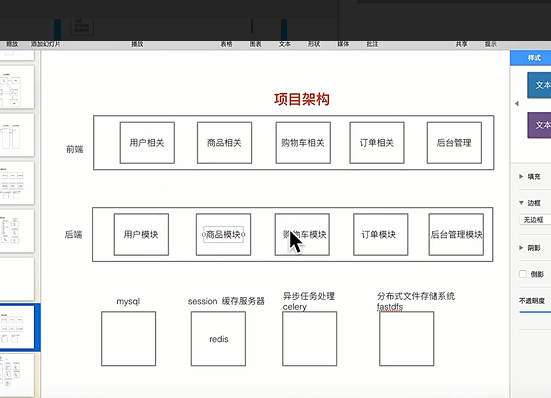
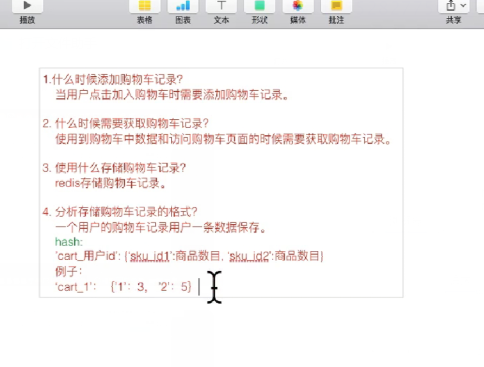
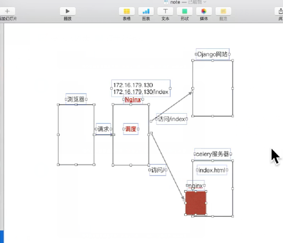
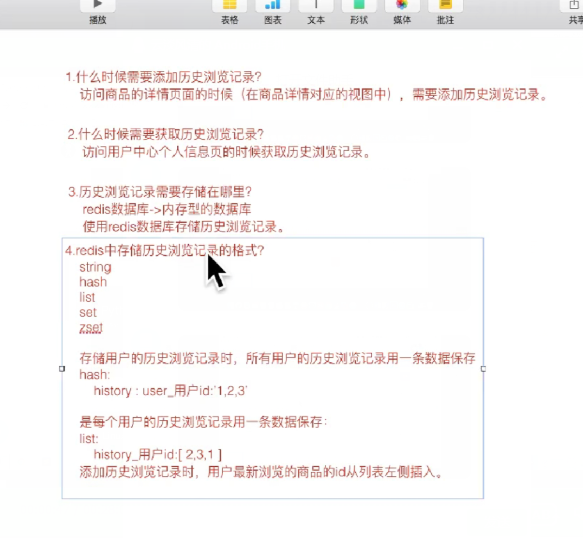
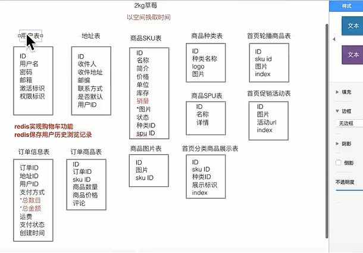
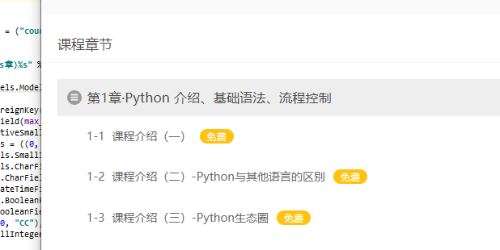
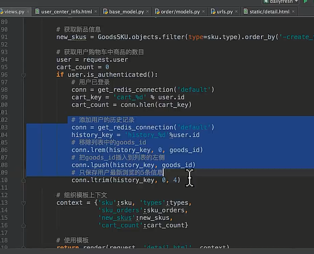
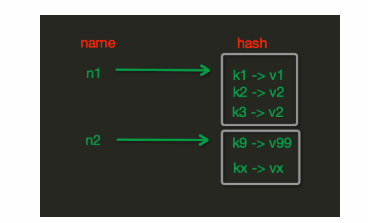
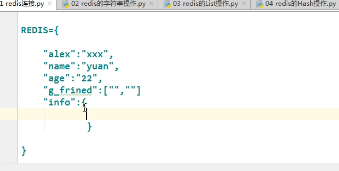
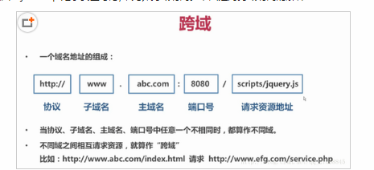

##### 表结构

- 课程表

  ```js
  和课程详情表 一对一的关系
  课程类型
  课程名称
  等级
  课程概述:
  
  # 并不生成字段, 用于反向查询     用于GenericForeignKey反向查询
  订单详情: GenericRelation("OrderDetail)
  优惠券:   coupon = GenericRelation("Coupon")
  价格策略: coupon = GenericRelation("PricePolicy")
  
  ```

- kindedditor 的使用:

  ```js
  KindEditor.ready(function (k) {
      window.editor = k.create('#id_text',{    #这个地方需要注意；模型类中使用 text = models.TextField()的话id就是id_text。如果是提前字段类型可以到浏览器中检查，获取到需要使用富文本编辑器的元素的id
          resizeType:1,
          allowPreviewEmoticons : false,
          allowImageRemote : false,
          uploadJson : '/upload/kindeditor', #这个是上传图片后台处理的url
          width:'800px',
          height:'400px',
  
  
      });
  })
  ```

- 课程详情表

  ```js
  course 和 course表是一对一关联
  推荐课程: 可以推荐多个课程
  ```

- 讲师表

- 价格与有效课程期表(PricePolicy)

  ```js
  # 一个表是多个表的forgein, 
  food 表
  fruit 表
  coupon 表:	
      food_id =  foreignKey('food')
      fruit_id = forerignkey('fruit')  详见django 基础 
  ####### 因为以后可能会更多的课程所有需要, 如果添加其他种类, n那么这个表就需要加字段, 设置外键, 所以直接使用content_type  
  一个课程有多个价格
  course 
  price
  
  
  
  ```

- 课程章节(每个)

- 课时目录表(每个)

  

- 常见问题表
- 优惠表
- 优惠券发放, 消费记录表
- order表
- 订单详情表


- 用户表
- Token
- Student

```js
- 自定义响应类
class BaseResponse(object):
    def __init__(self):
        self.code=1000
        self.data=None
        self.msg="购物车添加成功"

    # 自定义响应字典  __dict__,可以常用,需要掌握
    @property
    def dict(self):
        return self.__dict__

    '''
    res = BaseResponse()
    print(res.dict)
    
    {'code':100,'data':'123'}
    
    '''
```


#### 注册

#### 登录

```js
import pytz
import datetime

# 定义认证类
class LoginAuth(BaseAuthentication):
    def authenticate(self, request):
        # pass
        """
        1. 对token 设置14天有效时间
        2. 缓存存储
        """
        # 用户唯一字符串, 缓存校验, 数据库校验
        token = request.META.get("HTTP_AUTHORIZATION")
        user = cache.get(token)
        print("111111111111111",user)
        # 去缓存里面校验
        if user:
            print("缓存校验成功")
            #  如果缓存校验成功就直接返回user,token
            return user,token

        # 如果第一次登陆 进行数据库校验
        token_obj = Token.objects.filter(key = token).first()
        if not token_obj:
            raise  AuthenticationFailed("请先登录")
        else:
        #     如果认证成功,写进缓存中
            print("22222222222222")
            now = datetime.datetime.now()
            now = now.replace(tzinfo=pytz.timezone("UTC"))
            #  创建时间到现在的时间差,一会在设置缓存时间的时候有用
            delta =  now - token_obj.created
            state = delta < datetime.timedelta(weeks=2)
            if state:
                delta = datetime.timedelta(weeks=2) - delta
                cache.set(token_obj.key,token_obj.user,min(delta.total_seconds(),3600*24*7))
                #  返回赋值给request.user  request.auth
                return token_obj.user,token_obj.key
            else:
                raise  AuthenticationFailed("认证超时")


class LoginView(APIView):
    def post(self, request):
        # 1 获取数据
        username = request.data.get("username")
        pwd = request.data.get("password")
        user_obj = auth.authenticate(username=username, password=pwd)
        print(user_obj)
        res = {"username": None, "msg": None}
        #  如果用户存在 注入token
        if user_obj:
            random_str = str(uuid.uuid4())
            Token.objects.update_or_create(user=user_obj, defaults={"key": random_str,"created":datetime.datetime.now()})
            res["username"] = user_obj.username
            res["token"] = random_str
            res["code"] = 1000
        else:
            res["msg"] = "用户名或者密码错误！"
        return Response(res)
```


##### 滑动验证

```js
- 前端登录页面, 极验
 getGeetest(){
        this.$http.geetest()
        .then(res=>{
                let data  = res.data;

                var _this = this;
                    //请检测data的数据结构， 保证data.gt, data.challenge, data.success有值
                initGeetest({
                    // 以下配置参数来自服务端 SDK
                    gt: data.gt,
                    challenge: data.challenge,
                    offline: !data.success,
                    new_captcha: true,
                    product: 'popup',
                    width:'100%'
                },  (captchaObj)=>{
                    var result = captchaObj.getValidate();
                    console.log(result);

                    // 这里可以调用验证实例 captchaObj 的实例方法
                       captchaObj.appendTo("#geetest"); //将验证按钮插入到宿主页面中captchaBox元素内
                        captchaObj.onReady(()=>{
                          //your code
                        }).onSuccess(()=>{
                            var result = captchaObj.getValidate();
                            console.log("----->",result);

                            this.validateResult = result;

                        }).onError(()=>{

                        })
                })
        })
        .catch(err=>{
            console.log(err);
        })
    }
  }, 


created(){
    this.getGeetest()
  }


#  api.js
// geetest接口
export const geetest = ()=>{
	return Axios.get(`http://127.0.0.1:8000/captcha_check/`).then(res=>res.data);
}


# 在captcha.py

from web.utils.geetest import GeeTestLib
class CaptchaView(APIView):
    def get(self, request):
        gt = GeeTestLib(settings.GEE_TEST["gee_test_access_id"], settings.GEE_TEST["gee_test_access_key"])
        gt.pre_process()
        # 设置 geetest session, 用于是否启用滑动验证码向 geetest 发起远程验证, 如果取不到的话只是对本地轨迹进行校验
        # self.request.session[gt.GT_STATUS_SESSION_KEY] = status
        # request.session["user_id"] = user_id
        response_str = gt.get_response_str()
        response_str = json.loads(response_str)

        return Response({"error_no": 0, "data": response_str})
# 在settings.py里面配置


GEE_TEST = {
    "gee_test_access_id": "37ca5631edd1e882721808d35163b3ad",
    "gee_test_access_key": "7eb11ccf3e0953bdd060ed8b60b0c4f5",
    "verify_status": True,  # 是否启用滑动验证码验证组件(True表示启用)
    "not_verify": [
        "2ba6b08d53a4fd27057a32537e2d55ae",
    ],  # 不用验证的用户(存放着用户的uid)
}

# 配置极验文件:


	
```


##### 首页celery页面静态化

```js
celery 在哪就在那边生成静态页面
```



#### 认证接口

##### 1.超时token设置

##### 2.缓存存储

#### 购物车接口


```js
def post:
'''
# 构建数据结构
{
        "id": 2,
        "default_price_period": 14,
        "relate_price_policy": {
            "1": {
                "valid_period": 7,
                "valid_period_text": "1周",
                "default": false,
                "prcie": 100.0
            },
            "2": {
                "valid_period": 14,
                "valid_period_text": "2周",
                "default": true,
                "prcie": 200.0
            },
            "3": {
                "valid_period": 30,
                "valid_period_text": "1个月",
                "default": false,
                "prcie": 300.0
            }
        },
        "name": "Django框架学习",
        "course_img": "https://luffycity.com/static/frontend/course/3/Django框架学习_1509095212.759272.png",
        "default_price": 200.0
    }
'''
    1.获取数据  课程id   价格策略id
    course_id  = request.data.get("course_id","")
	price_policy_id = request.data.get("price_policy_id")
	user_id  = request.user.id
    2.效验数据
          2.1 课程id 
     try:
     	 // 如果没有直接报错
          course_obj = Course.objects.get(pk=course_id)
		 
          2.2 课程策略  因为get请求的时候会可以选择价格策略,所以需要获取相关价格策略
		  price_policy_list=course_obj.price_policy.all()
		  price_policy_dict = {}
		  // 循环每个价格策略对象
		  for price_policy in price_policy_list:
          price_policy_dict[price_policy.pk]={
             "prcie": price_policy.price,
                    "valid_period": price_policy.valid_period,
                    "valid_period_text": price_policy.get_valid_period_display(),
              		// 此处乃是精华,如果传过来的价格策略与当前价格策略一致为True
                    "default": price_policy.pk == price_policy_id
          }
          if price_policy_id not in price_policy_dict:
          		
    3.构建想要的数据结构
    pp = PricePolicy.objects.get(pk=price_policy_id)
    course_info = {
        "id":course_id,
        "name": course_obj.name,
        "course_img": course_obj.course_img,
        "relate_price_policy": price_policy_dict,
        "default_price": pp.price,
        "default_price_period": pp.valid_period,
        "default_price_policy_id": pp.pk
    }
    
    4.写进redis
   		4.1 拼接购物车键值
        import redis
        r = redis.Redis()
        shopping_car_key=settings.SHOPPING_CAR_KEY(%user_id,course_id)
		r.set(shopping_car_key,json.dumps(course_info))
		res.msg="加入购物车成功"
    
    
    except CommonException as e:
            res.code = e.code
            res.error = e.error
    except Exception as e:
            res.code = 1030
            res.error = "加入购物车失败!"
    return Response(res.dict)
def get(self,request):
	 1.获取user_id
     user_id = request.user.id
     2.拼接购物车的key
     shopping_car_key = settings.SHOPPING_CAR_KEY%(user_id,"*")
     3 去redis读取该用户的所有加入购物车的课程
           3.1 先去模糊匹配出所有符合要求的key
           all_keys = r.keys(shopping_car_key)
           3.2 循环所有的key,得到每个课程
		  shopping_car_list=[]
		  for key in all_keys:
          		course_info = json.loads(r.get(key))
			    shopping_car_list.append(course_info)
		  res.data = {"shopping_car_list": shopping_car_list, "total": len(shopping_car_list)}

```

#### 结算接口

```js
# 因为有直接购买,和加入到购物车两部分,所以如果要走一条线,redis 里面没有,所以需要重新存储,效验

// course_id = None  因为全局优惠券没有course_id
 def get_coupon_list(self, request, course_id=None):

        now = datetime.datetime.utcnow()

        coupon_record_list = CouponRecord.objects.filter(
            account=request.user,
            status=0,
            coupon__valid_begin_date__lte=now,
            coupon__valid_end_date__gt=now,
            coupon__content_type_id=14,
            coupon__object_id=course_id

        )

        coupon_list = []

        for coupon_record in coupon_record_list:
            coupon_list.append({

                "pk": coupon_record.pk,
                "name": coupon_record.coupon.name,
                "coupon_type": coupon_record.coupon.get_coupon_type_display(),
                "money_equivalent_value": coupon_record.coupon.money_equivalent_value,
                "off_percent": coupon_record.coupon.off_percent,
                "minimum_consume": coupon_record.coupon.minimum_consume,
            })

        return coupon_list
	
def post(self,request):
     1.获取数据
     """
		course_list=[{
                          "course_id":1,
                          "price_policy_id":2
                        },

                    ]
	"""
     user =  request.user
	 course_list = request.data
	try:
    	
     2.创建数据结构
     	# 清空操作
        # 找到所有以account_userid_*，全部清空
        
     	del_list = r.keys(settings.ACCOUNT_KEY % (user.pk, "*"))
		if del_list:
            	r.delete(*del_list)
  
    	price_list = []
		for course_dict in course_list:
        	# 检验课程时候存在
        	course_id = course_dict.get("course_id")
		    price_policy_id = course_dict.get("price_policy_id")	
             2.1 效验课程
             course_obj = Course.objects.get(pk=course_id)
             2.2 效验价格策略
             	2.2.1 获取相关价格策略
                 price_policy_list = course_obj.price_policy.all()
			    price_policy_dict={}
			    for price_policy  in  price_policy_list:
                     price_policy_dict[price_policy.pk]={
                        "prcie": price_policy.price,
                            "valid_period": price_policy.valid_period,
                            "valid_period_text": price_policy.get_valid_period_display(),
                            "default": price_policy.pk == price_policy_id
                    }
				if not price_policy_id in price_policy_list:
                		raise  CommonException(1001, "价格策略异常!")
				pp = PricePolicy.objects.get(pk=price_policy_id)
				2.2.2 将课程信息加入到每一个课程结算字典
                 account_dict = {
                    "id": course_id,
                    "name": course_obj.name,
                    "course_img": course_obj.course_img,
                    "relate_price_policy": price_policy_dict,
                    "default_price": pp.price,
                    "rebate_price": pp.price,
                    "default_price_period": pp.valid_period,
                    "default_price_policy_id": pp.pk
                }
                  
             	2.2.3 课程价格加入到价格列表
                price_list.append(float(pp.price))
			   2.2.4 查询当前用户拥有的未使用的,在有效期的且与当前当前课程相关的优惠券
			   account_dict["coupon_list"] = self.get_coupon_list(request, course_id)
			  2.2.5 存储结算信息
              account_key = settings.ACCOUNT_KEY % (user.pk, course_id)
              REDIS_CONN.set(account_key, json.dumps(account_dict))
	
REDIS_CONN.set("global_coupon_%s" % user.pk, json.dumps(self.get_coupon_list(request)))
            REDIS_CONN.set("total_price",sum(price_list))

    except ObjectDoesNotExist as e:
            response.code = 1001
            response.error = "课程不存在!"
    except CommonException as e:
            response.code = e.code
            response.error = e.error
    return Response(response.dict)

     
```

#### 支付接口

```js
# 涉及到钱了,一定要全部校验
def post(self,request,*args,**kwargs):
	1.  获取数据
    2.  效验数据
        2.1 效验课程id
        2.2 效验价格策略
        2.3 效验课程优惠券
    2.4 效验通用优惠券
    2.5 计算实际支付价格与money 做校验
    3. 生成订单信息
    	OrderDetail 信息	
    
```

#### 订单接口

#### 课程接口

```js
# filter.py
from api import models
from rest_framework.filters import BaseFilterBackend
class CourseFilter(BaseFilterBackend):
	def filter_queryset(self,request,queryset,view):
    	extra = {}
		category_id = str(request.query_params.get("category_id"))
		
		# 如果分类ID 不是数字 或分类ID 传输为0
        if not category_id.isdigit() or category_id=="0":
        	extra=extra
	   else:
        	extra.update({"course_category_id":category_id})
	   return queryset.filter(**extra)
	
```

```js
# course.py
class CourseView(ModelViewSet):
	queryset = Course.objects.all()
	serializer_class = serializer.CourseSerrializer
	filter_backends = [CourseFilter,]
	def list(self,request,*args,**kwargs):
   		queryset = self.filter_queryset(self.get_queryset())
		serializer = self.get_serializer(queryset, many=True)
		return Response({"code":0,"data":serializer.data})
class 
```


#### 


#### redis

```js
端口号:6379
mysql端口号:3306
```

##### 1.redis介绍

```js
redis 是一个非关系(No-mysql)型数据库
非关系型数据库:key-value存储系统,它支持存储value类型相对更多,
redis 对比 memcache 的共同点
	1.redis 是缓存到内存中
    2. 属于key-value
不同点:
	1. redis 可以做持久化,(将数据保存到磁盘上)
	2. 支持更丰富的数据类型.valus 可以是字符串.链表,哈希
		"k1":"v1",
		"k2":[1,2,3],
         'k3':{"name":"alex","age":18},
		"k4":{1,"hello",222}
    
```

```js
import redis
#  r = redis.Redis(host='192.168.11.81', port=6379)
# decode_responses=True直接返回字符串
# 方式一
r = redis.Redis(decode_responses=True)
#方式二 连接池
pool = redis.ConnectionPool(decode_response=True)
r = redis.Redis(connection_pool=pool)
```


##### 2.字符串操作

(1)set(name,value,time)    #  time  设置的过期时间,只能添加一个键值对

键值如果存在着更新,如果不存在就创建

```js
pool = redis.ConnectionPool(decode_response=True)
r = redis.Redis(connection_pool=pool)
r.set("people","yuan",10)    # 设置key 为peope value 为yuan 有效时间为10
print(r.get("people"))  # yuan   10 秒之后就取不到了,因为失效了
```

(2)setnx   只有当值不存在的时候才会进行操作,如果存在就不进行操作

```js
设置值，只有name不存在时，执行设置操作（添加）
```

(3)mset(*args, **kwargs)

```js
mset(k1='v1', k2='v2')
 # 版本只支持这个字典的
mget({"name":"yuan","age":14})
print(r.mget(["name","age"]))
```

(4)getset(name, value)

```
`设置新值并获取原来的值`
```

(5)getrange(key, start, end)    # 切片

```js
`# 获取子序列（根据字节获取，非字符）``# 参数：``    ``# name，Redis 的 name``    ``# start，起始位置（字节）``    ``# end，结束位置（字节）``# 如： "武沛齐" ，0-3表示 "武"`
```

(6) setrange(name, offset, value) 

 在位置插入,然后替换相应的字符串长度

```js
`# 修改字符串内容，从指定字符串索引开始向后替换（新值太长时，则向后添加）``# 参数：``    ``# offset，字符串的索引，字节（一个汉字三个字节）``    ``# value，要设置的值`
```

(7)strlen(name)

```
`# 返回name对应值的字节长度（一个汉字3个字节）`
```

(8)incr(self, name, amount=1)

```js
`# 自增 name对应的值，当name不存在时，则创建name＝amount，否则，则自增。` `# 参数：``    ``# name,Redis的name``    ``# amount,自增数（必须是整数）` `# 注：同incrby`
```

(9)append(key, value)

```js
`# 在redis name对应的值后面追加内容` `# 参数：``    ``key, redis的name``    ``value, 要追加的字符串`
```

##### 3.redis的list 操作  (注意取得时候只能lrange)

(1)	lpush(name,values)   先推进去后出来

```js
`# 在name对应的list中添加元素，每个新的元素都添加到列表的最左边` `# 如：``    ``# r.lpush('oo', 11,22,33)``    ``# 保存顺序为: 33,22,11` `# 扩展：``    ``# rpush(name, values) 表示从右向左操作`
```

(2)   llen(name)

```js
`# name对应的list元素的个数`
```

(3)   linsert(name, where, refvalue, value))

```js
`# 在name对应的列表的某一个值前或后插入一个新值` `# 参数：``    ``# name，redis的name``    ``# where，BEFORE或AFTER``    ``# refvalue，标杆值，即：在它前后插入数据``    ``# value，要插入的数据`
```

（4）r.lset(name, index, value)

```js
`# 对name对应的list中的某一个索引位置重新赋值` `# 参数：``    ``# name，redis的name``    ``# index，list的索引位置``    ``# value，要设置的值`
```

(5)   lrem(name, value, num)

```js
`# 在name对应的list中删除指定的值` `# 参数：``    ``# name，redis的name``    ``# value，要删除的值``    ``# num，  num=0，删除列表中所有的指定值；``           ``# num=2,从前到后，删除2个；``           ``# num=-2,从后向前，删除2个`
```

(6)   lpop(name)

```js
`# 在name对应的列表的左侧获取第一个元素并在列表中移除，返回值则是第一个元素` `# 更多：``    ``# rpop(name) 表示从右向左操作`
```

##### 4.redis的hash 操作



(1)hset(name, key, value)

```js
`# name对应的hash中设置一个键值对（不存在，则创建；否则，修改）` `# 参数：``    ``# name，redis的name``    ``# key，name对应的hash中的key``    ``# value，name对应的hash中的value` `# 注：``    ``# hsetnx(name, key, value),当name对应的hash中不存在当前key时则创建（相当于添加）`
```

(2)hmset(name, mapping)

```
`# 在name对应的hash中批量设置键值对` `# 参数：``    ``# name，redis的name``    ``# mapping，字典，如：{'k1':'v1', 'k2': 'v2'}` `# 如：``    ``# r.hmset('xx', {'k1':'v1', 'k2': 'v2'})`
```

(3)hget(name,key)

```
`# 在name对应的hash中获取根据key获取value`
```

(4)hmget(name, keys, *args)

```js
`# 在name对应的hash中获取多个key的值` `# 参数：``    ``# name，reids对应的name``    ``# keys，要获取key集合，如：['k1', 'k2', 'k3']``    ``# *args，要获取的key，如：k1,k2,k3` `# 如：``    ``# r.mget('xx', ['k1', 'k2'])``    ``# 或``    ``# print r.hmget('xx', 'k1', 'k2')`
```

##### 坑  

```js
r.hmset("peiqi",{"k1":{"111":"222"},"k2":"v2"})
print(r.hgetall("peiqi"))   //{"k1":"{"111":111}","k2":"v2"}

# 解决方法一
import json
r.hmset("peiqi",{"k1":json.dumps({"111":"222"}),"k2":"v2"})

# 解决方案二(nice)
r.set("peiqi",json.dumps({"k1":{"111":"222"},"k2":"v2"}))
```

(5)   hlen(name)

```
`# 获取name对应的hash中键值对的个数`
```

(6)  hkeys(name)

```js
`# 获取name对应的hash中所有的key的值`
```



(7)  hvals(name)

```
`# 获取name对应的hash中所有的value的值`
```

(8)  hexists(name, key)

```
`# 检查name对应的hash是否存在当前传入的key`
```

```js
print(r.exist("peiqi"))  // 判断最外层的是否存在
```

(9) hdel(name,*keys)

```js
`# 将name对应的hash中指定key的键值对删除`
```

##### 总体

```js
print(r.key())
r.delete("peiqi")
r.delete(*[])     // 删除多个键值
r.delete(*r.keys())  // 删除所有键值

# 如果已经为空,则会报错,所以删除之前应该先判断一下
```

keys(pattern='*')

```
`# 根据模型获取redis的name` `# 更多：``    ``# KEYS * 匹配数据库中所有 key 。``    ``# KEYS h?llo 匹配 hello ， hallo 和 hxllo 等。``    ``# KEYS h*llo 匹配 hllo 和 heeeeello 等。``    ``# KEYS h[ae]llo 匹配 hello 和 hallo ，但不匹配 hillo`
```

#### 跨域:



```js
这里面说的js 跨域是指通过js 或者python 在不同的域之间进行数据传输或通信,比如ajax 向一个不同的域请求数据,只要协议,域名,端口有任何一个不同,都被当做是不同的域
```

```js
from django.http import JsonResponse
def books(request):
	obj  = JsonResponse(["python","linux","go"],safe=False)
	obj["Access-Control-Allow-Origin"] = "*"
	obj["Access-Control-Allow-Headers"] = "Content-Type"
	return obj
```

##### 公钥私钥

```js
		RSA
私钥-----------------公钥

1.加密数据  作用:保护数据
#   公钥加密: 如果私钥加密我把公钥给了别人,那么所有人都能解开,保护数据
    	     所以只能用私钥加密这样只能我自己解开

2.数字签名: 身份验证
只要用yuan先生的公钥解开 就知道这篇文章一定是yuan 先生写的
私钥只能自己留着
https://blog.csdn.net/baidu_36327010/article/details/78659665
```


#### 复习mysql


#### 复习正则


#### 村长分享

进session存进redis


