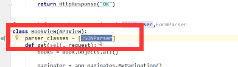

#### Json

json的作用（json是一种与语言无关的数据交换的格式）

```js
使用ajax进行前后台数据交换
移动端与服务端的数据交换
```

使用Json的格式与解析方便的可以表示一个对象信息，json有两种格式：

```js
1）对象格式：{"key1":obj,"key2":obj,"key3":obj...}
2）数组/集合格式：[obj,obj,obj...]
例如：user对象用json数据格式表示
{"username":"zhangsan","age":28,"password":"123","addr":"北京"}
List<Product> 用json数据格式表示
[{"pid":"10","pname":"小米4C"},{},{}]
只要是对象就用{括起来}，只要是集合就用【】括起来
注意：对象格式和数组格式可以互相嵌套，一个对象中的一个属性可以是一个集合或数组
```

举例:

1  这个是有一个person对象，person.lastname可以直接获取到person的lastname的值

2.  这个person为一个集合，集合中有两个对象，person【1】为集合中的第一个对象

3. json为一个对象，这个对象有一个属性baobao，baobao的值为一个集合，json。baobao【1】为获取baobao值的第一个对象


5.这个json为一个对象，它有三个属性，第一个属性是一个单纯的值，第二个属性是一个对象，第三个属性是一个集合


#### 序列化组件


用来告诉是对queryset来进行序列化,many 默认为false


```js
#  rest_framework 的序列化,不是一定依赖APIViews
from rest_framework import serializers
class PublishSerizers(serializers.Serializer):
    name = serializers.CharField()
    city = serializers.CharField()

# 用法
PublishSerizers(queryset, many=True)
PublishSerizers(model_obj)   # 默认 many = False
```


#### request   

1.此时继承的views


request.POST

request.body


当发送json 的时候request.POTS 里面就没有json 数据

request.body 里面有 是原始字节

#### 认证组件


##### restful 协议

```js
restful 协议:
	----  一切皆是资源,操作只是请求方式
	----  book表的增删改查(以前)
    	  /books/        			books       # 查询所有书籍
          /books/add/	 			addbook     # 添加书籍
          /books/(\d+)/change/   	 changebook  # 更新书籍
          /books/(\d+)/delete/  	 delbook     # 删除书籍
  (1) url 里面不能有一个动词
      /books/        	 -----get    books
      /books/		 -----post   books
      /books/(\d+)	     -----put    bookdetail
      /books/(\d+)		----delete   bookdetail
      /books/(\d+) 		------get 	 bookdetail
       class Books(View):
          def get(self,request):
          	pass  #  查看所有书籍
          def post(self,request):
          	pass  # 添加书籍
            
       class BookDetail(View):
       		def put(self,request,id):
            	pass   #更新书籍
            def get(self,request,id):
             	pass   # 获取某一本书
            def delete(self,request,id):
             	pass   # 删除某一本书
      

```


restframework (Django) 本质上是一个app,

```js
# 下载framework
pip3 install djangorestframework
# 在INSTALLED_APPS   里面注册rest_framework
# 如果扩展auth_user  需要在settings 里面 AUTH_USER_MODEL = "app名.表名"
```

```ls
---针对json
```

#### 序列化类

model.py

```js
class Author(models.Model):
    nid = models.AutoField(primary_key=True)
    name = models.CharField(max_length=32)
    age = models.IntegerField()
    def __str__(self):
        return self.name

class Publish(models.Model):
    nid = models.AutoField(primary_key=True)
    name = models.CharField(max_length=32)
    city = models.CharField(max_length=32)
    email = models.EmailField()
    def __str__(self):
        return self.name

class Book(models.Model):
    nid = models.AutoField(primary_key=True)
    title = models.CharField(max_length=32)
    price = models.DecimalField(max_digits=5, decimal_places=2)
    # 外键字段
    publish = models.ForeignKey(to="Publish", related_name="book", 		related_query_name="book_query", on_delete=models.CASCADE)
    # 多对多字段
    authors = models.ManyToManyField(to="Author")
    def __str__(self):
        return self.title
```

urls.py

```js
 # path('publishs/',views.PublishView.as_view()),
```

views.py  现在与restframework  还没有关系,还是基于CBV 模式

```js
from .model import Publish
from django.views import View
import json
class PublishView(View):
	def get(self,request):
    	publish
```

#### APIView :基于CBV 自己又扩展了一些   继承了View,自己重写了as_views()

dispatch()


 里面重新封装了request,有request.data

##### read_only 

```js
read_only:True   表示不允许用户自己上传只能用于api 的输出,如果某个字段设置了read_only=True   , # 那么不要进行数据验证,只会在返回时,将这个字段序列化后返回


```

#### APIView 源码解析

```js
1. APIView
   (1)urls.py
	   path('books/', views.BookView.as_view()),
        # APIview 里面继承了View的as_view, 自己重新定义了dispatch
       path('books/', BookView.view),
  (2)等待用户请求: 
```

​	


​	解析器就只有一个,自定义




APIView

```js
 def dispatch(self, request, *args, **kwargs):
        """
        `.dispatch()` is pretty much the same as Django's regular dispatch,
        but with extra hooks for startup, finalize, and exception handling.
        """
        self.args = args
        self.kwargs = kwargs
		// APIView  自己多干得事,构建新的request对象
        request = self.initialize_request(request, *args, **kwargs)
        self.request = request
        self.headers = self.default_response_headers  # deprecate?

        try:
        	// APIView  多干的事
        	// 认证组件  权限组件 频率组件
            self.initial(request, *args, **kwargs)

            # Get the appropriate handler method
            if request.method.lower() in self.http_method_names:
                handler = getattr(self, request.method.lower(),
                                  self.http_method_not_allowed)
            else:
                handler = self.http_method_not_allowed

            response = handler(request, *args, **kwargs)

        except Exception as exc:
            response = self.handle_exception(exc)

        self.response = self.finalize_response(request, response, *args, **kwargs)
        return self.response
```

```js
 def initialize_request(self, request, *args, **kwargs):
        """
        Returns the initial request object.
        """
        parser_context = self.get_parser_context(request)

        return Request(
            request,
            # self 是 视图类的实例化对象
            parsers=self.get_parsers(),
            authenticators=self.get_authenticators(),
            negotiator=self.get_content_negotiator(),
            parser_context=parser_context
        )
```

#### 解析器组件       parse  解析器

```js
解析器:request.data 里面进行解析的
```

```js
request.data
// data property 方法
// 在Request  这个类里面 
 @property
    def data(self):
        if not _hasattr(self, '_full_data'):
            self._load_data_and_files()
        return self._full_data
```

```js
    def _load_data_and_files(self):
        """
        Parses the request content into `self.data`.
        """
        if not _hasattr(self, '_data'):
        	# 解析
            self._data, self._files = self._parse()
            if self._files:
                self._full_data = self._data.copy()
                self._full_data.update(self._files)
            else:
                self._full_data = self._data
            if is_form_media_type(self.content_type):
                self._request._post = self.POST
                self._request._files = self.FILES
```

```js
 def _parse(self):
        """
        Parse the request content, returning a two-tuple of (data, files)

        May raise an `UnsupportedMediaType`, or `ParseError` exception.
        """
		# 解析格式
        media_type = self.content_type
        try:
            stream = self.stream
        except RawPostDataException:
            if not hasattr(self._request, '_post'):
                raise
            if self._supports_form_parsing():
                return (self._request.POST, self._request.FILES)
            stream = None

        if stream is None or media_type is None:
            if media_type and is_form_media_type(media_type):
                empty_data = QueryDict('', encoding=self._request._encoding)
            else:
                empty_data = {}
            empty_files = MultiValueDict()
            return (empty_data, empty_files)
		# 挑选解析器,self 是 request  
        parser = self.negotiator.select_parser(self, #self.parsers)
        if not parser:
            raise exceptions.UnsupportedMediaType(media_type)
        try:
            parsed = parser.parse(stream, media_type, self.parser_context)
        except Exception:
            self._data = QueryDict('', encoding=self._request._encoding)
            self._files = MultiValueDict()
            self._full_data = self._data
            raise
        try:
            return (parsed.data, parsed.files)
        except AttributeError:
            empty_files = MultiValueDict()
            return (parsed, empty_files)
在Request 里面
	# self 是 视图类的实例化对象 ,对request重新封装  实例化
 	self.parsers = parsers or ()
```

```js
# APIView
def get_parsers(self):
        return [parser() for parser in self.parser_classes]
self
```

```js
# 类里面没有这个属性.自动调用__getattr__
parser_classes = api_settings.DEFAULT_PARSER_CLASSES
```

```js
class APISettings(object):

    def __init__(self, user_settings=None, defaults=None, import_strings=None):
        if user_settings:
            self._user_settings = self.__check_user_settings(user_settings)
        self.defaults = defaults or DEFAULTS
        self.import_strings = import_strings or IMPORT_STRINGS
        self._cached_attrs = set()
	# (3)
    @property
    def user_settings(self):
        if not hasattr(self, '_user_settings'):
        	# (3) 返回一个{}
            self._user_settings = getattr(settings, 'REST_FRAMEWORK', {})
        return self._user_settings
	# (1)  调用类里面没有属性,自动执行__getattr__
    def __getattr__(self, attr):
        if attr not in self.defaults:
            raise AttributeError("Invalid API setting: '%s'" % attr)

        try:
        # (2)	DEFAULT_PARSER_CLASSES 在里面  分开看 
            val = self.user_settings   #(4) [attr]
            # (5)空字典里面取值失败 ,报错
        except KeyError:
            # Fall back to defaults
            val = self.defaults[attr]
			   // 'rest_framework.parsers.JSONParser',
                // 'rest_framework.parsers.FormParser',
                //'rest_framework.parsers.MultiPartParser'
DEFAULTS = {
    # Base API policies
    'DEFAULT_RENDERER_CLASSES': (
        'rest_framework.renderers.JSONRenderer',
        'rest_framework.renderers.BrowsableAPIRenderer',
    ),
    'DEFAULT_PARSER_CLASSES': (
        'rest_framework.parsers.JSONParser',
        'rest_framework.parsers.FormParser',
        'rest_framework.parsers.MultiPartParser'
    ),
    'DEFAULT_AUTHENTICATION_CLASSES': (
        'rest_framework.authentication.SessionAuthentication',
        'rest_framework.authentication.BasicAuthentication'
    ),
```

查找变量的顺序

```js
局部查找>全局>默认
```

#### 序列化组件

```js
urls.py
    path("publishs/", views.PublishView.as_view()),
    re_path(r"books/(\d+)/",views.BookFilterView.as_view()),
views.py
	# 1 .导入
    from rest_framework import serializers
    # ########drf  提供的resposne
    from rest_framework.response import Response
    # 2 .创建一个序列化类,字段类型不一定要跟models的字段一致
    class Bookserializer(serializers.Serializer):
    # 有几个键值序列化几个键值,
    	title=serializers.CharField(max_length=32)
 				     price=serializers.DecimalField(max_digits=5,decimal_places=2)'

# 一对多字段还挺好用的
publish=serializers.CharField(source='publish.pk') # 相当于告诉你序列化id
authors=serializers.SerializerMethodField()
def get_authors(self,obj):
        temp=[]
        for author in obj.authors.all():
            temp.append(author.name)
        return temp
class BookView(APIView):
	# 获取所有的书
	def get(self,request):
    	# 第三步获取queryset
         origin_data = Book.objects.all()
			# queryset 类似于一个列表,里面放的一个一model 对象
        #  第四步开始序列化
	     bs = Bookserializer(origin_data,many=True)
		
         return  Response(bs.data)
	# 添加一条记录
   def post(self,request):
   		verified_data = BookSerializer(data=request.data)
		if verified_data.is_valid():
        	 book = verified_data.save()
			authors  = Author.objects.filter(nid__in = request.data["authors"])
			book.authors.add(*authors)
		return Response(verified_data.data)  

class BookFilterView(APIView):
	def get(self,request,nid):
    	book_obj = Book.objects.filter(pk=nid).first()
		verified_data = BookSerializer(book_obj)
		return Response(verified_data,data)

	# 更新某一本书
    def put(self,request,nid):
        book_obj = Book.objects.filter(pk = nid).first()
        # 将获取到的对象和要更新的数据对象传进去
        verified_data = BookSerializer(instance=book_obj,data=request.data)
        if verified_data.is_valid():
            verified_data.save()
            return Response(verified_data.data)
        else:
            return Response(verified_data.errors)
    # 删除某一本书
    def delete(self,request,nid):
        book_obj = Book.objects.filter(pk = nid)
        book_obj.delete()
        return Response()
```

yuan先生解析serializer的代码内部干了什么


ModelSeries

https://www.cnblogs.com/yuanchenqi/articles/8719520.html#_label2

```js
class BookModelSerializers(serializers.ModelSerializer):
    class Meta:
        model = Book
        fields = "__all__"
extra_kwargs = {
    'publish':{'write_only':True}, # 只读:子序列化的时候读他,但是别往里写
    'author':{'write_only':True}	# 只写:读的时候就别度了
}	
    #publish=serializers.CharField(source="publish.pk")
    publish=serializers.HyperlinkedIdentityField(
            view_name="detailpublish",
            lookup_field="publish_id",
            lookup_url_kwarg="pk"
    )


    # authors=serializers.CharField(source="authors.all")
    # authors = serializers.SerializerMethodField()
    # def get_authors(self,obj):
    #     temp=[]
    #     for obj in obj.authors.all():
    #         temp.append(obj.name)
    #     return temp

    # def create(self, validated_data):
    #     print("validated_data",validated_data)
    #     book=Book.objects.create(title=validated_data["title"],price=validated_data["price"],pub_date=validated_data["pub_date"],publish_id=validated_data["publish"]["pk"])
    #     book.authors.add(*validated_data["authors"])
    #
    #     return book

```

```js
		    # from django.core import serializers
            # ret=serializers.serialize("json",publish_list)
		
		    restframework下的序列类  BookModelSerializers
			    将queryset或者model对象序列成一json数据
					bs=BookModelSerializers(book_list,many=True,context={'request': request})
					bs=BookModelSerializers(book,context={'request': request})
		   
		        还可以做校验数据，json-------》queryset/model-->记录
				
					bs=BookModelSerializers(data=request.data)
					if bs.is_valid():
						print(bs.validated_data)
						bs.save() # 重写create方法
```


```js
# 序列化组件用处: 1. 序列化数据 2.数据校验
```


#### 视图三部曲

使用混合类(mixins)  (路由有变化)   需要写get ,post ,put, delete, get

避免自己获取数据,和序列化的过程,和数据校验过程

```js
urls.py:
re_path(r'authors/$', views.AuthorView.as_view(),name = "authors"),
    re_path(r"authors/(?P<pk>\d+)",views.AuthorDetailView.as_view())
    
from rest_framework import mixins
from rest_framework import generics
class AuthorView(mixins.CreateModelMixin,mixins.ListModelMixin,generics.GenericAPIView):
	queryset = Author.objects.all()
	serializer_class = Authorserializers
	def get(self, request, *args, **kwargs):
    	return self.list(request, *args, **kwargs)
	def post(self,request, *args, **kwargs):
    	return self.create(request, *args, **kwargs)
class AuthorDetailView(mixins.RetrieveModelMixin,mixins.UpdateModelMixin,mixins.DestroyModelMixin,generics.GenericAPIView):
	queryset = Author.objects.all()
	serializer_class = Authorserializers
	def get(self,request, *args, **kwargs):
    	return self.retrieve(request, *args, **kwargs)
	def put(self,request, *args, **kwargs):
    	return self.update(request, *args, **kwargs)
	def delete(self,return self.retrieve(request, *args, **kwargs))
    	return self.delete(return self.retrieve(request, *args, **kwargs)


```


使用通用的基于类的视图

不用自己写get , post, delete, put, get

```js

urls.py
re_path(r'authors/$', views.AuthorView.as_view(),name = "authors"),
    re_path(r"authors/(?P<pk>\d+)",views.AuthorDetailView.as_view())
from rest_framework import generics
class AuthorView(generics.ListCreateAPIView):
	queryset = Author.objects.all()
	serializer_class = Authorserializers
class AuthorDetailView(generics.RetrieveUpdateDestroyAPIView):
	queryset = Author.objects.all()
    serializer_class = Authorserializers
```

viewsets.ModelViewSet

```js
urls.py

path("books/",views.BookViewSet.as_view({"get":"list","post":"create"}),name="book_list")
re_path(r'books/(?<pk>\d+)',views.BookViewSet.as_view({
        "get":"retrieve",
        "put":"update",
        "delete":"destory"
        }))
views.py
from rest_framework import viewsets
class BookViewSet(viewsets.ModelViewSet):
	queryset = Author.objects.all()
	serializer_class = Authorserializers
```

```js
# 如果前端返回字段非常多的话一个一个取出来太麻烦,所以
# 定义一个用户信息字典
field = {"username","password"}
user_info = dict()
# 如果字段是接收数据的子集
if fields.issubset(set(request.data.keys)):
	for key in fields:
    	user_info[key] = request.data[key]
user_obj = User.objects.filter(**user_info).first()
```

#### 认证组件:


认证: 身份的认证

```js
登录验证:
class UserView(APIView):
    # 定义返回消息体
    def post(self,request):
        # 你也可以直接,但是如果字段多的话,非常麻烦,
        # username = request.data.get("username")
        # password = request.data.get("password")


    # 以下是去user表里面进行认证看是否有这个用户如果有这个用户,就注入token
        #  李老师新教的方法
        response = dict()
        # 定义需要的用户信息
        fields = {"username","password"}
        # 定义一个用户信息字典
        user_info = dict()
        # 如果是子集
        if fields.issubset(set(request.data.keys())):
            for key in fields:
                user_info[key] = request.data[key]

        user_obj = User.objects.filter(**user_info).first()
        print("haha")
        if user_obj:
            # 给用户注入token,
                # 获取token
            access_token = get_token.generate_token()
            UserToken.objects.update_or_create(user=user_obj, defaults={
                'token':access_token
            })

            response["status_code"] = 200
            response["status_message"] = "登录成功"
            response["access_token"] = access_token
            # 针对chioce 的
            response["user_role"] = user_obj.get_user_type_display()
        else:
            response["status_code"] = 201
            response["status_message"] = "登录失败，用户名或密码错误"

        return JsonResponse(response)

# get_token 里面的
import uuid
def generate_token():
    random_str = str(uuid.uuid4()).replace("-","")

    return random_str
```

```js
 def initial(self, request, *args, **kwargs):

        self.format_kwarg = self.get_format_suffix(**kwargs)
        neg = self.perform_content_negotiation(request)
        request.accepted_renderer, request.accepted_media_type = neg
        version, scheme = self.determine_version(request, *args, **kwargs)
        request.version, request.versioning_scheme = version, scheme
		# 认证组件
        self.perform_authentication(request)
		# 权限组件
        self.check_permissions(request)
		# 频率组件
        self.check_throttles(request)
```

```js
 def perform_authentication(self, request):
        request.user
```

```js
 @property
    def user(self):
        """
        Returns the user associated with the current request, as authenticated
        by the authentication classes provided to the request.
        """
        if not hasattr(self, '_user'):
            with wrap_attributeerrors():
                self._authenticate()
        return self._user
```

```js
class UserAuth(BaseAuthentication):
	def authenticate(self,request):
    	user_token = request.query_params.get("token")
		try:
        	# 获取到token
            token = request.query_params.get("token")
			 # 返回对象user  和 token
		    return request.user, request.token
		except Exception:
			raise APIException("没有登录")
```

```
# 认证语法 authentication_classes = [Auth1,]
```

#### 权限:根据身份的不同所看到的的东西是不一样的

```
permission_classes =  [UserPerm]
```

```js
class UserPerm():
	message = "哈哈哈你没权限"
	def has_permission(self,request,view):
    	if request.user.user_type == 3:
        	return True
		return False		
```

#### 分页组件

```js
pagination_class = MyPagination
```

```js
class MyPagination(PageNumberPagination):
	// 每页显示数量
	page_size = 3
	// 在地址栏输入参数
	page_query_param = "page"
	// 在地址栏输入的参数,改变每页显示多少
	page_size_query_param = "size"
	// 最大显示
	max_page_size = 4
```

#### 频率组件

```
throttle_classes = [VisitThrottle]
```

```js
from rest_framework.throttling import BaseThrottle
from rest_framework import exceptions
class MyException(exceptions.Throttled):
	default_detail = "连接次数过多"
	extra_detail_plural = extra_detail_singular = "请在{wait}秒后访问"
	def __init__(self,wait=None, detail=None, code=None):
    	 super().__init__(wait=wait, detail=detail, code=code)
VISIT_CODE={}
class VisitThrottle(BaseThrottle):
	def __init__(self):
    	self.history=None
	def allow_request(self, request, view):
    	# 拿到用户请求的ip值
        remote_addr = request.META.get("REMRTE_ADDR")
	    import time
        ctime = time.time()
		# 如果IP 值 不在VISIT_CODE 中,说明用户之前没有访问过
        if remote_addr not in VISIT_CODE:
        	  VISIT_CODE[remote_addr] = ctime
		history =  VISIT_CODE[remote_addr]
		self.history = history
		
		# 如果最后一个和当前的时间差值大于60s,  就把它删除掉
        while history and ctime - history[-1]>60:
        	history.pop()
		if len(history)>3:
        	 view.throttled = self.throttled
			return False
		else:
        	history.insert(0,ctime)
            return True

	def wait(self):
    	import time
        ctime = time.time()
		return 60-(ctime-self.history[-1])
	def throttled(self, request, wait):
        raise MyException(wait=wait)
```

#### contentType

简单的说,ContentType就是一个model ,也就是一张表,也就是一张数据表,其中保存着当前project 中所有models的元数据, 具体就是name,app_label,model ,其中app_label  和 model 则两个字符串组合起来便可以唯一标识一个model,

```js
from django.db import models
from django.contrib.contenttypes.models import ContentType
from  django.contrib.contenttypes.fields import GenericForeignKey,GenericRelation
# content_type 表将app 名称与其中的表的关系进行保存
"""
    当一张表作为多个表的FK,并且只能选择其中一个或几个时,就可以使用content_type表
    例如上面的优惠券表,被食物和衣服当做FK,数据库表一旦建立就难以更改,如果以后需要增加
    电器等表并把优惠券作为FK表,这时就不能做到在优惠券表里面添加列字段,因此就可以使用content_type
    表 来将表与表中的对象进行关联,从而做到不增加列字段,因此就可以使用content_type 表来表与表中的对象进行个拉链
    从而做到不增加字段情况下增加FK
    在使用content_type表时,需要在FK表中增加concent_type 作为FK字段,并增加GenenricForeignKey
    便于优惠券建立,
"""
class Food(models.Model):
    name = models.CharField(max_length=32)
    coupon = GenericRelation("Coupon")

class Cloth(models.Model):
    name = models.CharField(max_length=32)
    coupon = GenericRelation("Coupon")
class Coupon(models.Model):
    name = models.CharField("活动名称",max_length=64)
    # 代表哪个app下的哪张表
    content_type = models.ForeignKey(ContentType,blank=True,null=True,on_delete=models.CASCADE)
    # 代表哪张表中的对象id
    object_id = models.PositiveIntegerField("绑定商品",blank=True,null=True)
    # 不会生成额外的列
    content_obj = GenericForeignKey("content_type","object_id")

```


##### django的drf组件


