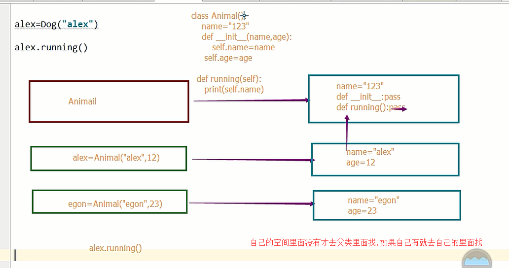
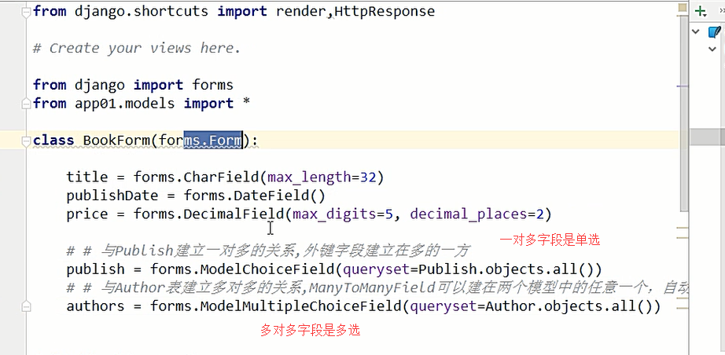
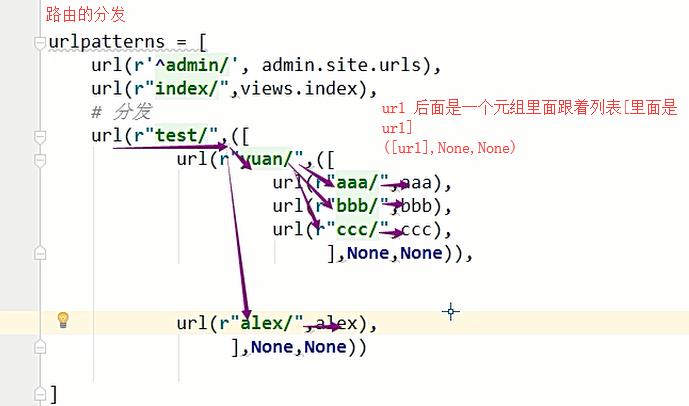
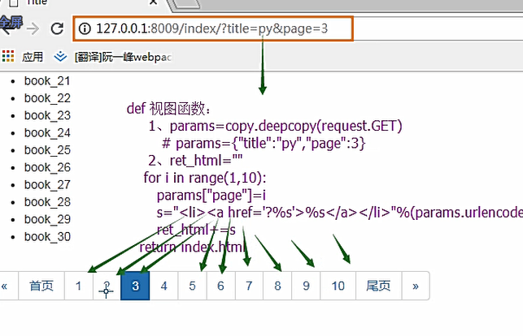
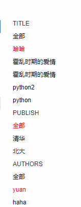

```js
如果新创建一个app ,需要在 settings 的 INSTALLED_APPS=[]  里面注册

django 进行数据库迁移的时候, 会到 INSTALLED_APPS  里面注册的app 下面找里面的所有models.py  文件
```

```js
admin: Django 的后台数据管理的web 版本
	针对Food,url:
    	http://127.0.0.1:8000/admin/app02/food/
		http://127.0.0.1:8000/admin/app02/food/add/
		http://127.0.0.1:8000/admin/app02/food/1/change/
		http://127.0.0.1:8000/admin/app02/food/2/delete/
```

#### 解析admin 的源码

```js
admin.ModelAdmin  默认配置类
# admin.py
from django.contrib import admin
from app01.models import Book
# Register your models here.
class BookConfig(admin.ModelAdmin):
    'admin.ModelAdmin提供了大量的可定制功能'
    # 加authors 会报错, 多对多字段他不是到以什么为分割符,如果在publish表里面加上book也会报错
    list_display = ["nid","title","price"]

    # 编辑页面的超链接跳转
    list_display_links = ['price',"nid"]

    # 过滤,一般放多对多字段或一对多字段
    list_filter = ["authors"]

    # 普通字段,一对一的  或的关系
    search_fields = ["title","price"]

    # 批量处理  分三步
    def patchinit(self,request,queryset):
        queryset.update(price=0)
        patchinit.short_description = "价格初始化"
    actions = ["patchinit"]
admin.register(Book,BookConfig)
```

##### 单例模式

- 基于__new__

  ```js
  class Settings(object):
      _instance = None
      # cls 是当前类对象 Settings
      def __new__(cls, *args, **kw):
          # Settings 里面有类变量_instance
          if not cls._instance:
              cls._instance = super(Settings, cls).__new__(cls, *args, **kw)
              # super(Settings, cls).__new__(cls, *args, **kw) 返回的是一个Settings的实例对象
          return cls._instance
  
  
  # __new__  在实例化的时候执行, 在__init__之前
  s1 = Settings()
  
  s2 = Settings()
  
  print(s1==s2)
  print(id(s1))
  print(id(s2))
  # 是一样的
  ```

- 基于模块

```js
# func.py
print("OK")
def add(x,y):
	return x+y
# main.py
print("____begin_____")
// 导入模块就是执行模块,现在只打印一个ok, 导多少次无所谓,
import func    // ok 是他打印的
import func
func.add(1,2)
```

```js
# cal.py
from single import a
def foo():
	print(id(a))

# single.py
class Animal(object):
	def __init__(self):
    	self.name = "alex"

	def wangwang(self):
    	print("alex id")

a = Animal()
b = Animal()

// 这两个id 不一样

# main.py

from single import a
print(id(a))
// python 的模块就是天然的单例模式,因为模块在第一次导入时,会生成.pyc 文件,当第二次导入的时,就会直接加载 .pyc 文件,而因此不会再执行模块代码
// 去pyc 文件里面取出的,并没有又实例化一次
from single import a
print(id(a))

//这两个id 是一样的

from cal import foo
foo()
// 都在main.py 这个程序里面,所以导入的模块第二次都是从.pyc 文件里面拿
#  // 这个里面的id 和上面的一样

// main.py  上面的都注释掉
from single import a,Animal
a2 = Animal()
a3 = Animal()
print(id(a))
//  a2,a3 不一样
print(id(a2))
print(id(a3))

// 单例基于模块用的是对象, 不是那个类
# 三次初始化, id 都不一样
```

##### admin 的 注册功能

```js
解析admin 的源码:
- 启动
	django 启动的过程中, 会加载settings 中的install_app
    
	# settings.py
    INSTALL_APP = [
        django.contrib.admin,
        
    ]
	解析成:
	from django.contrib import admin  // 点进去
    加载到admin 这个模块的时候
    	from django.contrib.admin.sites import AdminSite, site
    #  单例模式
    // 自动发现
    def autodiscover():
            autodiscover_modules('admin', register_to=site)
			// 加载每一个app 下面的 admin.py  文件
    // 点击sites site.py
class DefaultAdminSite(LazyObject):
   pass
site = DefaultAdminSite()
	# app01/admin0.py
- 注册
    class Bookconfig(admin.ModelAdmin):
        pass
    admin.site.register(Book,Bookconfig)  
	//  self._register = {"Book":Bookconfig(Book)}

	admin.site.register(Publish)  //  self._register = {"Book":Bookconfig ; "Publish":ModelAdmin(Author)}
// model_or_iterable 模型类的名字   // admin_class 配置类的名字	
	# app02/admin.py
    from app02.models import Food
    admin.site.register(Food)
 ##############因为是一个单例例对象,所以self._register里面有三个键值
class AdminSite(object):
	 def __init__(self, name='admin'):
        self._registry = {}
	def register(self, model_or_iterable, admin_class=None, **options):
   		# self 是 site 对象  model_or_iterable接收的是模型类的名字
        admin_class = admin_class or ModelAdmin  
        '''
		or 如果前面的是false 就返回后面的,如果是true 就返回前面的
		if not admin_class:
			admin_class = ModelAdmin
		这是以前的源码, 优化的很好
		'''
        self._registry[model] = admin_class(model, self)
site = AdminSite()
- 设计url
	1. 知识点 
    	1. path('admin/', admin.site.urls)
    	2. url 方法的分发
        	
         
```

##### model._meta

```js
model._meta.model_name     模型类的名
model._meta.app_label      模型类所属的app
```

##### 仿照admin 实现一个自定义的增删改查组件

```js
(1) 启动
在app.py 里面
#配置这个是为了django 启动 ,扫描上来就执行每个app 下的stark.py
class StarkConfig(AppConfig):
    name = 'stark'
    def ready(self):
        autodiscover_modules('stark',)

(2) 注册
   sites.py
	from stark.services.sites import site
from stark.services.sites import ModelStark
from app01.models import *


class Bookconfig(ModelStark):
    # 加authors 会报错, 多对多字段他不是到以什么为分割符
    list_display = ["nid","title","price"]

    # 编辑页面的超链接跳转
    list_display_links = ['price',"nid"]

    # 过滤,一般放多对多字段或一对多字段
    list_filter = ["authors"]

    # 普通字段,一对一的  或的关系
    search_fields = ["title","price"]

    # 批量处理  分三步
    def patchinit(self,request,queryset):
        queryset.update(price=0)
    patchinit.short_description = "价格初始化"

    actions = ["patchinit"]

site.register(Book,Bookconfig)
site.register(Publish)


(3) 设计url

```




```js
组件 :
	查:
            1. 查看数据
            2. 查看表头
                表头	书籍  价格
                python  123
            3. 自定义列(添加,编辑,删除)
				表头	书籍  价格      编辑
                		python  123
            4. 分页器
            5. search(搜索框)
            6. 批量处理
            7. 分类
            8. pop(弹出框)
	// 基于modelForm
	增:
	删:
	改:
```

##### modelForm 回顾

```js

forms 组件
	--- 1. 检验数据
    ---  2. 渲染标签
    ---- 3. 显示错误信息  重置错误信息,保存原有信息
	---- 4. 钩子与全局钩子
modelForm 组件
	借助model 创建form
    --- 除了可以校验数据,保存数据,更新数据


```

- forms 组件



- modelForm


##### 方法和函数

```js
class Animal(object):
    def __init__(self,name,age):
        self.name = name
        self.age = age
    def jump(self):
        print(" B  jumping")
alex = Animal("alex",12)
alex.jump()   # 对象.jump()  是方法  实例调用方法不用传递
Animal.jump(123)  # 类.jump()   jump 是函数


def jump(x):
    print(x)
    print("  A  jumping")
jump("123")
```

##### searchs:get  请求

```js
做search 的时候一共分两步
1. 是否显示搜索框
后端传到前端的是一个show_list  的一个当前显示页面的配置类对象
只需要判断配置类对象(默认配置类对象,自定义配置类对象)里 的search_field
 字段是否存在即可,

2. 判断搜索字段  (  Q 的另一种用法)

def get_search_condition(requet):
	q = request.GET.get("q")
        from django.db.models import Q
        search_condition = Q()
        if q:
            search_condition.connector = "or"

            for field in self.search_fields:
                # 这样是完全匹配
                # search_condition.children.append((field,q))
                # 模糊查询
                search_condition.children.append((field + "__icontains", q))
        return search_condition
```

##### Q  用法总结

```js

https://www.cnblogs.com/huchong/p/8027962.html
from django.db.models  import Q
from  app01.models  import Book
// 方式一
#  Q 的 或的条件
Book.objects.filter(Q(title="哈哈")|Q(price=123))
#  Q 的 且的条件
Book.objects.filter(Q(title="哈哈")&Q(price=123))
// 方式二

实例化一个Q 对象
q = Q()
q.children.append(("title":"哈哈"))
q.children.append(("price":123))
// 默认是且的关系
Book.onjects.filter(q)


// 如果需要改成 或的关系
q.connector("or")


// q = Q()
Book.onjects.filter(q)    #  向当于拿出的是所有数据
```

##### actions :post  请求

```js
1. 页面渲染select 标签
	<select>
    	  <option>-------------</option>  
    </select>
2. 按照actions  变量去创建<option></option> ,渲染到select标签中 

post 提交:
	pk-list=[1,3]
	// request.POST.getlist()
	
```

##### filter

```js

```

##### 路由的分发



##### 面相对象知识回顾

```js
- 1
class A(object):
	x = 10
class B(A):
	def __init__(self):
    	self.y = 10
	x = 8
print(B().x)  //输出的8

self.y  // 叫实例变量存在实例变量自己的空间里面
x   // 类变量存在类的空间里面

- 2
class A(object):
	def __init__(self):
    	self.y = 10
	x = 10
class B(A):
	x = 8
	y = 20
print(B().x)  //输出的8
print(B().y)   // 输出10 B()实例化自信__init__

`一个实例变量找变量, 先从自己的内存空间里找, 如果没有就去类变量里面, 如果在没有就去继承的类里面找`
```

```js
- 获取模型类的表名字符串形式, 获取模型类所在的app名
from app01.models import Book
Book._meta.model_name
Out[3]: 'book'
Book._meta.app_label
Out[4]: 'app01'


```

##### stark 组件 启动

```js
- 希望django 一启动就执行每个App 下面的stark.py

INSTALLED_APPS = [
    'django.contrib.admin',
    'django.contrib.auth',
    'django.contrib.contenttypes',
    'django.contrib.sessions',
    'django.contrib.messages',
    'django.contrib.staticfiles',
    'stark.apps.StarkConfig',
    "app01.apps.App01Config",
    "app02.apps.App02Config"
]

一启动就会加载, INSTALLED_APPS, 加载到strak  app 的时候,
 翻译成   from stark.apps import  StarkConfig 会执行里面的ready
  from django.apps import AppConfig
from django.utils.module_loading import autodiscover_modules


#配置这个是为了django 启动 ,扫描上来就执行每个app 下的stark.py
# stark/apps 里面
class StarkConfig(AppConfig):
    name = 'stark'
    def ready(self):
        autodiscover_modules('stark',)   
	
```

##### stark 组件之注册及Url 分发

```js
class ModelStark(object):
    def listview(self,request):
    	
    def addview(self,request,id=None):pass
    def deleteview(self, request, id):pass
    def get_urls(self):
    app_name = self.model._meta.app_label
    model_name = self.model._meta.model_name
    def get_urls(self):
        app_name = self.model._meta.app_label
        model_name = self.model._meta.model_name
        temp = [
            re_path('^$', self.listview,name="%s_%s_list"%(app_name,model_name)),
            path('add/', self.addview,name = "%s_%s_add"%(app_name,model_name)),
            re_path(r"(\d+)/change/", self.addview, name="%s_%s_change" % (app_name, model_name)),
            re_path('(\d+)/delete', self.deleteview,name="%s_%s_delete"%(app_name,model_name)) ]

     	return temp

    @property
    def urls(self):
        return self.get_urls(), None, None
class AdminSite(object):
    '''
    stark 组件的全局类, 单例对象
    '''
    def __init__(self):
        self._registry = {} #有了所有注册类的键值 self._register = {"Book":Bookconfig ; "Publish":ModelAdmin(Author)}
    def register(self, model, admin_class=None, **options):
        # self 是 site 对象
        admin_class = admin_class or ModelStark
        self._registry[model] = admin_class(model)
    def get_urls(self):
    	temp = []
        for model, config_obj in self._registry.items():
        # print(model, config_obj)
        #  config_obj  是配置类对象(可能是配置类信息,可能是自定义配置信息)
        app_name = model._meta.app_label
        model_name = model._meta.model_name
        # print("**************", app_name, model_name)
        temp.extend([
            path("%s/%s/" % (app_name, model_name), (
                config_obj.urls)),
        ]
        )
        return  temp
	@property
    def urls(self):
        return self.get_urls(), None, None
site = AdminSite()
```


##### 查看功能list_display  listview 自定义列

   ```js

   ```


```js
# sites.py
class ModelStark(objects):
	'
	因为不只有一张表有增删改查,所以应该放到默认配置类里面,因为他放到默认配置类里面了,所以需要重新购建list_display, 因为如果把它加到全局类list_display 只有默认配置类的才会走,
	def edit(self,obj=None,is_header=False):
    	'
		is_header=Flase 的时候是表单数据里面的,需要obj, is_header=True 的时候是表头,你需要obj,所以设置默认值为None
		'
        if is_header:
            return "编辑"
        else:
            return mark_safe("<a href='%s'>编辑</a>"%self.get_change_url(obj))

    def delete(self,obj=None,is_header=False):
        if is_header:
            return "删除"
        return  mark_safe("<a href = '%s'>删除</a>"%(self.get_del_url(obj)))
    def checkbox(self,obj=None,is_header=False):
        if is_header:
            return "选择"
        return mark_safe("<input type='checkbox' name='pk_list' value=%s>"%obj.pk)
	'
    '
     1.构建数据表单部分
    '
    list_display = ["__str__"]  // 如果不设这个,循环的时候列表为空,就不会显示值
    def listview(self, request):
        data_list = self.model.objects.all() // Query[book1, book2]
        new_data_list = []
        for obj in data_list:
            tmp = []
            for field_or_func in self.list_display: // ['title', 'price','publish',edit] 如果放authors相当于 obj.authors是没有意义,打印他是一个多对多字段的,obj.authors.all()才是所有的作者,
            	# 自定义函数列 添加, 编辑
                if callable(field_or_func):
                	val = field_or_func(self, obj) // 需要传self,因为那边传过来的是一个函数
            	# 这里一个知识点, field 是字符串, 不能直接obj.field
                # 所以用反射,不懂请看下面框里代码
                else:
                	try:
                        field_obj = self._meta.get_filed(field_or_func) // 获取字段对象				  // 使用默认配置类会报错, 里面没有__str__ 这个字段对象
                       所以try一下
                        '
                       # 这段代码主要是判断authors字段
                        from django.db.models.fields.related import ManyToManyField
                        if instance(field_obj, ManyToManyField):
                            rel_data_list = getattr(obj, field_or_func).all()
                            l = [str(item) for item in rel_data_list]
                            val = ','.join()
			'		except Exception as e:
                        # __str__
                        	val = getattr(obj, field_or_func)
                val = getattr(obj,field) // 如果是__str__,直接调用模型类里面的__str__
                tmp.append(val) // ['python', '122','编辑']
            new_data_list.append(tmp)

    '
    2. 构建表头部分
    '
	head_list = []	
        #   obj = Book._meta.get_field('title') 获得字段对象
        #   obj.max_length
        #   Out[6]: 20
     for filed in self.list_display:
            if callable(field_or_func):
                name = field_or_func(self.config_obj, is_header=True)
            else:
                if field_or_func == "__str__":
                    name = self.config_obj.model._meta.model_name.upper()
                else:
                    field_obj = self.config_obj.model._meta.get_field(field_or_func)
                    name = field_obj.verbose_name
            header_list.append(name)
	
'
head_list=['书籍名称','价格']
data_list = [
    		['python', '123'],
             ['haha', '235']]
前端想要这样一个数据
'
```

```js
class Animal(object):
    def __init__(self,name,age):
        self.name = name
        self.age = age
    def jump(self):
        print(" B  jumping")
alex = Animal("alex",12)
alex.jump()   # 对象.jump()  是方法  实例调用方法不用传递
Animal.jump(123)  # 类.jump()   jump 是函数


def jump(x):
    print(x)
    print("  A  jumping")
jump("123")

print(alex.name)
field = "name"


# 反射
ret  = getattr(alex,'name')
print(ret)
```

##### mark_safe

```js
from django.utils.safestring import mark_safe
- 加 mark_safe 的原因:(python 脚本里面)
	因为 django 对 标签字符串<a href
        =''></a> 进行转义,将大于号小于号转义, 提醒django不要转义
```

##### 重新购建new_list_display

```js
'
因为不只有一张表有增删改查,所以应该放到默认配置类里面,因为他放到默认配置类里面了,所以需要重新购建list_display, 因为如果把它加到全局类list_display 只有默认配置类的才会走,' 
def new_list_display(self):
        temp=[]
        temp.extend(self.list_display)
        temp.insert(0,ModelStark.checkbox)
		# 如果有link_display 就不显示编辑
        if not self.list_display_links:
            temp.append(ModelStark.edit)
        temp.append(ModelStark.delete)
        return  temp
```

##### stark 组件增删改查 add_edit_view,  deleteview

```js
class ModelStark(objects):# 默认配置类
因为很多地方用到增删改查的url, 所以将他们封装起来:
	def get_list_url(self):
        url_name = "%s_%s_list" % (self.app_label, self.model_name)
        _url = reverse(url_name)
        return _url

    def get_add_url(self):
        url_name = "%s_%s_add" % (self.app_label, self.model_name)
        _url = reverse(url_name)
        return _url

    def get_change_url(self, obj):
        url_name = "%s_%s_change" % (self.app_label, self.model_name)
        print('##############', url_name, obj.pk, type(url_name), type(obj.pk))
        _url = reverse(url_name, args=(obj.pk,))
        return _url

    def get_del_url(self, obj):
        url_name = "%s_%s_delete" % (self.app_label, self.model_name)
        _url = reverse(url_name, args=(obj.pk,))
        return _url
# 添加和编辑页面只差一个instance, 所以合并成一个
    def addview(self,request,id=None):
        ret=self.get_form_class(request, id)
        return  ret
    def get_form_class(self,request,id=None):
        #  如果默认
        obj = None
        if id:
            obj = Book.objects.get(pk=id)
        if self.model_form_class:
            DemoModelForm = self.model_form_class
        else:
            class DemoModelForm(forms.ModelForm):
                class Meta:
                    model = self.model
                    fields = "__all__"
					'这样写不可以, 因为publish 里面没有title字段,前改'
                    from django.forms import widgets as wid
                    # widgets = {
                    #     "title":wid.TextInput(attrs={"class":"form-control"}),
                    #     "price":wid.TextInput(attrs={"class":"form-control"}),
                    # }
                    # error_messages={
                    #     "title":{"required":"该字段不能为空"}
                    # }
        if request.method == "POST":
            form = DemoModelForm(data=request.POST,instance=obj)
            if form.is_valid():
                form.save()
                #  跳转到当前表的查看页面
                return redirect(self.get_list_url())
            # 错误信息在之前的form 对象里面
            return  render(request,"change_view.html",locals())

        form = DemoModelForm(instance=obj)
        return render(request, "change_view.html", locals())
```

##### 分页组件



##### list_dispaly_links

```js
 def get_body(self):
        data_list = []
        for obj in self.page_query:
            temp = []
            ###########################  极好, 如果是函数直接执行, 如果是默认配置类,返回对象__str__方法,如果是字段,返回字段的数据
            for field_or_func in self.config_obj.new_list_display():
                if callable(field_or_func):
                    val = field_or_func(self.config_obj, obj)
                else:
                    # try这里是为了使用默认类  self.list_display = [__str__]
                    try:
                        from django.db.models.fields.related import ManyToManyField
                        # 获取字段对象, 字段对象并没有__str__ , 这个字段,所以会报错, 所以需要except 一下
                        field_obj = self.config_obj.model._meta.get_field(field_or_func)
                        # 此处判断是为了判断authors
                        if isinstance(field_obj, ManyToManyField):
                            rel_data_list = getattr(obj, field_or_func).all()
                            l = [str(item) for item in rel_data_list]
                            val = ','.join(l)
                        else:
                            val = getattr(obj, field_or_func)  # obj.title
                            # print(self.config_obj.list_display_links)
                            if field_or_func in self.config_obj.list_display_links:
                                _url = self.config_obj.get_change_url(obj)
                                val = mark_safe("<a href='%s'>%s</a>" % (_url, val))
                    except Exception as e:
                        # __str__
                        val = getattr(obj, field_or_func)
                temp.append(val)
            data_list.append(temp)
        return data_list
```


##### search

```js
form  表单提交多个参数 设置input 标签然后,hidden

{#        搜索框#}
        <form class = "form-inline pull-right" action="">
                <div class="form-group">
                    <div class="input-group">
                        <input name = "q" type="text" class="form-control" id="" placeholder="Search">

                        
                            <input name = '{{ key }}' type="hidden" value="{{ value.0}}">
                        
                    </div>
                </div>
                <button type="submit" class="btn btn-primary">Search</button>

            </form>
        

        
        
     def get_search_condition(self,request):
        q = request.GET.get("q")
        search_condition = Q()
        other_condition = Q()
        for filter_field, val in request.GET.items():
            print('filter_field',type(filter_field),type(q))
            if filter_field=='q':
                search_condition.connector = "or"
                print('self.search_fields',self.search_fields)
                for field in self.search_fields:
                    print("search_fields",field)
                    # 这样是完全匹配
                    # search_condition.children.append((field,q))
                    # 模糊查询
                    search_condition.children.append((field + "__icontains", q))
            if filter_field in self.list_filter:
                print('filter_field',filter_field)
                print("self.list_filter",self.list_filter)
                other_condition.children.append((filter_field, val))
            print('filter_field',search_condition)
        return search_condition, other_condition
```


##### action

```js
'''
from 表单提交 多个参数 可以设置input  type=hideen
check_box  提交用 request.POST.getlist()  name='pk_list' value='obj.pk'
'''


# 展示类里面
def  get_new_actions(self):
        temp = []
        temp.extend(self.config_obj.actions)
        temp.append(self.config_obj.patch_delete)  # 默认都有patch_delete
        new_actions = []
        print(self.config_obj.actions)
        for  func in temp: # [patchinit]
            new_actions.append({
                'text':func.short_description,
                "name":func.__name__
            })
        return new_actions  #[{"text":"价格初始化","name":"patchinit"},{}]


# 默认配置类里面

def patch_delete(self,request,queryset):
        queryset.update(price=0)
    # 2.起个short_description
    patch_delete.short_description = "批量删除"


def list_view(self,request):
		# 为action 功能
        if request.method == "POST":
            pk_list = request.POST.getlist("pk_list")
            func_name = request.POST.get("action")

            # action  就是一个函数对象 self  是当前配置类对象
            action = getattr(self,func_name)  # 实例方法,需要不需要传参
            queryset = self.model.objects.filter(pk__in = pk_list)
            action(request,queryset)


<form action="" method="post">
                
                <select name="action" id="" class="form-control" style="width: 300px;display: inline-block" >
                <option value="">----------</option>
                
                    <option value="{{ func.name }}">{{ func.text }}</option>>
                

            </select>
            <button class="btn btn-danger">GO</button>
        <table class="table-bordered table table-striped table-hover">
            <thead>
                <tr>
                    
                    <td>{{ foo }}</td>
                    

                </tr>
            </thead>
            <tbody>
                
{#                  因为__str__ 所以显示这个#}
                    <tr>
                        
                            <td>{{ ret }}</td>
                        
                    </tr>
                
            </tbody>

        </table>
            </form>
```

##### filter



```js
 def get_filter_linktag(self):
        print("list_filter",self.config_obj.list_filter)
        import copy


        link_dict={}
        for filter_field  in  self.config_obj.list_filter:  # ['publish','authors']
            #  如果不加默认值, int 转化得时候报错
            cid = self.request.GET.get(filter_field, 0)

            params = copy.deepcopy(self.request.GET)  # self.request.GET) 没有搜索条件的时候是空
            # 拿到字段对象
            filter_obj = self.config_obj.model._meta.get_field(filter_field)
            from django.db.models.fields.related import ForeignKey,ManyToManyField
            if isinstance(filter_obj,ManyToManyField) or isinstance(filter_obj,ForeignKey):

                print(filter_obj)
                # filter_obj.rel.to 通过字段对象可以找到模型表
                # 拿到关联表下的所有字段, 只有多对多或者一对多 才有
                # print("related_fields++++++++++++++++++++",filter_obj.remote_field)
                ####################### 注意重点
                data_list = filter_obj.remote_field.model.objects.all()#
                print("data_listmore", data_list)
            else:
                # 一对一字段也可以显示
                data_list = self.config_obj.model.objects.all().values("pk",filter_field)
                print("data_list",data_list)


            temp = []
            # 处理 全部标签,更新全部的href  ,  如果publish=1&authors=2,请求来了,
            if params.get(filter_field): # publish
                del params[filter_field]
                _url = params.urlencode() # authors=2
                temp.append(mark_safe("<a href=?%s>全部</a>"%_url))

            else:
                temp.append(mark_safe("<a class = 'active' href=>全部</a>"))

            for obj in data_list:
                print('obj',obj)
                # 分支处理  普通字段  和 多对多字段
                if isinstance(filter_obj, ManyToManyField) or isinstance(filter_obj, ForeignKey):
                    pk = obj.pk
                    text = str(obj)
                    params[filter_field] = pk
                else:
                    pk = obj.get("pk")
                    text = obj.get(filter_field)
                    # 一对一字段 是text
                    params[filter_field]=text
                _url = params.urlencode()

		

				'authors=1&title=linux  如果cid是当前循环字段当前字段对象循环数据的对象pk值,加active属性'
                if cid == str(pk) or cid== text:
                    link_tag = mark_safe("<a class='active' href=?%s>%s</a>"%(_url,text))
                else:
                    link_tag = mark_safe("<a href=?%s>%s</a>" % (_url, text))
                temp.append(link_tag)
            link_dict[filter_field] =temp
        return link_dict
```

```js
# 默认配置类里面
test = ''

    def get_filter_condition(self,request):
        import copy
        self.test =  dict(copy.deepcopy(request.GET))
        print(self.test)
        filter_condition = Q()
        for filter_field, val in request.GET.items():
            # 处理分页publish=1&page=2, 判断在不在list_filter
            if filter_field in self.list_filter:
                filter_condition.children.append((filter_field, val))
        print('filter_condition',filter_condition)
        return filter_condition
    #
```

##### values 和 values_list

```js
 1. values返回的是一个QuerySet 列表里面放的字典   [{'id':1, 'name':'yuan'},{'id':2,'name':'yuan2'}]
 2. values()结果如何序列化为json？

（1）将QuerySet转为list: city_list = list(cities)

（2）将list序列化为json: city_json = json.dumps(city_list)
ret = Book.objects.filter(pk=1).values('room','time_id')
ret
Out[5]: <QuerySet [{'room': 1, 'time_id': 4},{'room': 2, 'time_id': 4}]>
    
    
    
2. value_list()
ret = Book.objects.all().values_list('room','time_id')
ret
Out[9]: <QuerySet [(1, 4), (1, 5), (1, 7), (1, 7), (2, 7), (2, 7), (2, 7), (3, 7), (3, 7), (3, 7), (3, 5)]
```


