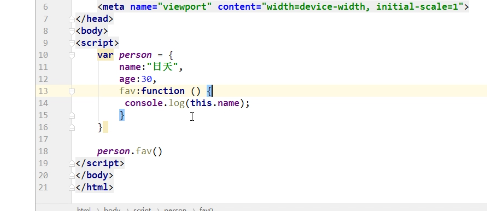

#### es6的语法

##### 1.let

```js
 // console.log(b)
    // 直接报错,
    {
        let b = 3;
        let b = 5;
        console.log(b)
    }
```


```js
特点:
	1. 不存在变量提升
    2. 变量不能重复声明
    3. 局部作用域
```

##### 2.const

```js
特点:
	1.局部作用域
    2.不存在变量提升
    3.不能重复声明,只能声明常量
```

##### 3.模板字符串

```js
tab上面的反引号,${变量名}来插值
let name = '未来'
let str =`我是${name}`
```

##### 4.es6的箭头函数(http://www.cnblogs.com/dongcanliang/p/7054176.html)

```js
# function(){}  ====> ()=>{} this 的指向发生了变化
1.es5 中的函数this指向调用了函数的对象
2.箭头函数,定义函数的上下文,不是调用者,this指的是定义对象上下文

```


##### 5.es6 的类

```js
class Person{
    // 相当于__init__
    constructor(name){
        this.name = name;
    }
    // 单体模式
    fav(){
        
    }
}
```

- 注意 : 目前在主流浏览器,

#### 普通函数变成箭头函数

普通函数

```js
function a(){
    return 1
}
# 函数对象
var a = function(){
    return 1
}
```

箭头函数:

```js
var a = ()=>{
}
```



```js
# es5
function add(x){
    return x
}
# 函数对象
var add= function(x){
    return x
}

# es6
let add = (x)=>{
    return x
}
console.log(add(20))

# 简便写法
// x 表示传递进去的形参  后面的表示函数体,如果只有返回值,直接就可以写x,不用写return
let add = x => x ;

```


#### vue的介绍

| 框架    | 介绍                   |
| ------- | ---------------------- |
| vue     | 渐进式的javascript框架 |
| react   | Facebook公司           |
| angular | 谷歌公司               |

##### 1.vue的进本引入与创建

- 1.下载

    cdn方式下载
    
    ```html
    <script src="https://cdn.jsdelivr.net/npm/vue@2.5.17/dist/vue.js"></script>
    ```

 - 2.引包

  ```html
  <script src='./vue.js'></script>
  ```

- 3.实例化

```js
//2.实例化对象
new Vue({
    el:'#app', //绑定那块地
    data(){
        //数据属性  种子
        return{
        msg:'黄瓜',
        # 可以是一个对象
        person:{
            name:'wusir'
        },
        msg2:'hello Vue'
    },
    methods:{
        // 该组件中声明方法
    },
    watch:{
       // 该组件中监听的单个属性 
    },
    // 计算属性
    computed:{
        // 监听多个属性,
    }
    
   }
});
```

#####  2.vue的模板语法

​	可以插入任何你想插入的内容，除了if-else if-else用三元运算符代替

```html
<h2>{{msg}}</h2>
<h3>{{"hahha"}}</h3>
<h3>{{1+1}}</h3>
<h4>{{ {"name":"alex"} }}</h4>
<h5>{{person.name}}</h5>
<h5>{{ 1>2? "真的":"假的"}}</h5>
<p>{{ msg2.split("").reverse().join("") }}</p>

```


##### 3.vue的指令系统之v-text和v-html

```js
v-text 相当于innerText
# v-html 相当于innnerHTMl

<div v-text="msg"></div>
    <div v-html="haha"></div>

new Vue({
        el:"#app",
        // 这里面这么写
        data(){

            return {
                // 数据属性
                msg:"yuan",
                person:{
                    name:"haha"
                },
                haha:"<h2>今天很好<h2/>"
            }
        },
```

##### 4.vue的指令系统之一v-if  和v-show

```js
v-show 相当于style.display
v
```

```js
v-if vs v-show
v-if 是“真正”的条件渲染，因为它会确保在切换过程中条件块内的事件监听器和子组件适当地被销毁和重建。

v-if 也是惰性的：如果在初始渲染时条件为假，则什么也不做——直到条件第一次变为真时，才会开始渲染条件块。

相比之下，v-show 就简单得多——不管初始条件是什么，元素总是会被渲染，并且只是简单地基于 CSS 进行切换。

一般来说，v-if 有更高的切换开销，而 v-show 有更高的初始渲染开销。因此，如果需要非常频繁地切换，则使用 v-show 较好；如果在运行时条件很少改变，则使用 v-if 较好。
```

##### 5.v-bind 和 v- on

```js
v-bind 可以绑定标签中的任何属性
v-on 可以监听js 中所有事件
# 简写:
v-bind:src 等价于 :src
v-on:click 等价于 @click
```

##### 6.v-for 遍历列表	

```js
v-for 可以遍历列表,也可以遍历对象
在使用vue的 v-for指令的时候,一定一定要绑定key,避免 vue帮咱们计算dom

```

#####  7.watch 和computed

```js
watch 可以监听单个属性
 //watch单个属性，如果想监听多个属性 声明多个属性的监听
计算属性 computed  // 主要产生缓存的数据属性,防止DOM性能消耗
监听多个属性


```

##### watch和computed

watch可以监听单个属性

```javascript
<!DOCTYPE html>
<html lang="zh-CN">
<head>
    <meta charset="UTF-8">
    <title>Title</title>
    <meta name="viewport" content="width=device-width, initial-scale=1">
</head>
<body>
    <div id="app">
        <p>{{ msg }}</p>
        <button @click = 'clickHandler'>修改</button>
    </div>
    <script src="vue.js"></script>
    <script>
        new Vue({
            el:'#app',
            data(){
                return {
                    msg:"alex",
                    age:18
                }

            },
            methods:{
                clickHandler(){
                    this.msg = "wusir"
                }
            },
            watch:{
                //watch单个属性，如果想监听多个属性 声明多个属性的监听
                'msg':function (value) {

                    console.log(value);

                    if (value === 'wusir'){
                        alert(1);
                       this.msg = '大武sir'
                    }
                },
                'age' :function (value) {
                    
                }
            }
        })
    </script>
</body>
</html>
```

计算属性 computed

监听多个属性

```javascript
<!DOCTYPE html>
<html lang="zh-CN">
<head>
    <meta charset="UTF-8">
    <title>Title</title>
    <meta name="viewport" content="width=device-width, initial-scale=1">
</head>
<body>
<div id="app">
    <p>{{ myMsg }}</p>
    <button @click='clickHandler'>修改</button>
</div>
<script src="vue.js"></script>
<script>
    let vm = new Vue({
        el: '#app',
        data() {
            return {
                msg: "alex",
                age: 18
            }

        },
        created() {
            //定时器  ajax  库 function(){}
            setInterval(() => {

            })
        },
        methods: {
            clickHandler() {
                //this的指向就是当前对象
                this.msg = "wusir";
                this.age = 20;
            },
            clickHandler: function () {
                console.log(this);
            }

        },
        computed: {
            myMsg: function () {
                //业务逻辑

//                    计算属性默认只有getter方法
                return `我的名字叫${this.msg},年龄是${this.age}`;
            }
        }
    })

    console.log(vm);
</script>
</body>
</html>
```


#### 表单输入绑定

##### 1.数据的双向绑定

- v-model 只能应用在input   textare select 中

```js
<!DOCTYPE html>
<html lang="en">
<head>
    <meta charset="UTF-8">
    <title>Title</title>
</head>
<body>
<div id ="app">
    <input type ="text" v-model="msg">
    <p>{{ msg }}}</p>
</div>
<script src="./vue.js"></script>
<script>
    new Vue({
        el:"#app",
        data(){
            return{
                msg:"alex"
            }
        }
    })
</script>
</body>

</html>
```


#### 组件


##### 1.全局组件

```js
<!DOCTYPE html>
<html lang="zh-CN">
<head>
    <meta charset="UTF-8">
    <title>Title</title>
    <meta name="viewport" content="width=device-width, initial-scale=1">
</head>
<body>
<div id="app">
    <App></App>
</div>
<script src="vue.js"></script>
<script>
    //如果仅仅是实例化vue对象中 既有el 又有template，如果template中定义模板的内容
    //        那么template模板的优先级大于el
    //第一个参数是组件的名字，第二个参数 options参数 它是全局组件
//     <slot></slot>  slot是vue中提供的内容组件  它会去分发 内容
    Vue.component('VBtn',{
        data(){
            return {

            }
        },
        template:`<button>
            <slot></slot>

</button>`
    })

//    App   header Vaside  Vcontent
//    1.声子  Vue中 组件的名字 首字母要大写 跟标签区分 组件中的data必须是个函数 一定要有返回值


    let Vheader = {
        data(){
            return {

            }
        },
        //template定义模板的内容
//        Component template should contain exactly one root element
        template:`
            <div>
                <h2>日天</h2>
                <h2>日天</h2>
                <VBtn>登录</VBtn>
                <VBtn>注册</VBtn>
                <VBtn>按钮</VBtn>
                <VBtn>提交</VBtn>

            </div>
        `
    }


    let App = {
        data(){
            return {
               text:"我是日天"
            }

        },
        template:`
            <div id="a">
                <h2>{{ text }}</h2>
                <Vheader></Vheader>
                 <VBtn>删除</VBtn>
                 <br>

            </div>
        `,
        methods:{

        },
        components:{
            Vheader
        }
    }

    new Vue({
        el: '#app',
        data() {
            return {
                msg:'alex'
            }
        },
        template:`<App />`,
        components:{
            //2.挂子
            //如果key和value一样 可以只写一个
            //App:App
            App
        }
    })

</script>
</body>
</html>
```


##### 2.局部组件

声子 挂子 用子

```js
<!DOCTYPE html>
<html lang="zh-CN">
<head>
    <meta charset="UTF-8">
    <title>Title</title>
    <meta name="viewport" content="width=device-width, initial-scale=1">
</head>
<body>
<div id="app">
    {{ msg }}
</div>
<script src="vue.js"></script>
<script>
    //如果仅仅是实例化vue对象中 既有el 又有template，如果template中定义模板的内容
    //        那么template模板的优先级大于el

//    App   header aside  content
//    1.声子  Vue中 组件的名字 首字母要大写 跟标签区分 组件中的data必须是个函数 一定要有返回值
    let App = {
        data(){
            return {
               text:"我是日天"
            }

        },
        template:`
            <div id="a">
                <h2>{{ text }}</h2>
            </div>
        `,
        methods:{

        }
    }

    new Vue({
        el: '#app',
        data() {
            return {
                msg:'alex'
            }
        },
        //3 用子
        template: `
                <div class="app">

                 <App></App>
                </div>

            `,
        components:{
            //2.挂子
            //如果key和value一样 可以只写一个
            //App:App
            App
        }
    })

</script>
</body>
</html>
```


##### 3.组件的嵌套

##### 4.父子组件

```js
父组件往子组件里面传值
1. 在子组件里定义props:[]
2. 在父组件里绑定自定义属性  


<!DOCTYPE html>
<html lang="zh-CN">
<head>
    <meta charset="UTF-8">
    <title>Title</title>
    <meta name="viewport" content="width=device-width, initial-scale=1">
</head>
<body>
<div id="app">
    <App></App>
</div>
<script src="vue.js"></script>
<script>
    Vue.component('VBtn', {
        data() {
            return {}
        },
        template: `<button>
            {{ id }}

        </button>`,
        props:['id']
    })
    let Vheader = {
        data() {
            return {}
        },
        //只要声明了父组件的属性，就可以使用

        props: ['msg', 'post'],
        template: `
            <div class="child">
                <h2>日天</h2>
                <h2>{{ msg }}</h2>
                <h3>{{ post.title}}</h3>
                <VBtn v-bind:id = 'post.id'></VBtn>
            </div>
        `
    }


    let App = {
        data() {
            return {
                text: "我是父组件的数据",
                post: {
                    id: 1,
                    title: 'My Journey with Vue'
                }
            }

        },
        template: `
            <div id="a">

                <Vheader :msg = 'text' v-bind:post = 'post'></Vheader>
            </div>
        `,
        methods: {},
        components: {
            Vheader
        }
    }
    // Vue实例
    new Vue({
        el: '#app',
        data() {
            return {
                msg: 'alex'
            }
        },
        template: `<App />`,
        components: {

            App
        }
    })

</script>
</body>
</html>
```


```js
// 子往父组件传值
1. 在父组件里自定义事件
2. 在子组件里触发 this.$emit('clickHandler',this.id);


<!DOCTYPE html>
<html lang="zh-CN">
<head>
    <meta charset="UTF-8">
    <title>Title</title>
    <meta name="viewport" content="width=device-width, initial-scale=1">
</head>
<body>
<div id="app">
    <App></App>
</div>
<script src="vue.js"></script>
<script>
    Vue.component('VBtn', {
        data() {
            return {}
        },
        template: `<button @click = 'clickHandler'>
            {{ id }}

        </button>`,
        props:['id'],
        methods:{
            clickHandler(){
                //每个组件中的this指的是当前组件对象
                console.log(this);
                this.id++;
//                this.$emit('父组件声明自定义的事件','传值');
                this.$emit('clickHandler',this.id);


            }
        }
    })
    let Vheader = {
        data() {
            return {}
        },
        //只要声明了父组件的属性，就可以使用
        props: ['msg', 'post'],
        template: `
            <div class="child">
                <h1>我是header组件</h1>
                <h2>日天</h2>
                <h2>{{ msg }}</h2>
                <h3>{{ post.title}}</h3>
                <VBtn v-bind:id = 'post.id' @clickHandler="clickHandler"></VBtn>
            </div>
        `,
        methods:{
          clickHandler(val){
              alert(val);
              // 触发父组件的内容
              this.$emit('fatherHandler',val)
          }
        },
         created(){
          console.log(this);
        },
    }


    let App = {
        data() {
            return {
                text: "我是父组件的数据",
                post: {
                    id: 1,
                    title: 'My Journey with Vue'
                }
            }

        },
        template: `
            <div id="a">
                我是父组件的 {{post.id}}
                <Vheader :msg = 'text' v-bind:post = 'post' @fatherHandler = 'father_handler'></Vheader>
            </div>
        `,
        methods: {
            father_handler(val){
                console.log(val);

                this.post.id = val;
            }
        },
        components: {
            Vheader
        },
         created(){
          console.log(this);
        },
    }

    new Vue({
        el: '#app',
        data() {
            return {
                msg: 'alex'
            }
        },
        created(){
          console.log(this);
        },
        template: `<App />`,
        components: {

            App
        }
    })

</script>
</body>
</html>
```


##### 5.平行组件传值

```js
<!doctype html>
<html lang="en">
<head>
    <meta charset="UTF-8">
    <meta name="viewport"
          content="width=device-width, user-scalable=no, initial-scale=1.0, maximum-scale=1.0, minimum-scale=1.0">
    <meta http-equiv="X-UA-Compatible" content="ie=edge">
    <title>Document</title>
</head>
<body>
<div id="app">
    <App/>
</div>
<script src="vue.js"></script>
<script>
    let bus = new Vue();
    //A===》B   B要声明事件  $on('事件的名字',function(val){})  A要触发事件 $emit('A组件中声明的事件名','值')

    //前提 这两个方法必须绑定在同一个实例化对象（bus）
    Vue.component('Test2', {
        data() {
            return {
                text:''
            }
        },
        template: `
            <h2>{{ text }}</h2>
        `,
        methods: {

        },
        created(){
            bus.$on('testData', (val)=> {
                alert(val);
                this.text = val;
            })
        }
    })
    Vue.component('Test', {
        data() {
            return {
                msg: '我是子组件的数据'
            }
        },
        props:['txt'],
        template: `
            <button @click = 'clickHandler'>{{ txt }}</button>
        `,
        methods: {
            clickHandler() {

                bus.$emit('testData',this.msg)
            }
        }
    })

    let Vheader = {
        data() {
            return {
                txt:'wusir'
            }

        },
        template: `
            <div class="header">

                <Test :txt = 'txt'/>
                <Test2 />

            </div>
        `
    }
    let App = {
        data() {
            return {}

        },
        template: `
            <div class="app">

                 <Vheader />

            </div>
        `,
        components: {
            Vheader
        }
    }
    new Vue({
        el: '#app',
        data() {
            return {}
        },
        components: {
            App
        }
    })

</script>
</body>
</html>
```


##### 过滤器

1.局部过滤器

```js
<!DOCTYPE html>
<html lang="zh-CN">
<head>
    <meta charset="UTF-8">
    <title>Title</title>
    <meta name="viewport" content="width=device-width, initial-scale=1">
</head>
<body>
    <div id="app">
        <App />
    </div>
    <script src="vue.js"></script>
    <script src="moment.js"></script>
    <script>
        let App = {
            data(){
                return {
                    msg:"hello world",
                    time:new Date()
                }
            },
            template:`

               <div>我是一个APP  {{ msg | myReverse }}
                <h2>{{ time | myTime('YYYY-MM-DD')}}</h2>

               </div>
            `,
            filters:{
                myReverse:function (val) {
                    console.log(val);
                    return val.split('').reverse().join('')
                },
                //年-月- 日  年- 月
                myTime:function(val,formatStr){
                    return moment(val).format(formatStr);
                }
            }
        }
        new Vue({
            el:'#app',
            data(){
                return {

                }
            },
            components:{
                App
            }

        })

    </script>
</body>
</html>
```

2.全局过滤器

```js
<!DOCTYPE html>
<html lang="zh-CN">
<head>
    <meta charset="UTF-8">
    <title>Title</title>
    <meta name="viewport" content="width=device-width, initial-scale=1">
</head>
<body>
    <div id="app">
        <App />
    </div>
    <script src="vue.js"></script>
    <script src="moment.js"></script>
    <script>
        //全局过滤器
        Vue.filter('myTime',function (val,formatStr) {
            return moment(val).format(formatStr)
        })
        let App = {
            data(){
                return {
                    msg:"hello world",
                    time:new Date()
                }
            },
            template:`

               <div>我是一个APP  {{ msg | myReverse }}
                <h2>{{ time | myTime('YYYY-MM-DD')}}</h2>

               </div>
            `,
            filters:{
                myReverse:function (val) {
                    console.log(val);
                    return val.split('').reverse().join('')
                }

            }
        }
        new Vue({
            el:'#app',
            data(){
                return {

                }
            },
            components:{
                App
            }

        })

    </script>
</body>
</html>
```

##### 3.生命周期的钩子函数

- [beforeCreate](https://cn.vuejs.org/v2/api/#beforeCreate)

- [created](https://cn.vuejs.org/v2/api/#created)

  ```js
  上面这两个是组件创建,下面的是DOM 渲染,  组件创建是在DOM渲染之前
  beforeCreate(){
      // 组件创建之前,this.msg 是unfined
      console.log("组件创建之前",this.msg);
  	
  }
  created(){
  
      // 组件创建之后,DOM 还没有渲染上
  
      // 使用该组件，就会触发以上的钩子函数，created中可以操作数据，发送ajax，并且可以实现vue==》页面的影响  应用：发送ajax请求
  
      console.log(this.msg);
  
      // this.msg = '嘿嘿黑';
  
  },
  ```

- [beforeMount](https://cn.vuejs.org/v2/api/#beforeMount)

- [mounted](https://cn.vuejs.org/v2/api/#mounted)

```js
beforeMount(){
    // 装载数据到DOM之前会调用
    console.log(document.getElementById('app'));
},
mounted(){
    // 这个地方可以操作DOM
    // 装载数据到DOM之后会调用 可以获取到真实存在的DOM元素，vue操作以后的DOM
    console.log(document.getElementById('app'));
},

```

```js

var obj={
	fn:function(){
		console.log(this);
	}
}
obj.fn();//object
以上这段代码是再浅显不过的this指向问题，也就是谁调用的函数，函数体中的this就指向谁
再看下面这段

var obj={
	fn:function(){
		setTimeout(function(){
			console.log(this);
		});
	}
}
obj.fn();//window
这次this指向了最外层的window对象，为什么呢，还是那个道理，这次this出现在全局函数setTImeout()中的匿名函数里，并没有某个对象进行显示调用，所以this指向window对象
假如我们在这里使用箭头函数呢

var obj={
	fn:function(){
		setTimeout(() => {
			console.log(this);
		});
	}
}
obj.fn();//object
总结：
1.箭头函数的this绑定看的是this所在的函数定义在哪个对象下，绑定到哪个对象则this就指向哪个对象

2.如果有对象嵌套的情况，则this绑定到最近的一层对象上
```


- [beforeUpdate](https://cn.vuejs.org/v2/api/#beforeUpdate)

- [updated](https://cn.vuejs.org/v2/api/#updated)

- [activated](https://cn.vuejs.org/v2/api/#activated)

- 

- [deactivated](https://cn.vuejs.org/v2/api/#deactivated)

  ```js
  ctivated(){
      console.log('组件被激活了');
  },
  
  deactivated(){
      console.log('组件被停用了');
  }
  
  # 需要借助<keep-alive></keep-alive>  Vue提供的内置组件
  slot  插槽  Vue提供的内置组件
  ```

- [beforeDestroy](https://cn.vuejs.org/v2/api/#beforeDestroy)

- [destroyed](https://cn.vuejs.org/v2/api/#destroyed)

  https://blog.csdn.net/u013344815/article/details/73184928

  https://www.cnblogs.com/majj/p/10148765.html


  ```js
  # 组件的销毁与创建,定时器用定时器一定要清定时器
  beforeDestroy(){
      console.log('beforeDestroy');
  },
  
      #定时器的销毁 在这个方法里面
  destroyed(){
      console.log('destroyed');
  },
      
      console.log(document.querySelector('#app'));
      
      
      
  ```

- [errorCaptured](https://cn.vuejs.org/v2/api/#errorCaptured)


##### 4.路由的匹配

动态路由的匹配

```js
<!DOCTYPE html>
<html lang="zh-CN">
<head>
    <meta charset="UTF-8">
    <title>Title</title>
    <meta name="viewport" content="width=device-width, initial-scale=1">
</head>
<body>
<div id="app">

</div>
<script src="vue.js"></script>
<script src="vue-router.js"></script>
<script>
    //如果以后是模块化编程，Vue.proptotype.$VueRouter = VueRouter
    //    Vue.use(VueRouter)

    //路由范式：

    //http://127.0.0.1:8080/index/user
    //http://127.0.0.1:8080/user/1 params
    //http://127.0.0.1:8080/user/2
    //http://127.0.0.1:8080/user?user_id =1   query


    const User = {
        data() {
            return {
                user_id:null
            }
        },
        template: `<div>我是用户{{ user_id}}</div>`,
        created() {
            // 如果想找地址栏参数就从route 里面找
            console.log(this.$route); //路由信息对象
//            提醒一下，当使用路由参数时，
// 例如从 /user/foo 导航到 /user/bar，原来的组件实例会被复用。
// 因为两个路由都渲染同个组件，比起销毁再创建，复用则显得更加高效。
// 不过，这也意味着组件的生命周期钩子不会再被调用。
            console.log(this.$router)
            // 当前路由信息对象
        },
        watch: {
            '$route'(to, from) {
                // 对路由变化作出响应...监听地址栏变化
                console.log(to.params.id);
                console.log(from);
                this.user_id = to.params.id;
                //发送ajax

            }
        }
    }

    //创建路由
    const router = new VueRouter({
        //定义路由规则
        routes: [

            {
                path: '/user/:id',
                name: 'User',
                component: User
            }

        ]
    })
    let App = {
        data() {
            return {}
        },
//        router-link和router-view 是vue-router 提供的两个全局组件
        //router-view  是路由组件的出口
        template: `
            <div>

                <div class="header">
                    <router-link :to = '{name:"User",params:{id:1}}'>用户1</router-link>
                    <router-link :to = '{name:"User",params:{id:2}}'>用户2</router-link>

                </div>
                <router-view></router-view>
            </div>

        `

    }
    new Vue({
        el: '#app',
        //挂载 路由对象
        router,
        data() {
            return {}
        },
        template: `<App />`,
        components: {
            App
        }
    })

</script>

</body>
</html>

$route.query
类型: Object
一个 key/value 对象，表示 URL 查询参数。例如，对于路径 /foo?user=1，则有 $route.query.user == 1，如果没有查询参数，则是个空对象。
```


##### 5.编程式导航 vs 声明式导航 

```js
<!DOCTYPE html>
<html lang="zh-CN">
<head>
    <meta charset="UTF-8">
    <title>Title</title>
    <meta name="viewport" content="width=device-width, initial-scale=1">
</head>
<body>
<div id="app">

</div>
<script src="vue.js"></script>
<script src="vue-router.js"></script>
<script>
    //如果以后是模块化编程，Vue.proptotype.$VueRouter = VueRouter
    //    Vue.use(VueRouter)   相当于给Vue添加两个

    //路由范式：

    //http://127.0.0.1:8080/index/user
    //http://127.0.0.1:8080/user/1 params
    //http://127.0.0.1:8080/user/2
    //http://127.0.0.1:8080/user?user_id =1   query
    const Home = {
        data() {
            return {}
        },
        template: `<div>我是首页</div>`
    }

    const User = {
        data() {
            return {
                user_id: null
            }
        },
        template: `<div>我是用户{{ user_id}}
                    <button @click = 'clickHandler'>跳转首页</button>

                 </div>`,
        created() {
            console.log(this.$route);
        },
        methods:{
            //编程式导航
            clickHandler(){
                #  // 注意不是数组里的push  就是进行路由的跳转
                this.$router.push({
                    name:"Home"
                })
            }
        },
        watch: {
            '$route'(to, from) {
                // 对路由变化作出响应...
                console.log(to.params.id);
                console.log(from);
                this.user_id = to.params.id;
                //发送ajax

            }
        }
    }

    //创建路由
    const router = new VueRouter({
        //定义路由规则
        routes: [

            {
                path: '/user/:id',
                name: 'User',
                component: User
            },
            {
                path: '/home',
                name: 'Home',
                component: Home
            }

        ]
    })
    let App = {
        data() {
            return {}
        },
//        router-link和router-view 是vue-router 提供的两个全局组件
        //router-view  是路由组件的出口
        template: `
            <div>

                <div class="header">
                    <router-link :to = '{name:"User",params:{id:1}}'>用户1</router-link>
                    <router-link :to = '{name:"User",params:{id:2}}'>用户2</router-link>

                </div>
                <router-view></router-view>
            </div>

        `

    }
    new Vue({
        el: '#app',
        //挂载 路由对象
        router,
        data() {
            return {}
        },
        template: `<App />`,
        components: {
            App
        }
    })

</script>

</body>
</html>
```

```js
scoped   样式只对当前模板作用有效
```

#### refs 属性,获取原生DOM

给某标签或组件添加ref属性,可以通过this$refs 属性获取

```js
<div ref="alex">哈哈哈哈</div>
<p ref="a"></p>
#  Home 组件
<Home ref="b"></Home>

this.$refs.alex    获取原始DOM对象
this.$refs.a	  获取的是原始的Dom 对象
this.$refs.b		获取的是当前组件实例化对象
```

```js
<div id="app">
    <input type="text" ref="input1"/>
    <button @click="add">添加</button>
</div>
复制代码
<script>
new Vue({
    el: "#app",
    methods:{
    add:function(){
        this.$refs.input1.value ="22"; //this.$refs.input1  减少获取dom节点的消耗
        }
    }
})
</script>
复制代码
一般来讲，获取DOM元素，需document.querySelector（".input1"）获取这个dom节点，然后在获取input1的值。

但是用ref绑定之后，我们就不需要在获取dom节点了，直接在上面的input上绑定input1，然后$refs里面调用就行。

然后在javascript里面这样调用：this.$refs.input1  这样就可以减少获取dom节点的消耗了

this.$refs.input   # 获取原始DOM
this.$refs.input.focus  # 原始DOM 获取焦点
this.$refs.abc.$parent   # 获取当前组件的父组件
this.$refs.abc.$root	# 获取最原始的组件,跟组件
this.$children           # 获取组件的children, 与组件的加载顺序有关

```


#### webpack模板

```js
vue init  webpack    项目名
切到项目目录下    npm install


```


#### Vue 基于组件式开发

##### element的使用

```js
// 安装
npm i element-ui -S
// main.js
import Vue from 'vue';
import ElementUI from 'element-ui';
import 'element-ui/lib/theme-chalk/index.css';
Vue.use(ElementUI);
```

#### axios  的使用    

```js
https://www.kancloud.cn/yunye/axios/234845
```

```js
npm install axios
```

```JS
main.js
Vue
# 将axios 挂载到全局上
import Axios from "axios"
Vue.proptotype.$https = Axios

this.$https.get()

# 用Use 是在Vue的基础上封装的一层框架
axios 不是Vue 的  是基于ES6 的新的http库
是独立的一个知识点
```

```js
getCourseList(){
    var _this = this;
    this.$https.get("course/?sub_category=0)
                    // 正确信息
      .then(function(res){
        data = res.data
        // 如果不想给this 赋值  就用箭头函数
        _this.CourseList= data.data
    })
                    .catch(err=>{
        console.log(err)
    })
    
}
                    
# 基于组件式开发 restful  下的api 里面的写法
                    export const cateoryList = ()=> {
        return Axios.get('http://127.0.0.1:8000/course_sub/category/list/',).then(res=>res.data)
    }                  	
    
 getCourseDetail(){
  		this.$http.coursedetail(this.$route.params.detailId)
  		.then(res=>{
  		  // console.log("yuan",res)
  			this.coursedetail = res.data;
  		  // console.log("yuan",res.data)
  			this.prices = res.data.prices
  		})
  		.catch(err=>{
  			console.log(err);
  		})
  	}                   
```

#### 配置的默认值/defaults

```js

你可以指定将被用在各个请求的配置默认值
全局的 axios 默认值
axios.defaults.baseURL = 'https://api.example.com';
axios.defaults.headers.common['Authorization'] = AUTH_TOKEN;
axios.defaults.headers.post['Content-Type'] = 'application/x-www-form-urlencoded
```

#### vuex 

```js
1.Vuex 的状态是响应式的
2.不能直接改变store 中的状态,改变store中状态的唯一途径就是显式的提交(commit) mutation. 这样使的我们可以方便的跟踪每一个变化状

```

```js

有了action 一定有mutations,有了mutations一定有actions
```


```js
// The Vue build version to load with the `import` command
// (runtime-only or standalone) has been set in webpack.base.conf with an alias.
import Vue from 'vue'
import App from './App'
import router from './router'
//创建bus实例，挂载在原型
let bus = new Vue()
Vue.prototype.$bus = bus;


//1导入vuex
import Vuex from 'vuex'
Vue.use(Vuex)
//2.创建store实例
let store = new Vuex.Store({
  state:{
    count:1
  },
  mutations:{
    get_count(state){
      state.count++;
    }
  },
  actions:{
    //Action 函数接受一个与 store 实例具有相同方法和属性的 context 对象
    get_count(context){
      setTimeout(()=>{
        context.commit('get_count')
      },500)
    }
  }
})

Vue.config.productionTip = false
/* eslint-disable no-new */
new Vue({
  el: '#app',
  router,
  //3挂载 store实例到vue实例中  在各个组件中，都能通过this.$store
  store,
    // 用子
  components: { App },
  template: '<App/>'
})
```

```js
# Son 组件
<template>
    <div>
        <h2>我是子组件{{getCount}} {{ title }}-- {{msg}}---{{ name}}			</h2>    
    </div>
</template>
<script>
    export default {
        name:'Son',
        data(){
            return {
                name:''
            }
        },
        # Home 组件向 Son 组件传值
        props:['title','msg'],
        created(){
            # 子组件向父组件传值,触发父组件里面的事件
            this.$emit('handler',1);
		   # 平行组件接收接收Son 传过来的值
            this.$bus.$on('click',(name)=>{
                this.name = name;
            })
        },
         # 哪个组件里面要传值,就在哪个组件里面写这句话,然后调用
         computed:{
            //默认只有getter
            getCount(){
                return this.$store.state.count
            }
        }
    }
</script>

<style scoped>

</style>
```

```js
# Home 组件 里面也用count ,所以写this.$store.state.count
<template>
    <div>
        我是首页
		# 父组件向子组件传值,父组件定义数据属性
        <Son title = 'alex' @handler = 'handlerClick'/> 
        <Son :msg = 'msg'/>
		# 子组件向父组件传值,父组件自定义事件,通过子组件里面的emit 创建
         
            # 平行组件传值  通过bus
            <button @click = 'busHandler'>通过bus对象传值</button>
        {{ getCount }}
    </div>
</template>

<script>
//1.声子  挂子  用子  局部组件的使用
import Son from './Son'
    export default {
        name:'Home',
        data(){
            return {
                msg:"我是父组件的信息",
                currentIndex:0
            }
        },
        
        methods:{
            handlerClick(val){
                // alert(val);
            },
            busHandler(){
                this.$bus.$emit('click','wusir');
                  //不能直接修改state,为了实现异步的操作，我们通过dispatch
            //分发actions中声明的方法
            this.$store.dispatch('get_count');
            }
        },
        components:{
            Son
        },
        computed:{
            //默认只有getter
            getCount(){
                return this.$store.state.count
            }
        }
    }
</script>

<style scoped>

</style>
```


#### SPA 页面带来的问题

```js
优点:
	避免资源加载过多,出现白屏现象提升用户体验
缺点:
	如果想要显示html 里面DOM,必须得做服务器渲染,构建一个node.js 服务器,来做服务器渲染
单页应用:
	防止爬虫, 防止白屏现象,提升用户体验
    
```

#### 全局导航守卫

```js
//全局导航守卫
// 使用 vue-cookies
import VueCookies from 'vue-cookies'
router.beforeEach((to, from, next) => {
  // ...  
  
  if(VueCookies.isKey('access_token')){
   let user = {
        # 获取cookies
    username:VueCookies.get('username'),
    shop_cart_num:VueCookies.get('shop_cart_num'),
    access_token:VueCookies.get('access_token'),
    avatar:VueCookies.get('avatar'),
    notice_num:VueCookies.get('notice_num')
   }
   store.dispatch('getUser',user)
  }
  next()

})

```

#### 


#### 权限

login.Vue

```js
 this.$http.login(params)
            .then(res=>{
                console.log(res)
                if(res.error_no === 0){
                    //前面的记录
                    this.$router.go(-1)
                    let data = res.data;

                    //存储cookie  通过for-in循环来遍历 字典对象
                    for(let key in data){
                        # 设置cookies
                        this.$cookies.set(key,data[key])
                    }  

                    //分发actions中声明的方法
                    this.$store.dispatch('getUser',data);
                   
                }
            })
            .catch(err=>{
                console.log(err)
            })
        }
    },
```

stores

```js
import Vue from 'vue'
import Vuex from 'vuex'

Vue.use(Vuex);

let store = new Vuex.Store({
	// 三大将
	state:{
		userInfo:{}
	},
	// 修改state的唯一方法 是提交mutations
	mutations:{
		getUserInfo(state,user){
			state.userInfo = user;
			console.log(state.userInfo);
		},
		accountLogout(state){
			state.userInfo = {}
		}
	},
	actions:{
		getUserInfo({commit},user){
			commit('getUserInfo',user);
		},
		accountLogout({commit}){
			commit('accountLogout')
		}
	}
});
export default store
```


#### 使用Vue-cli

- 电脑上,linux 等,安装node.js,npm 包管理器

- webpack,  https://cli.vuejs.org/guide/installation.html 官网

   	安装 脚手架 3.2.1    npm install -g @vue/cli

  ​	vue -V查看当前版本


  ​	


​	npm install 

- npm run dev 


​	 

将axios 挂载到vue的原形上

​	


#### lufficity   Vue 使用教程

```js
1. 下载node.js 必须执行第一步
2.  npm install -g @vue/cli
//拉一下2.x模板，此时既可以用3.x模板也可以用2.x模板
	npm install -g @vue/cli-init	
3.生成项目
//初始化项目。
/*
参数介绍：
webpack: 使用webpack模板
luffy-project: 项目名称
*/
vue init webpack luffy-project
4.启动项目
cd luffy-project
npm run dev
访问： http://localhost:8080/#/


项目中使用了element-ui
npm i install -ui -S

```

- main.js

  ```js
  // elementUI 导入
  import ElementUI from "element-ui"
  // 导入全局的elementUI 的全局的css样式
  import 'element-ui/lib/theme-chalk/index.css';
  // 调用插件啊
  Vue.use(ElementUI)
  ```

  项目中使用axios

  ```js
  npm i axios -S
  ```

  ```js
  import  axios from "axios"
  // 将axios
  Vue.prototype.$http = axios
  ```


#### 我的djando

```js
E:\luffiycity
```


#### 自己的vUE

```js
E:\self_luffiycity
```


mjj

```js
E:\djando\07-luffy_project
```


