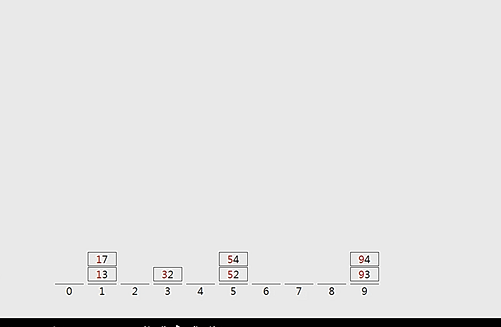
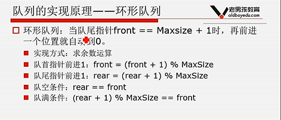
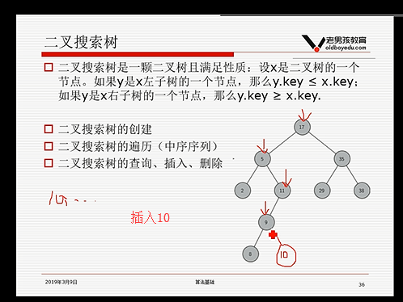

#### 算法基础

```js
# 判断一个数是不是在列表里面, 最快的

lst1 = [1,2,3,4]
lst2 = [0,0,0,0,0]
for el in lst1:
    lst2[el]=1
print("===>",lst2[4]==1)  # 时间查找复杂度是o(1), 没有什么比索引查找更快,但是占内存,
# [0,1,1,1,1]


# 查询列表里面出现奇数次的那个数
print(3 and 7)  //7
print(0 and 7)  //0
print(3 & 7)  //3
print(3|6)  //7
print(3^5)  //6
3  0011
7  0111
   0011  所以输出3

3 0011
6 0110

3 0011
5 0101
  0110


`1001
运算符优先级: not > () > and > or
x and y   x 为真, 值为y, x为假, 值为x
x or y    x 为真, 值为x, x为假, 值为y
位运算:
    &  按位与(都为1时, 结果是1,否则是0)
    |  按位或(有1时结果是1,都是0是结果为0)
    << 左移运算符  : print(3<<1)   6,在后面加一个0,如果是十进制加0,相当于*10,二进制的加0,相当于*2     0011  0110
    >> 右移一位(相当于/2)
	^ 都一样就是0, 不一样就是1
`


32  100000  2^5 往前挪一位
168  2^7 + 2^5 + ^3  10101000
# 奇数次数只能有一次
li = [1,1,2,2,3,2,2,3,3]
a = 0
for i in li:
	a = a^i
	// a^0 = a
	// a^a = 0
print(a)


// 需求不能用if while 关键字 写出具有if while 功能的语句

a = 2
s = 'hello'
a > 0 and print(s)

// and 前面如果是False 就不看后面的,如果是True 就看后面的
// or 前面如果是True 就不看后面的,如果是False 就看后面的

```

##### -  算法简单概念

- 时间复杂度:用来评估算法运行效率的一个东西

  

  ```js
  while n > 1:
  	print(n)
  	n = n // 2
  # 时间复杂度  遇见循环减半的时候时间复杂度就是O(logn)
  ```


  

  

- 空间复杂度:用来评估算法内存占用大小的一个式子

- 递归复习


  


##### 

##### 斐波那切数列

```js
- 描述:  1 1 2 3 5 8 
		F(n) = F(n-1) + F(n-2)  F(0)=1 F(1)=1
# 方式一(递归) 求斐波那切数列的第n项 
def fibnacci1(n):  // 时间复杂度  o(2^n)
	if n==0 or n==1:
    	return 1
	else:
    	return fibnacci(n-1) + fibnacci(n-2)
print(fibnacci(4))
//  5


# 方式二 这个快一点, 但是列表占地方
def fibnacci2(n): // 时间复杂度 o(n),空间复杂度o(n)
	li = [1,1]
	for i in range(2,n+1):
    	li.append(li[-1]+li[-2])
print(fibnacci2(6))

#方式三 可能会比上面的快一点
def fibnacci3(n):  // 时间复杂度o(n),空间复杂度o(1)
	a = 1
	b = 1
	c = 0
	if n == 0 or n == 1:
    	return 1
	else:
    	for i  in range(2,n+1):
        	c = a + b
		    a = b
		    b = c
		return c
	'''
		a 		b 		c
		1        1       2
		1        2       3
		2        3       5
	'''
```


```js
n阶台阶, 假设有n种方法
假设第一步只走一阶台阶, F(n-1)
假设第一步迈两步 F(n-2)
F(n) = F(n-1) + f(n-2)
终止条件 F(1)=1 F(2)=2
```

##### 汉诺塔问题


```js
def hanoi(n, from_pole, through_pole, to_pole):
	if n > 0:
        hanoi(n-1,A,C,B)  # 第一步
        hanoi("%s->%s",%(A,C))  # 第二步
        hanoi(n-1,B,A,C)
 hanoi(64,'A', 'B', 'C' )
```

#### 列表查找

```js
列表查找:从指定列表中找到指定元素
	- 输入: 列表, 待查找元素
	- 输出: 元素下标或未找到元素
```

##### 顺序查找

- 从列表的第一个元素开始,顺序进行搜索,直到找到为止

##### 二分查找

- 从***有序列表的候选区data[0:n]开始,通过对待查找的值与候选区中间的值的比较,可以使候选区减少一半

  ```js
  # 普通查找
  def bin_search(li,val):
  	left = 0
  	right = len(li) - 1
  	while left <= right:
      	mid = (left + right) // 2
  		if v3 < li[mid]:  // 说明在左侧区域					right = mid -1
          if val >  li[mid]:
          	left = mid +1
  		if val == li[mid]:
          	 return mid 
  	else:
      	print('没有这个数')
  		return -1
  
  # 递归版本
  def func(n, left, right):
      if left <=  right:
          mid = (left + right) // 2
          if lst[mid] > n:  # 说明数在左边
              right = mid - 1
              return  func(n,left,right)  # 递归函数入口
          if lst[mid] < n:  # 说明数在右边
              left = mid + 1
              return  func(n, left, right)  # 递归函数入口
          if lst[mid] == n:
              print('找到这个数')
              return mid # 通过return 返回, 终止递归
      else:
          print("没有这个数")
          return -1  # 1. 索引 2. 什么都不返回, None return 如果什么都不写,返回的就是None
  ret = func(11, 0, len(lst)-1)
  print(ret)
  
  ```

#### 列表排序

```js
- 稳定的排序算法: 保证排序前 2 个相等的数其在序列的前后位置顺序和排序后它们两个的前后位置顺序相同
```


- 将无序列表变成有序列表'
- 应用场景
   - 各种榜单
   - 各种表格
   - 给二分查找
   - 给其他算法
 - 输入:  无序列表
 - 输出: 有序列表
 - 升序与降序 

- 排序low B三人组

##### 冒泡排序


```js
- range(10)  从0到9
- range(2,10) 从2到9
- range(0,-10,-1)
[0,-1,-2,...-9]

- 冒泡排序是一个一个换值
- 从列表索引为0的元素位置开始，依次向上比较，列表每两个相邻的数，如果前边的比后边的大，
															  那么交换这两个数(可以理解为冒泡)，直到遇到比它大的元素或到达最顶端（即该元素为列表中的最大值）后停止。
															  若该数到达最顶端，则继续由索引为0的元素重复上述冒泡运动；若遇到更大的元素，则由该大元素向上冒。
															  冒泡排序总的平均时间复杂度为O(n*n)  ，空间复杂度：O(1)
// 走一趟最大就去最上面了, 第二趟第二大的就去最上面了


- 算法

lst = [11,65,9,8]
def bubble_sort(li):
	for i in range(len(li)-1): // 循环一趟跳出一个最大的,i表示趟数, 一共走n趟或n+1趟都是一样的
    	for j in range(0,len(li)-i-1): // 此处循环的是无序区[0,len(li)-i-1], j表示箭头,永远是走到0 - n-i-2 的位置,因为range 前包后不包所以
			if li[j]>li[j+1]:
            	li[j],li[j+1] = li[j+1],li[j]
			
bubble_sort(lst)

- 如果冒泡排序中执行一趟而没有交换,则表示列表已经是有序状态,可以直接结束算法
lst = [11,65,9,8]
def bubble_sort(li):
	exchange = Flase
	for i in range(len(li)-1): // 循环一趟跳出一个最大的,i表示趟数, 一共走n趟或n+1趟都是一样的
    	for j in range(0,len(li)-i-1): // 此处循环的是无序区[0,len(li)-i-1], j表示箭头,永远是走到0 - n-i-2 的位置,因为range 前包后不包所以
			if li[j]>li[j+1]:
            	li[j],li[j+1] = li[j+1],li[j]
			   exchange = True
			if not exchange:
				break		
bubble_sort(lst)

- 最好情况 O(n)
- 平均情况 O(n^2)
- 最坏情况 O(n^2)

```

##### 选择排序

```js
- 一趟遍历记录最小的数，放到第一个位置,将第一个位置得数放到最小数的位置； 再一趟遍历记录剩余列表中最小的数，继续放置

def get_min_pos(li):
	min_pos = 0
	for i in range(1, len(li)):
    	if li[i] <  li[min_pos]:
        	min_pos = i # 是最小值的索引
     return min_pos  


- 选择排序(直接命中索引 切换)
def select_sort(li):
	for i in range(len(li)-1):   # n 或者 n-1 趟
    	# 第i 趟无序区 [i,最后]
    	min_pos = i  # min_pos为无序区的最小值位置
		for j in range(i+1,len(i)):
        	 if li[j] < li[min_pos]:
             	min_pos = j
		li[i],li[min_pos] = li[min_pos],li[i]
select_sort(li=[1,8,8,5])


```

##### 插入排序


```js
- 列表被分为, 最初有序区只有一个元素
- 每次从无序区选择一个元素, 插入到有序区的位置,直到无序区变为空


def insert_sort(li):

	for i in range(1,len(li)): # i 表示摸到的牌的下标
    	tmp = li[i]
		j = i-1
		while j>=0 and li[j] > tmp: # 只要往后挪就循环 2个条件都得满足,如果j = -1 就停止挪,如果li[j] 的值小了,就停止循环
        		li[j+1]=li[j]
		# j 位置在循环结束的时候要么j 是-1, 要么li[j] 就是一个比tmp 小的值
    	li[j+1] = tmp
```

```js
# 布尔语句短路功能
// 需求不能用if while 关键字 写出具有if while 功能的语句

a = 2
s = 'hello'
a > 0 and print(s)

// and 前面如果是False 就不看后面的,如果是True 就看后面的
// or 前面如果是True 就不看后面的,如果是False 就看后面的

```

 - 排序NB三人组

##### 快速排序

​	


```js

- 思路: 
	- 取一个元素p (第一个元素), 使元素p归位
	- 列表被p分成两部分, 左边都比p小, 右边都比p大
	- 递归完成排序
	def quick_sort(li,left,right):
		if left < right: # 待排序区至少有两个元素
        	 mid = partition(li,left,right)
		     quick_sort(li,left,mid-1)
			quick_sort(li,mid+1,right)
     
        def partition(li,left,right):
            tmp = li[left]
            # 取出待排区的第一个元素, 然后将它归位
            归位思路: 第一个元素取出,第一个元素就空着, 从右边找出元素如果比第一个元素小就移到第一个元素的位置, 右边此时空了, 从左边找,如果左边的元素大于取出第一个元素就拿到右边去,反复执行,直到最后归位
            while left < right:
                while left<right and li[right] >= tmp:
                    right -= 1
                li[left] = li[right]
                while  left<right and li[left] <= tmp:
                    left +=1
                li[right] = li[left]

            li[left] = tmp
            return left

  // 方式二
  def quick_sort2(li):
  		tmp = li[0]
         left =  [v for v in li[1:] if v <= tmp]
         right =  [v for v in li[1:] if v > tmp]
		quick_sort2(left)
		quick_sort2(right)
     	return left + [tmp] + right
        	
        	
       
```

- 树与二叉树

  ​	


  

  

  ```js
  - 树:是一种数据结构  比如目录结构
  - 树是一种可以递归定义的数据结构
  - 树是由n个节点组成的集合:
  	- 如果n=0, 那这是一棵空树
  	- 如果n>0, 那存在1个节点作为树的根节点,其他节点可以分为m个集合, 每个集合本身又是一棵树
  - 一些概念
  	- 根节点,叶子节点
  	- 树的深度
  	- 树的度
  	- 孩子节点/父节点
  	- 子树
  
  
  二叉树: 度不超过2的树,
  ```


##### 堆排序

```js
大根堆: 一棵完全二叉树,满足任一节点都比其孩子节点大
小根堆: 一棵完全二叉树,满足任一节点都比其孩子节点小
```


```js

`
向下调整思路:
市长下面有县长: 但是县长智力高,所以市长下来当县长,
	- 如果村长的智力比退休下来的县长的智力高,退休的继续下来
		- 当退休的下面还有下属,但是智力没有退休的高的时候退出循环
		- 当退休得下面没有下属的时候退出循环


`
li = [9,8,7,6,5,0,1,2,4,3]
# 向下调整
def sift(li,low,hight): // low树的根的位置下标 
                        // high树的最后一个节点的位置下标
	tmp = li[low]
	i = low
	j = 2*i+1 //初始指向左孩子
	// i指向空位置, j指向两个孩子
	// 循环结束的两种情况
	// -1. 当j 大于 high的时候,
	// -2. 当tmp 大于 j的时候
	while  j <= hight : // 循环退出的第1个条件
    	# 如果右孩子存在并且比左孩子大
    	if j+1<= hight and =li[j] < li[j+1]:
        	j=j+1
		if li[j] > tmp:
		    li[i] = li[j]
			i = j 
			j = 2 * i +1
		else:  // 退出的第2种情况:j 位置的值比tmp 的值小
        	break
	li[i]=tmp


# 构造堆 (如图)
`
- 思路:
	从最下面向上调整
	*** 把最后一个节点的位置一直当做hight
`

def heap_sort(li):
 	n = len(li)
	# 1 构造堆
	for low in range(n//2-1,-1,-1):
             sift(li,low,n-1)
	# 2 挨个向下出数
    for hight in range(n-1,-1,-1):
    	li[0],li[hight] = li[hight],li[0]# 退休棋子调整 li[0] 是退休的, li[hight] 是棋子
        sift(li,0,hight-1)
```


- 堆排序内置模块

  - 优先队列: 一些元素的集合,POP操作每次执行都会从优先队列中弹出最大(或最小) 元素.

  - 堆: 优先队列

  - 内置模块 --heapq

    ```js
    heapq.heapify(li)  # 将列表变成堆
    heapq.heappush(li,0)  # 添加一个数他自动把它变成堆
    heapq.heappop(li) # 删除一个数之后自动变成堆,
    // 只能pop 出最小元素
    ```

  - 堆排序扩展 (TOPK)

    ```js
    - 现在有n个数, 设计算法找出前K大的数(k<n)
    - 堆的思路如图
    - heapq.nlargeest(5,li)
    
    ```

    

##### 归并排序


假设现在的列表分两段- 有序-, 如何将其合并成一个有序列表

```js
def merge(li,low,mid,high):
	# 列表两段有序:[low:mid]  [mid+1:high]
     i = low
	j = mid +1
	li_tem = []
	while i <= mid and j<= high:
    	if li[i]<li[j]:
        	li_tem.append(li[i])
		    i +=1	
		else:
        	li_tem.append(li[j])
			j +=1
	# 添加循环之后剩下的,可能是左面可能是右边
	while i <= mid:
    	li_tmp.append(li[i])
	while j <= high:
    	li_tmp.append(li[j])

	# 要将li_tmp[0:high-low+1] 里面的值 写到li[low:high+1]
	for i in range(low,high+1):
    	li[i] = li_tem[i-low]

	# li[low:high+1] = li_tmp  和上面的for一样
 li = [2,5,7,8,9,1,3,4,6]
 merge(li,0,4,8)
```

```js
# 需求给你两个有序列表, 合并后一个有序列表
def merge2list(li1, li2):
	li = []
	i = 0
	j = 0
	li_tem = []	
	while i < len(li1) and j < len(li2):
    	if li1[i] < li2[j]:
        	li_tem.append(li[i])
			i += 1
		else:
        	li_tem.append(li[j])
			j += 1
	while i < len(li1):
    	li.append(li1[i])
	while j < len(li2):
    	li.append(li2[j])
return li
```


```js
- 有了归并怎么用
	- 分解 : 将列表越分越小,直到分成一个元素
  	- 终止条件: 一个元素是有序的
    - 合并: 将两个有序列表归并,列表越来越大
```

```js
# 归并排序
def merge(li,low,mid,high):
	# 列表两段有序:[low:mid]  [mid+1:high]
     i = low
	j = mid +1
	li_tem = []
	while i <= mid and j<= high:
    	if li[i]<li[j]:
        	li_tem.append(li[i])
		    i +=1	
		else:
        	li_tem.append(li[j])
			j +=1
	# 添加循环之后剩下的,可能是左面可能是右边
	while i <= mid:
    	li_tmp.append(li[i])
	while j <= high:
    	li_tmp.append(li[j])

	# 要将li_tmp[0:high-low+1] 里面的值 写到li[low:high+1]
	for i in range(low,high+1):
    	li[i] = li_tem[i-low]

	# li[low:high+1] = li_tmp  和上面的for一样
 li = [2,5,7,8,9,1,3,4,6]
 merge(li,0,4,8)
def merge_sort(li, low, high):
	if low < high:
    	mid = (low + high) // 2
	 	merge_sort(li, low, mid)
		merge_sort(li,mid+1,high)
		merge(li, low, mid, high)
```

```js
NB三人组总结:
	一般情况下就运行时间而言:
		快速排序 < 归并排序 < 堆排序
    三种排序算法的缺点:
		快速排序:极端情况下排序效率低
        归并排序:需要额外的内存开销
        堆排序: 在快的排序算法中相对较慢
```

##### 总结


- 没什么人用的排序

##### 希尔排序


```js
- 插入排序是取出的牌比他小的都往前挪动
- 希尔排序减少了挪动的次数
```

```l
def insert_sort(li, d):
	for i in range(d,len(li)-1):
		tmp = li[i]
		j = i- d
		while j >= 0 and  tmp < li[j]:
        	li[j+d]=li[j]
        	j -= d
         li[j+d] = tmp
def shell_sort(li):
	d = len(li) // 2
	while d > 0:
		insert_sort(li, d)
		d = d // 2
```

##### 计数排序


```js
def count_sort(li):
	max_num = max(li)
	# 开的列表数量
	count = [0 for _ in  range(max_num+1)]
    for val in li:
    	count[val] += 1
	li.clear()
	for i,j in enumerate(val):  # 表示i这个数出现v次
    	for _ in range(j):
        	li.append(i)
count_sort()
```

##### 桶排序


##### 基数排序(只能处理正整数)


​		




```js
- 时间复杂度是O(nk) k 表示数字位数
- 空间复杂度 O(k+n)
# 得到数的个位, 十位, 百位
def get_digit(num, i):
	# i=0 个位 1 十位 2百位
    102  i=0 2  102 % 10
		i=1 0  102 // 10 % 10
		i=2 1  102 // 100 % 10
	return num // (10**i) % 10

def radix_sort(li):
	# 来几趟取决于最大数的位数
    buckets = [[] for _ in range(10)]
	max_num = max(li)
	i = 0
	while (10**i <= max_num): // 保证最大数有几位就循环几次
    	// 把数放进桶里
    	for val in li:
        	digit = get_digit(val, i)
        	buckets[digit].append(val)
		li.clear()
		// 把 数从桶里面拿出来, 然后添加到列表里面
		for bucket in buckets:
        	for val in bucket:
            	li.append(val)
		i = i+1
```

```js
# 翻转列表 reverse功能
// [5,4,3,2,1] --> [1,2,3,4,5]  思路:交换第一个和最后一个交换
def reverse_list(li):
	 n = len(li)
	 for  i in range(len(li)//2):
		li[i], li[n-1-i] = li[n-1-i], li[i]
	 return li
# 反转 int 
// 123 -> 321   12300 -> 321
// 思路:  123%10 = 3 12%10  1   1%10 = 1  1
		 30		    32    320	321
def reverse_int(num):
	# 判断是不是负数
    is_neg = False
	if num < 0:
    	num = -1 * num
		is_neg = True
	res = 0
	while num > 0:
    	res = res * 10
        i = num % 10
        res = res + i
		# res += num % 10
	    num = num // 10
		
	if is_neg:
        res = res * -1
	return res
# 将int 型转化成列表  123  
def int2list(num):
	li = []
	while num > 0:
    	li.append(num % 10)
		num = num // 10
	li.reverse()	


```

#### 数据结构


##### 栈


- 出栈次序

  ```js
   三个元素进栈顺序是ABC  , (注意没说同时进栈), 哪个不可能是他的出栈序列
  abc  a 进 a出 b 进 b 出 c 进 c 出
  acb  a 进 a出 b进c进 c出b出
  bca  a 进 b进b出 c进c出 a出
  bac  a 进 b进b出 a出 c进c出
  cba  
  cab  # 这个不可以, c 出栈说明a 和 b 都放进去了, 所以顺序是 ba 
  
  第一个位置后面的出栈必须是按照顺序的, 因为第一个位置出栈的元素他之前的元素都已经进栈了
  
  - 栈的应用  (括号匹配) 
      - 思路左括号进栈, 和不是左括号就栈顶比较,如果一样就出栈
  def match_parentheses(s):
      # 把一个list当做栈使用
      ls = []
      parentheses = "()[]{}"
      for i in range(len(s)):  # s=[[(] 循环三次
          si = s[i]  # si = {
          # 如果不是括号则继续
          if parentheses.find(si) == -1:
              continue
          # 左括号入栈
          if si == '(' or si == '[' or si == '{':
              ls.append(si) #
              continue
          if len(ls) == 0: 
          	print('多了右括号%s'%i)
              return False
          # 出栈比较是否匹配
          p = ls.pop() # p = ls
          if (p == '(' and si == ')') or (p == '[' and si == ']') or (p == '{' and si == '}'):
              continue
          else:
              return False
  
      if len(ls) > 0:
          return False
      return True
  
  
  if __name__ == '__main__':
      s = "{abc}{de}(f)[(g)"  # False
      result = match_parentheses(s)
      print(s, result)
      s = "0{abc}{de}(f)[(g)]9"
      result = match_parentheses(s)
      print(s, result)
  # [(]) 不匹配
  			
  ```

##### 队列


​			- 理解即可




```js
用两个栈实现一个队列

1 2 3 4 5 
栈1 (负责进队 ): 1 2 3 (假设先进3个, 如果想要出栈, 看看栈2 是不是空的,如果是空的, 就出) 123 就没了 , 接着进 4 5 
栈2 (负责出队)(3 2 )  比如 1 出来了, 
    
    
进队 -> 1号线进栈
出队 -> 2号线出栈 如果2号栈为空, 那么就把1 号栈依次出栈 并进2号栈

import queue  # 双向对列(见上图)
from collections import deque  (和多线程无关的时候用dq)
q = deque()
q.append()  # 进队
q.popleft() # 出队 从右边进左边出


q.appendleft() # 左边进队
q.pop() # 右边出队

如果四个都用就是双向队列


# linux 里面的命令, 用队列实现

print(deque(open('test.txt','r',encoding='utf8'),5))
// 5 表示max_len 是5, 队列长度固定5, 第六个来, 第一个就出去

```


##### 迷宫问题

​	


​			-  这个是深度优先搜索, 一条道跑到黑, 如果不是就往回退一点

```js
from collections import deque

maze = [
    [1,1,1,1,1,1,1,1,1,1],
    [1,0,0,1,0,0,0,1,0,1],
    [1,0,0,1,0,0,0,1,0,1],
    [1,0,0,0,0,1,1,0,0,1],
    [1,0,1,1,1,0,0,0,0,1],
    [1,0,0,0,1,0,0,0,0,1],
    [1,0,1,0,0,0,1,0,0,1],
    [1,0,1,1,1,0,1,1,0,1],
    [1,1,0,0,0,0,0,0,0,1],
    [1,1,1,1,1,1,1,1,1,1]
]

dirs = [
    lambda x, y: (x-1, y), #上
    lambda x, y: (x, y+1), #右
    lambda x, y: (x+1, y), #下
    lambda x, y: (x, y-1), #左
]
def solve_maze(x1, x2, x3, x4):
	# x1, y1 表示起点, x2,y2 表示终点
    stack = []
	stack.append((x1,y1))
	maze[x1][y1] = 2
	while len(stack) > 0:  // 当栈不空的时候循环
    	cur_node = stack[-1]
		if cur_node == (x2, y2)://如果到终点了
            print(stack)
            return True
    	for func in dirs:
                next_node = func(*stack[-1])
                if maze[next_node[0],next_node[1]] == 0:
                	maze[next_node[0],next_node[1]] = 2 // 2表示已经走过的
                    stack.append(next_node)
                    break  // 如果可以走, 就break
         // 如果循环走完都没有能走的, 就退一步
		else:
        	stack.pop()
	else:
    	print('无路')
		return False
```


​		-  这个是广度查询

```js
- 用队列的方式解决迷宫问题
from collections import deque
def solve_maze_queue(x1, y1, x2, y2):
	d = deque()
	q.append(x1, y1, -1)
	maze[x1][y1] = 2
	trackback = []
	while len(q) > 0:  // 队不空的时候循环
    	cur_node = q.popleft()
		if cur_node[:-1] == (x2, y2):
        	#到达终点  , 打印路径
                path = []
                i = len(trackback) -1 
			   while i >= 0:
                   	path.append(trackback[i][0:2])
			   path.reverse()
			   print(path)
i = trackback[i][2]
				
		trackback.append(cur_node)
		for d in dirs:
        	next_x, next_y = d[cur_node[0], cur_node[1]]
			q.append((next_x, next_y, len(traceback)-1))
			maze[next_x][next_y]=2	
	else:
    	print('无路')
```


##### 链表


```js
class Node:
	def __init__(self, data=None):
    	self.data = data
		self.next =  None
a = Node(1)  // 头结点
b = Node(2)
c = Node(3)
a.next = b
b.next = c
head = a // 方式一 表示头结点
head = Node() // 方式二, 创建头结点, 带空头的结点的链表, 可以用来存放长度
a = Node(1)
b = Node(2)
c = Node(3)
head.next = a
print(a.next.data) //2
```


   ```js
class Node:
	def __init__(self, data=None):
    	self.data = data
		self.next =  None
		self.tail = None
class LinkList:
	def __init__(self, li, method='tail'):
    	self.head = None
		if method = 'tail':
        	self.create_LinkList_tail(li)
		else:
			self.create_LinkList_head(li)
	# 创建链表头插法
    def create_linklist_head(self, li):
        self.head = Node()
        for num in li:
            s = Node(num)
            s.next = self.head.next
            self.head.next = s
		   self.head.data += 1
    	return head
	# 尾插法
    def create_linklist_tail(self, li):
    	# 开始尾结点就是头结点
    	self.head = Node(0)
    	tail = self.head
		for v in li:
        	p = Node(v)
			// 将尾节点的下一个设置成当前的
            self.tail.next = p
			// 更新尾节点
            self.tail = p
            self.head.data += 1
	def traverse_linklist(self):
    	p = self.head.next
		while p:
             yield p.data
			p = p.next
	def __len__(self):
    	return self.head.data
   ```


##### 哈希表


##### 链表转换顺序

##### 判断一个链表是否有环

```js
快慢指针法,一个走一个,一个走两个
```

##### 用链表写一个冒泡排序


```js
p.next = q.next
n.next = q
q.next= p
```

#### 二叉树


```js

# by luffycity.com
from collections import deque

class BiTreeNode:
    def __init__(self, data):
        self.data = data
        self.lchild = None
        self.rchild = None


a = BiTreeNode('A')
b = BiTreeNode('B')
c = BiTreeNode('C')
d = BiTreeNode('D')
e = BiTreeNode('E')
f = BiTreeNode('F')
g = BiTreeNode('G')

e.lchild = a
e.rchild = g
a.rchild = c
c.lchild = b
c.rchild = d
g.rchild = f

root = e

def pre_order(root):
    if root:
        print(root.data, end='')
        pre_order(root.lchild)
        pre_order(root.rchild)


def in_order(root):
    if root:
        in_order(root.lchild)
        print(root.data, end='')
        in_order(root.rchild)


def post_order(root):
    if root:
        post_order(root.lchild)
        post_order(root.rchild)
        print(root.data, end='')

# 层次遍历
def level_order(root):
    q = deque()
    q.append(root)
    while(len(q)>0): # 当队不空时循环
        x = q.popleft() # 出队节点
        print(x.data, end='')
		# 所有子孩子都进队
        if x.lchild: 
            q.append(x.lchild)
        if x.rchild:
            q.append(x.rchild)


level_order(root)
```

```js
给你前序,中序 画树
```


##### 二叉搜索树




时间复杂度是o(logn)

```js
# by luffycity.com

# binary search tree

class BiTreeNode:
    def __init__(self, data):
        self.data = data
        self.lchild = None
        self.rchild = None


class BST:
    def __init__(self, li):
        self.root = None
        if li:
            for val in li:
                self.insert(val)

    def insert(self, key): # 插入的值 
        # 如果root是空,就直接放根节点
    	if not self.root:
            self.root = BiTreeNode(key)
        # 如果根不是空
		else:
            p = self.root
			# [5,4,8,7,1,9,2,3]
            while p:
                if key < p.data:    # key要存储在左子树
                    if p.lchild:    # 如果左子树有节点,往左子树走,继续看
                        p = p.lchild
                    else:   # 如果左子树是空,就插入到左孩子的位置
                        p.lchild = BiTreeNode(key)
                        break
                elif key > p.data:
                    if p.rchild:
                        p = p.rchild
                    else:
                        p.rchild = BiTreeNode(key)
                        break
                else:
                    break
	# 查找(看一个数是否在数里面是返回True)
    def query(self, key):
        p = self.root
        while p:
            if key < p.data:
                p = p.lchild
            elif key > p.data:
                p = p.rchild
            else:
                return True
        return False

	# 中序遍历
    def traverse(self):
        def in_order(root):
            if root:
                in_order(root.lchild)
                print(root.data, end=',')
                in_order(root.rchild)
        in_order(self.root)


tree = BST([5,4,8,7,1,9,2,3])
print(tree.traverse()) # 1,2,3,4,5,6,7,8,9是必然有序的
# 二叉搜索搜索树中序序列是有序的 O(nlogn)
print(tree.query(6))
```

##### B树

```js
哈希表没有大小关系, 二叉树依赖大小关系
```


##### 算法习题


```js
li = list(s)
li.sort()  
# 然后比一下
```


```js
- 思路1将二维转换成一维,然后看他们的索引关系,与之前索引的关系1
```


```js
- 思路二:找到中间的那个值,然后在二分式查找
```


```js
此图是哈希表的,方法四的
```


```js
# by luffycity.com

# [2,1,3,5] 4
# def two_sum_1(li, num):
#     for i in range(len(li)):
#         for j in range(len(li)):
#             if i != j:  # [2,1,3,5]   找到相加为4的 会返回(0,0)
#                 if li[i] + li[j] == num:
#                     return i, j
#     return -1,-1

# O(n^2)
def two_sum_1(li, num):
    for i in range(len(li)):
        for j in range(i+1, len(li)):
            if li[i] + li[j] == num:
                return i, j


def bin_search(li, val, low, high):
    while low <= high:  # 只要候选区不空,继续循环
        mid = (low + high) // 2
        if li[mid] == val:
            return mid
        elif li[mid] < val:
            low = mid + 1
        else:  # li[mid] > val
            high = mid - 1
    return -1

# 要求有序 O(nlogn)
def two_sum_2(li, num):
    for i in range(len(li)):
        a = li[i]
        b = num - a
        j = bin_search(li, b, i+1, len(li)-1)
        if j >= 0:
            return i, j

# 要求有序 O(n)
# 2, 3, 8 ,12, 19, 23 num=24   2+23=25>24, 所以看19, 19+2=21<24 所以看3+19
def two_sum_3(li, num):
    i = 0
    j = len(li)-1
    while i < j:
        s = li[i] + li[j]
        if s == num:
            return i, j
        elif s < num:
            i += 1
        elif s > num:
            j -= 1
    return -1,-1


# 不要求有序 O(n)
def two_sum_4(li, num):
    dic = {}
    for i in range(len(li)):
        a = li[i]
        b = num - li[i]
        if b not in dic:
            dic[a] = i
        else:
            return dic[b], i


# 2-sum问题
# 无序列表: 4哈希表(最优)
# 有序列表: 3两边找(最优)


# 3-sum问题
# 1.暴力枚举法 O(n^3)
# 2.二分查找   O(n^2logn)
# 3.两边找     O(n^2) (最优)
# 4.哈希表     O(n^2) (次优)

# 2-sub问题
# 哈希表    O(n) 定住一个找#两#个
```


